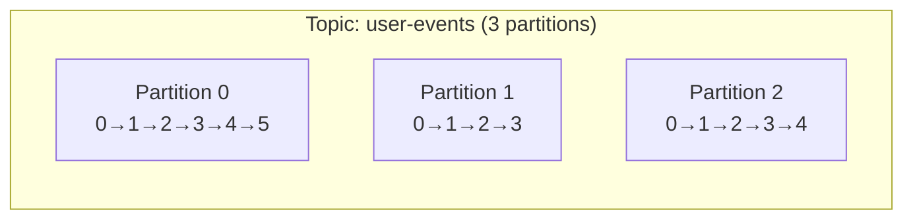
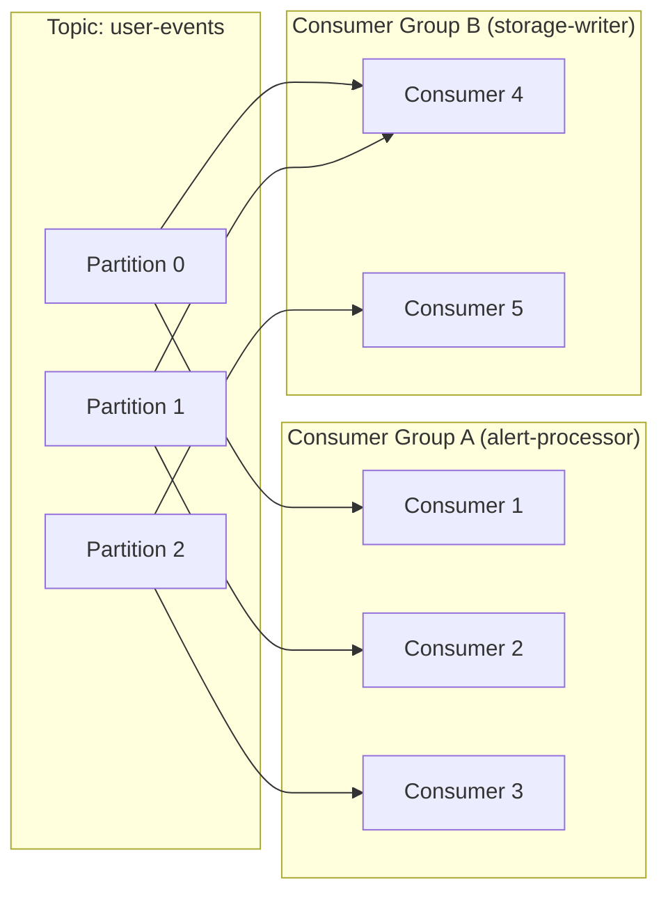

# The Log Abstraction

## Why Not a Database?

Before Kafka, teams used databases as event queues: write events to a table, consumers read and delete them.

This works until it doesn't:

- **Coupling**: producers and consumers must agree on the table schema
- **Durability**: once a consumer reads and deletes a record, it is gone — another consumer cannot read it
- **Throughput**: databases optimised for random access are inefficient at high-rate sequential appends
- **Replay**: if downstream processing had a bug, you cannot reprocess historical events
- **Backpressure**: a slow consumer blocks a fast producer (or the table grows unboundedly)

---

## The Append-Only Log

The insight behind Kafka's design:

> What if we store events in an ordered, immutable sequence? Producers only append. Consumers only read. Retention is configurable. Multiple consumers can read independently.

```
Position:  0    1    2    3    4    5    6    7
           ─────────────────────────────────────→
Event:    [e0] [e1] [e2] [e3] [e4] [e5] [e6] [e7]

Producer appends at tail (position 8)
Consumer A reads from position 3
Consumer B reads from position 6
```

**Key properties:**
- Immutable: written records are never modified in place
- Ordered: records have a monotonically increasing offset
- Retained: records remain for a configurable duration (time or size)
- Multi-consumer: many consumers can read the same records independently

---

## Topics, Partitions, Offsets

A **topic** is a named stream of records. For example: `user-events`, `payment-transactions`, `security-alerts`.

A topic is divided into **partitions** for parallelism. Each partition is an independent ordered log.



An **offset** is the position of a record within a partition. Offset 0 is the first record. Offsets are per-partition — Partition 0, Offset 5 is different from Partition 1, Offset 5.

---

## Producers

Producers write records to a topic. They choose which partition each record goes to (or let Kafka decide).

**Partition assignment strategies:**
- **Key-based**: `hash(key) % num_partitions` — all records with the same key go to the same partition
- **Round-robin**: records distribute evenly across partitions (no key)
- **Custom**: implement your own partitioner

```python
from kafka import KafkaProducer
import json

producer = KafkaProducer(
    bootstrap_servers=['localhost:9092'],
    value_serializer=lambda v: json.dumps(v).encode('utf-8'),
    key_serializer=str.encode
)

# Same user_id always goes to same partition (consistent ordering per user)
producer.send(
    topic='user-events',
    key='user_12345',
    value={'event': 'page_view', 'page': '/dashboard', 'timestamp': '2024-01-15T10:00:00Z'}
)
producer.flush()
```

---

## Consumers

Consumers read records from a topic, tracking their position (offset) in each partition.

**Consumer groups**: multiple consumers can form a group to share the work of processing a topic.



- Consumer Group A processes each partition independently with one consumer per partition
- Consumer Group B processes the same topic with 2 consumers — one handles partitions 0 and 1, the other handles partition 2
- Both groups maintain independent offsets — Group B's position does not affect Group A

---

## Offset Commits

Consumers must tell Kafka their current position. This is **offset commit**.

If a consumer crashes after processing a record but before committing its offset, Kafka thinks the record has not been processed. On restart, the consumer re-reads it. This leads to **at-least-once processing** — you must design your consumer to handle duplicate delivery.

```python
from kafka import KafkaConsumer

consumer = KafkaConsumer(
    'user-events',
    group_id='alert-processor',
    bootstrap_servers=['localhost:9092'],
    enable_auto_commit=False,  # manual commit for control
    auto_offset_reset='earliest'
)

for message in consumer:
    # Process the message
    process_event(message.value)

    # Commit only after successful processing
    consumer.commit()
```

With `enable_auto_commit=True`, Kafka commits offsets periodically regardless of whether your processing succeeded. This is convenient but can cause data loss if your processing fails between commits.

---

## Retention

Kafka retains records for a configurable duration or size:

```properties
# Retain for 7 days
log.retention.hours=168

# Or retain up to 100 GB per partition
log.retention.bytes=107374182400
```

After retention expires, old records are deleted. **Consumers that fall too far behind may lose records** — they are reading offsets that no longer exist.

---

## Log Compaction

For "latest value per key" use cases (e.g., current user settings, current order status), Kafka offers **log compaction**: retain only the most recent record per key, removing older versions.

This allows a topic to function as a durable key-value store that consumers can replay from the beginning to rebuild state.

```
Before compaction:
key=user_1: {name: "Alice"}
key=user_2: {name: "Bob"}
key=user_1: {name: "Alice Smith"}  ← updated

After compaction:
key=user_2: {name: "Bob"}
key=user_1: {name: "Alice Smith"}  ← only latest retained
```

---

## Why Kafka Is Not a Database

!!! warning "Production Gotcha"
    Kafka is not a replacement for a database. It is optimised for high-throughput sequential appends and reads. It does not support random access by key (you cannot say "give me all events for user X across all partitions without scanning everything"). For that, use a database.

Kafka's strengths:
- Extremely high write throughput (millions of records/sec)
- Decoupled producers and consumers
- Replay and event sourcing
- Multi-consumer fan-out

Kafka's weaknesses:
- No random-access queries
- Consumer lag can grow unboundedly without monitoring
- Schema evolution requires coordination
- Not designed for complex queries
