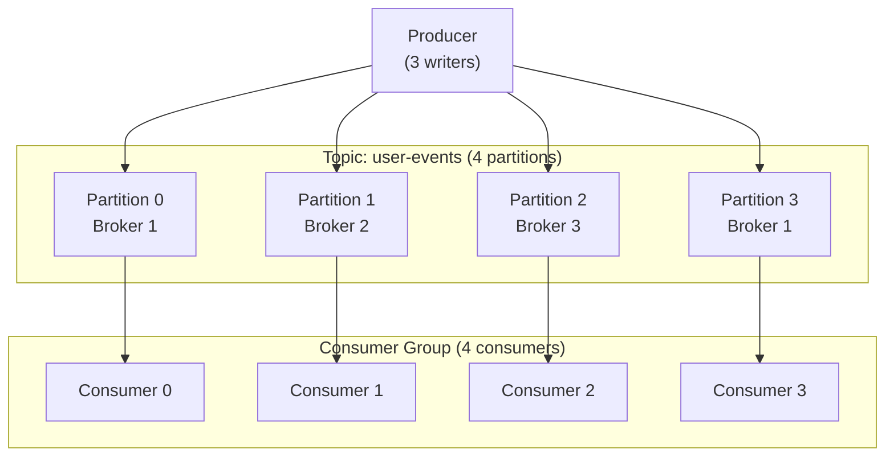

# Partitions & Consumers

## Why Multiple Partitions?

A single Kafka partition is a single ordered log processed by at most one consumer in a group at a time.

If you have one partition and one consumer, your throughput is bounded by:
- What the single broker can write per second
- What the single consumer can process per second

For millions of events per second, that is not enough.

---

## Partitions Enable Parallelism

With multiple partitions:



- 4 producers write to different partitions simultaneously
- 4 consumers process different partitions simultaneously
- Throughput scales (approximately) linearly with partition count up to hardware limits

---

## The Ordering Guarantee

Kafka guarantees ordering **within a partition**. It does not guarantee global ordering across partitions.

```
Partition 0: event A (t=10:00:01) → event B (t=10:00:02) → event C (t=10:00:03)
Partition 1: event D (t=10:00:01) → event E (t=10:00:02)
```

Consumer 0 sees A, B, C in order. Consumer 1 sees D, E in order. But there is no guarantee about the relative ordering of events across partitions.

**If you need global ordering**: use one partition. Accept the throughput limit.

**If you need per-key ordering** (e.g., all events for a user in order): use key-based partitioning. All events with the same key go to the same partition. Within a partition, they are ordered.

---

## Consumer Group Rebalancing

When a consumer joins or leaves a group, Kafka must reassign partitions. This is a **rebalance**.

```
Before rebalance (2 consumers, 4 partitions):
  Consumer A: Partition 0, Partition 1
  Consumer B: Partition 2, Partition 3

A new consumer C joins:
  Rebalance triggered
  Processing pauses during rebalance

After rebalance:
  Consumer A: Partition 0, Partition 1
  Consumer B: Partition 2
  Consumer C: Partition 3
```

During a rebalance, all consumption in the group **stops** until the new assignment is complete. For slow applications, rebalances can take seconds or minutes.

!!! warning "Production Gotcha"
    Consumers that take too long to process a message may be considered "dead" by the group coordinator and trigger a rebalance. If processing is slow, increase `max.poll.interval.ms` or process faster.

---

## Consumers and Partitions: The Rules

1. Each partition is assigned to at most one consumer in a group at a time
2. A consumer can be assigned multiple partitions
3. If there are more consumers than partitions, excess consumers are idle

```
4 partitions, 6 consumers in same group:
  Consumer 0: Partition 0
  Consumer 1: Partition 1
  Consumer 2: Partition 2
  Consumer 3: Partition 3
  Consumer 4: idle
  Consumer 5: idle
```

Adding more consumers than partitions does nothing. To increase parallelism beyond current partition count, you must increase the partition count.

---

## How Many Partitions?

More partitions = more parallelism, but with costs:

**Benefits of more partitions:**
- Higher throughput (more parallel writers and readers)
- Finer-grained load balancing across brokers

**Costs of more partitions:**
- More open file handles on brokers
- Higher end-to-end latency (more coordination)
- Slower leader election during broker failure
- More memory for metadata on clients

**Rule of thumb**: start with the number of consumers you need for your throughput, add some headroom. Common starting point: 10–100 partitions for typical workloads.

!!! warning "Production Gotcha"
    You can increase partition count, but **you cannot decrease it without recreating the topic**. Start conservatively and scale up. Increasing partitions redistributes keys across partitions, breaking per-key ordering for existing records.

---

## Consumer Lag

**Consumer lag** = (latest offset in partition) - (consumer's committed offset)

```
Partition 0:
  Latest offset: 10,000
  Consumer committed: 9,500
  Lag: 500 messages
```

Lag is normal (consumers are never quite at the tip). Lag that grows over time means the consumer is not keeping up with the producer.

Lag growth causes:
- Processing delays (data getting stale before it is processed)
- Risk of reaching retention limit (unprocessed records can be deleted)
- Memory pressure if consumers buffer unprocessed records

**Monitor lag** with Kafka's consumer group commands or a monitoring tool like Burrow.

```bash
kafka-consumer-groups.sh --bootstrap-server localhost:9092 \
  --describe --group alert-processor
```

---

## Hot Partitions

If you partition by a key with uneven distribution (e.g., `customer_id` where one customer generates 40% of events), you get a **hot partition**: one partition receives disproportionate writes.

```
Partition 0 (BigCorp): 40,000 events/sec
Partition 1 (SmallCo): 1,000 events/sec
Partition 2 (MidCorp): 5,000 events/sec
```

The consumer handling Partition 0 cannot keep up. Lag grows on Partition 0 while other consumers are idle.

Fix: use a compound partition key (`customer_id` + random suffix), or use round-robin with metadata enrichment downstream.
