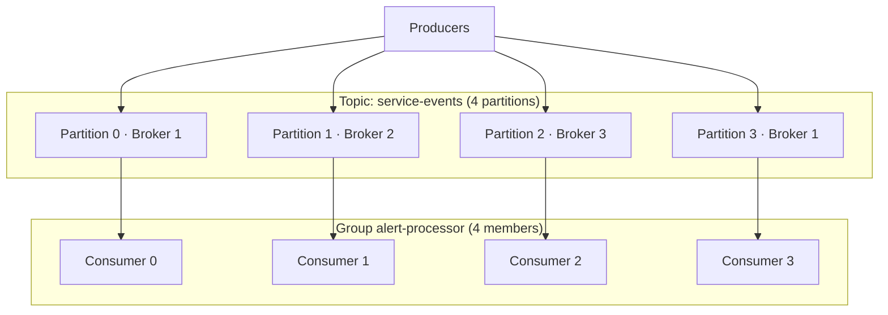

# Partitions and consumers

16:02. Consumer lag on `alert-processor` won't come down. Someone scales the Kubernetes Deployment from 12 pods to 52, certain more workers means more throughput. Ten minutes later, lag is exactly where it was.

A. The new pods need time to warm up.
B. `service-events` has 12 partitions, so 40 of those pods are sitting idle no matter what.
C. One `customer_id` is hot and needs to be split, not parallelised around.
D. The consumer group needs a rebalance to notice the new members.

Pick one before reading on. `service-events` is one logical stream, and how partitions turn one topic into many parallel logs — without throwing away per-key order — is the entire answer.

## Use case

`service-events` is one logical stream. At 50k records/s the warehouse loader is fine on one thread. At 500k records/s — SaaS analytics on a launch day, or observability in a busy region — one process cannot parse JSON, enrich, and write ClickHouse.

You also care about order: all events for `customer_id=cust_1842` should be seen in the order they were appended, so "upgrade then downgrade" does not flip. You do **not** need a global order of every tenant in the fleet.

Partitions are how Kafka turns one topic into many parallel logs without throwing away per-key order.

---

## Why this is hard at scale

A single partition is:

- one leader broker writing one log
- at most **one consumer** in a group reading it

Throughput is then `min(leader disk, network, that consumer's CPU)`. For the observability number (~2.5M records/s) that is not enough.

If you naively add partitions later, **keys move**. `hash(cust_1842) % 12` is not `hash(cust_1842) % 48`. Per-customer order is preserved *within the new partition going forward*, but a consumer that was in the middle of a sequence now sees a split history. Increasing partitions is a compatibility event, not a slider.

If you partition on the wrong key, one tenant (or one `region`, or one `device_id` firmware bug) owns 40% of traffic and you have a **hot partition**: 47 idle consumers and one on fire.

---

## Intuition

Think of the topic as a set of independent logs. The producer picks a log. A consumer group assigns each log to exactly one group member.



A second group (`warehouse-loader`) has its own assignment and its own offsets. Fan-out is free in the "no extra produce" sense; it is not free in disk reads and page cache.

**Order is per partition.** Cross-partition, there is no "happened before".

```
Partition 0: A (10:00:01) → B (10:00:02) → C (10:00:03)
Partition 1: D (10:00:01) → E (10:00:02)
```

If you need a total order for the whole company, you need one partition and you accept the throughput cap. If you need per-user or per-order order, put that id in the **key**.

---

## Internals: the partitioner

The producer does not "send to a topic". It sends to a **(topic, partition)**.

| Strategy | When | Behaviour |
|----------|------|-----------|
| Keyed (default) | `key` is set | `murmur2(key) % n` — stable for a given `n` |
| Sticky (null key, Kafka 2.4+) | No key | Batch to one partition until full / linger, then switch |
| Round-robin (legacy null key) | Old clients | Alternate partitions; worse batching |
| Custom `partitioner_class` | Explicit | You own skew and compatibility |

```python
from kafka import KafkaProducer
import json

producer = KafkaProducer(
    bootstrap_servers=["localhost:9092"],
    key_serializer=str.encode,
    value_serializer=lambda v: json.dumps(v).encode("utf-8"),
    acks="all",
)

event = {
    "timestamp": "2024-01-15T10:03:45.123Z",
    "customer_id": "cust_1842",
    "user_id": "u_99102",
    "service": "checkout",
    "endpoint": "/pay",
    "region": "us-east-1",
    "latency_ms": 210,
    "status_code": 200,
    "bytes": 1024,
}

# E-commerce: order of events per customer
producer.send("service-events", key=event["customer_id"], value=event)

# Observability metrics often have no useful order — omit key for sticky batching
producer.send("metrics-raw", value=event)
```

A custom partitioner is justified when a handful of keys are known hot (a mega-tenant). Typical pattern: `hash(customer_id + suffix)` with `suffix in 0..N-1` for that tenant only, and **re-aggregate by `customer_id` downstream** (Flink / Spark). You have traded per-key order of the mega-tenant for parallelism. Document that trade; fraud and billing often cannot take it.

---

## Internals: consumer groups

Members of a group **share** the partitions of the subscribed topics. The **group coordinator** (a broker) tracks membership via heartbeats and stores commits in `__consumer_offsets`.

Rules:

1. Each partition is assigned to **at most one** member of a given group.
2. A member can hold many partitions.
3. Extra members beyond partition count sit idle.
4. Different groups do not share assignments.

```
4 partitions, 6 consumers in `alert-processor`:
  C0..C3: one partition each
  C4, C5: idle
```

Adding consumers past partition count does nothing. Parallelism is capped by partitions. This is why "we'll scale the Deployment to 80 replicas" on a 12-partition topic wastes 68 pods.

Two clocks on a consumer, easy to confuse:

| Knob | Meaning |
|------|---------|
| `session.timeout.ms` / `heartbeat.interval.ms` | Broker considers the process dead if heartbeats stop (crash, freeze, pause) |
| `max.poll.interval.ms` | Coordinator considers the member dead if it does not **poll** in time — even if heartbeats are fine. Long processing between polls triggers this. |
| `max.poll.records` | Caps records per poll so you can finish work before `max.poll.interval.ms` |

Processing a poison message for 15 minutes with default `max.poll.interval.ms=300000` (5 minutes) looks like a crash. The group rebalances. The record is delivered to someone else. Repeat. That is a [rebalance storm](gotchas.md).

---

## Internals: rebalance — eager versus cooperative

When membership or subscribed partitions change, the group **rebalances**.

**Eager** (classic `range`, `roundrobin`, `sticky` assignors): every member **revokes all partitions**, stops processing, commits if configured, then receives a new assignment. This is stop-the-world. A 200-partition group with slow `onPartitionsRevoked` (flushing a buffer, calling an external API) stalls *all* consumption.

```
Before:  A{0,1}  B{2,3}
C joins (eager): everyone pauses
After:   A{0,1}  B{2}  C{3}     # sticky tries to minimise movement
```

**Cooperative** (`CooperativeStickyAssignor`, Kafka 2.4+): incremental. Only partitions that must move are revoked. Members keep working on the rest. Join/leave still costs something, but you do not drop the whole group to zero.

**Static membership** (`group.instance.id`): a bounced pod with the same instance id can rejoin *without* a rebalance if it returns inside `session.timeout.ms` / `rebalance.timeout`. Rolling deploys stop being incidents.

```python
from kafka import KafkaConsumer

consumer = KafkaConsumer(
    "service-events",
    group_id="alert-processor",
    bootstrap_servers=["localhost:9092"],
    enable_auto_commit=False,
    auto_offset_reset="earliest",
    partition_assignment_strategy="cooperative-sticky",  # client-specific name
    group_instance_id="alert-processor-3",  # stable per pod ordinal
    max_poll_interval_ms=300_000,
    max_poll_records=500,
)
```

`kafka-python` support for cooperative/static membership lags the Java client; in production Java / `confluent-kafka` this is the expected configuration. The *mechanism* is what you need to reason about in incidents, regardless of client.

!!! production-gotcha "Eager rebalance plus slow revoke"
    A connector that flushes to S3 in `onPartitionsRevoked` can pause a 40-member group for minutes. Cooperative assignor + smaller buffers + static membership is the usual fix, not "increase `max.poll.interval.ms` to 30 minutes" (that only delays detecting real stuck members).

---

## How many partitions?

More partitions: more parallelism, more open files, more replication threads, slower controller failover, more memory for producer/consumer metadata.

**Rule of thumb:** start from required consumer throughput, not from a round number.

```
needed_partitions ≈ peak_in_records_per_sec / per_consumer_records_per_sec
```

Then add headroom (2×) so you can scale consumers without a topic recreation. Typical SaaS topics land in **12–96** partitions. Observability firehoses land in **hundreds**, sometimes sharded into multiple topics (`logs.api`, `logs.auth`) so that failure domains stay small.

You **can increase** partition count. You **cannot decrease** it without creating a new topic and migrating. Increasing **reshuffles keys**.

!!! warning "Production gotcha"
    Raising `service-events` from 12 to 48 partitions on Friday afternoon splits every `customer_id`. In-flight per-key processors (especially exactly-once read-process-write jobs) see a new partition mapping. Do this with a new topic and a planned cutover if order or stateful Flink keyed state depends on the old mapping.

---

## Consumer lag

**Lag** = log end offset − consumer's committed (or fetched) offset, **per partition**.

```
Partition 0: log end 10_000, committed 9_500 → lag 500
```

Lag is normal. Growing lag is a rate mismatch. Summing lag across partitions hides a hot partition: total lag "fine", partition 7 at 12 million.

```bash
kafka-consumer-groups.sh --bootstrap-server localhost:9092 \
  --describe --group alert-processor
```

Lag that approaches retention is not a latency problem; it is impending **data loss** ([the log](log.md)).

---

## Hot partitions

Partition by `customer_id` in SaaS analytics. One enterprise tenant emits 40% of events.

```
P0 BigCorp: 40_000/s
P1 SmallCo:  1_000/s
P2 MidCorp:  5_000/s
```

Symptoms: lag on one partition, one consumer CPU at 100%, one broker's disk and network hot (the **leader** of that partition). Other members idle.

Fixes, in order of honesty:

1. **Split the key** for known whales (`customer_id + shard`). Re-group downstream. Lose per-customer global order for that tenant.
2. **Break the topic** by tenant tier (`service-events.enterprise` with more partitions and dedicated consumers).
3. Round-robin (no key) if you truly do not need order — rare for product events, common for stateless logs.

IoT analogue: one `device_id` stuck in a reconnect loop. Fraud analogue: one `user_id` brute-forcing login — that *should* be hot; isolate it so it cannot starve the rest of the partition.

---

## How: a consumer that will not lie to you

```python
from kafka import KafkaConsumer
import json

consumer = KafkaConsumer(
    "service-events",
    group_id="alert-processor",
    bootstrap_servers=["localhost:9092"],
    enable_auto_commit=False,
    auto_offset_reset="earliest",
    value_deserializer=lambda v: json.loads(v.decode("utf-8")),
    max_poll_records=200,
)

for message in consumer:
    event = message.value
    if event.get("status_code", 0) >= 500:
        page(event)
    consumer.commit()
```

For independent processors, **new group id**, same topic. Do not "share a group and filter in code" unless you want them to split partitions, not duplicate the stream.

---

## Gotchas

- **More consumers than partitions** → idle pods. Scale partitions (with a migration plan) or merge work.
- **One group, two logical jobs** → they steal partitions from each other. Two groups.
- **Sticky vs key.** Dropping the key "to load-balance" destroys order. Measure skew first.
- **`assign()` instead of subscribe.** Manual assignment skips group rebalance — useful for unique tasks, a foot-gun if two processes assign the same partition.
- **Transactional / EOS consumers** still obey one-member-per-partition. EOS does not add parallelism. See [exactly-once](exactly-once.md).

---

## Failure modes

| Failure | Effect |
|---------|--------|
| Member dies | Rebalance; partitions of the dead member pause until assigned |
| Slow processing > `max.poll.interval.ms` | Member kicked; rebalance; same slow record may move | 
| Rolling deploy, no `group.instance.id` | Rebalance *per pod* — a 30-pod deploy is 30 rebalances |
| Coordinator broker dies | Group cannot commit / rebalance until a new coordinator is elected |
| Hot key | One partition's lag → retention risk on that partition only |
| Increase partitions mid-flight | Key mapping changes; stateful jobs shuffle state poorly |

---

## Debugging

Always split lag **by partition**. Then split CPU **by consumer instance**. Then check which broker leads the hot partitions.

| Metric | Why |
|--------|-----|
| Consumer lag **by partition** | Skew vs global slowness |
| `rebalance-rate` / `last-rebalance-seconds-ago` | Storm vs one-off join |
| `records-consumed-rate` per member | Idle members = assignment or more consumers than partitions |
| Broker `BytesInPerSec` **per partition** (or topic-partition metrics) | Confirm producer-side hot key |
| Under-replicated partitions | If the hot partition's leader disk is wedged, replication fails too |

```bash
# Java client JMX / Prometheus: kafka_consumer_lag_sum{partition="7"}
# CLI still wins in the first five minutes of an incident
kafka-consumer-groups.sh --bootstrap-server localhost:9092 \
  --describe --group alert-processor
```

If partition 7's lag grows and others are zero, do not add consumers. You cannot assign two members to partition 7. Fix the key or speed up that member's work (faster sink, less per-record I/O).

---

## Scale: 10× / 100× / 1000×

| Scale | Partitioning response |
|-------|------------------------|
| **10×** | 12 → ~24–48 partitions. Cooperative rebalance + static membership. Watch one whale tenant. |
| **100×** | Hundreds of partitions, or **topic sharding** (`service-events.eu`, `service-events.us`). Consumer pods in the hundreds. Coordinator and `__consumer_offsets` load become real. |
| **1000×** | Multiple clusters (by region or by workload). Producers must not hash across a global 10_000-partition topic from one client (metadata and memory). Aggregation moves to [Flink](../flink/index.md) with a designed key, not "one topic to rule them all". |

The [partition simulator](../simulations/kafka-partitions.html) is the right place to feel skew before you feel it in paging.

---

## Trade-offs

| Choice | Gain | Cost |
|--------|------|------|
| More partitions | Parallelism | Metadata, file handles, slower failover, future key reshuffle |
| Keyed partition | Per-key order | Skew |
| Null key / sticky | Even load, better batches | No per-entity order |
| Whale sharding | Parallelise a hot tenant | Downstream must merge; order weakened |
| Eager rebalance | Simple assignors | Stop-the-world |
| Cooperative + static ids | Rolling deploys survive | Client/version requirements |

---

## Alternatives

- **Competing-consumer queues** (SQS, RabbitMQ): easy parallelism, weak replay, weak fan-out. Better for "do this job once".
- **One partition + faster consumer** (Rust, batch sink): works surprisingly far for e-commerce order topics that *must* be totally ordered. Does not work for observability.
- **Flink / Spark** as the parallelism layer: Kafka stays modestly partitioned; the processor reshuffles on a compute cluster. That is a [data movement](../foundations/data-movement.md) cost you are choosing on purpose.

---

## How to apply this at work

On any existing topic, write down:

1. Partition count, consumer count per group, peak records/s.
2. The key (or "none").
3. The 99th-percentile share of the hottest key.
4. Rebalance assignor and whether `group.instance.id` is set.
5. Lag **histogram by partition**, not a single number.

If (3) is > ~5–10% of traffic into one partition, you have a design problem, not a "needs more consumers" problem.

---

## Exercise

`login-events` has 24 partitions, keyed by `user_id`. Group `fraud-scorer` has 24 pods. p99 latency is 40ms except during deploys, when lag spikes to 8 minutes and fraud misses brute-force bursts. `max.poll.interval.ms=300000`. A second group, `audit-writer`, shares **the same `group_id`** "to save connections".

1. Why do deploys stall fraud detection?
2. What does sharing `group_id` do to audit versus fraud?
3. A single `user_id` is 15% of login traffic. What happens, and what is the fix if fraud **requires** per-user order?

??? question "Answer"
    1. Without static membership, each pod stop/start is a group membership change. Eager assignors stop the world; even cooperative assignors move some partitions. If revoke/processing is slow, `max.poll.interval.ms` kicks members and you get a rebalance storm. Fix: `group.instance.id` per ordinal, cooperative sticky, faster revoke, rolling one pod at a time.

    2. Same `group_id` means they are **one** group. Partitions are split between fraud pods and audit pods. Each record is processed by *either* fraud *or* audit, not both. Fan-out requires **two group ids**.

    3. ~15% of traffic hashes to one partition (or a few, if you are unlucky with other keys). One fraud pod saturates; lag is on that partition only. You cannot add a 25th pod usefully. If per-user order is mandatory, you must make *that user* faster (optimise the scorer, batch, local cache) or isolate the user onto a dedicated topic/pipeline. Sharding `user_id + n` breaks order and can miss "10 failed logins in 5 minutes" unless you aggregate shards in [Flink](../flink/windows.md).
