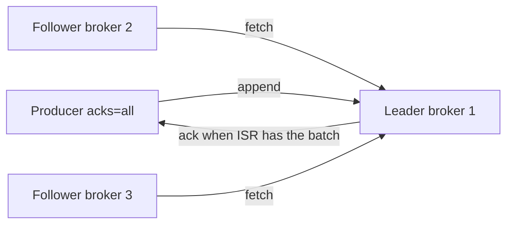

# Replication and durability

03:41 AM. The `service-events` producer starts logging `NotEnoughReplicas` on every write with `acks=all`. Two of three brokers for partition 7 dropped out of the ISR eight minutes ago; nobody paged on that. Now checkout cannot write orders at all.

A. Durability is broken — `acks=all` failed to protect the data.
B. Durability is working exactly as configured — `min.insync.replicas=2` is refusing to accept writes it cannot guarantee, which is inconvenient, not wrong.
C. The leader election picked the wrong broker.
D. This is a disk-full incident on the leader, not a replication incident.

Pick one before reading on. A broker holding the leader for hundreds of partitions can lose its disk at any moment — replication is how Kafka survives that **without** turning producers into a backup system.

## Use case

A broker holds the leader for 800 partitions of `service-events`. It loses its disk. Observability cannot drop 20 minutes of logs. E-commerce cannot lose `acks=1` checkout events that the API already treated as stored. Fraud cannot "mostly" have the login stream.

Replication is how Kafka survives a broker death **without** turning producers into a backup system.

---

## Why this is hard at scale

Copying bytes is easy. Copying bytes **in order**, **without silent loss**, **while producers keep writing**, is not.

If you wait for every replica on every produce, one slow disk in another rack stalls the fleet. If you wait for none, a leader crash drops the last few thousand records the API already "successfully" published. If you elect a replica that was behind, you **truncate** the log that other replicas (and consumers) already saw — a consistency bug that looks like time travel.

At 2.5M records/s with replication factor 3, the cluster writes roughly **3×** the ingest to disk and **2×** the ingest across the network (two followers fetching). Durability is a throughput budget.

---

## Intuition

Each partition is a log with several copies. One copy is the **leader**. All produces and (by default) fetches go to it. Followers **fetch** in offset order — they are consumers of the leader.

```
Partition 0, RF=3
  Leader:   Broker 1   ← producers write here
  Follower: Broker 2   ← fetch replica
  Follower: Broker 3
```

The copies that have caught up form the **in-sync replica set (ISR)**. Durability knobs (`acks`, `min.insync.replicas`) talk about the ISR, **not** "all brokers that were supposed to have a copy".



---

## Internals: ISR

A replica stays in the ISR if it has fetched the leader's tail within `replica.lag.time.max.ms` (default 30s). Kafka 0.9.0 dropped the old `replica.lag.max.messages` "lag in *messages*" check; a replica that is steadily catching up remains in ISR even if it is a few thousand offsets behind, as long as it is not *stuck* in time.

```
ISR partition 0: [b1, b2, b3]
b3's disk saturates, fetch stalls > replica.lag.time.max.ms
ISR: [b1, b2]
```

That shrink is visible as **under-replicated partitions** (URP): `RF - ISR size > 0`.

When the leader dies, the controller (KRaft in Kafka 3.x; ZooKeeper+controller in older clusters) elects a new leader **from the ISR**. Consumers and producers refresh metadata and follow the new leader. Pause is typically seconds if the controller and clients are healthy.

---

## Internals: `acks` and `min.insync.replicas`

The producer `acks` setting is the durability contract **for that produce**.

| `acks` | Wait for | Durability | Latency |
|--------|----------|------------|---------|
| `0` | Nothing | Can lose data on a blip | Lowest |
| `1` | Leader only | Survives follower deaths; **lost** if leader dies before followers fetch | Medium |
| `all` (`-1`) | All **current ISR** members | Survives any failure that leaves one ISR member | Highest |

`acks=all` does **not** mean "all replicas in the RF". If ISR has shrunk to `{leader}`, `acks=all` acknowledges after **one** broker. That is why `min.insync.replicas` exists.

```properties
# producer
acks=all

# topic or broker
min.insync.replicas=2
replication.factor=3
```

With `acks=all` and `min.insync.replicas=2`, the broker **rejects** the produce (`NotEnoughReplicas`) if ISR size < 2. Availability drops; silent loss does not.

!!! danger "acks=all with min.insync.replicas=1"
    This combination is the most common false sense of safety. ISR can be `{leader}` and you still get acks. A leader disk loss then drops acknowledged data.

Recommended production floor: RF=3, `min.insync.replicas=2`, `acks=all`, `unclean.leader.election.enable=false`.

---

## Internals: leader epochs and fetch

Kafka 0.11+ tags the log with **leader epochs**. When a new leader is elected, it bumps the epoch. A follower that had extra records from a previous (possibly lost) leader **truncates** to the epoch's start offset before catching up. This is how Kafka avoids the old "replica has bytes the new leader does not" split-brain.

Consumers that had read past the truncation point see an `OffsetOutOfRange` or a reset — another reason unclean election is painful. Clean ISR elections should not truncate **acknowledged** data; that is the HW/ISR contract.

Fetch is sequential. Followers use the replica fetcher threads (`num.replica.fetchers`). Too few fetchers + many partitions on one broker → URP even when disks are fine. Too many → thread and network overhead. This is a 100× tuning knob, not a 10× one.

Preferred leader is the first replica in the replica list. After failures, leadership is wherever it landed. `kafka-leader-election.sh --election-type preferred` (or auto-rebalance) puts traffic back onto the planned brokers.

---

## Internals: high watermark and what consumers can see

The **high watermark (HW)** is the offset the leader knows every ISR replica has fetched.

Followers may have the bytes; consumers (non-transactional) only see up to HW. A crash cannot make consumers "un-read" data they were allowed to see, unless you enable unclean leader election.

Idempotent producers and transactions add a second axis ([exactly-once](exactly-once.md)); they do not replace ISR.

---

## What happens when a broker dies

1. Followers stop receiving fetch responses; clients' metadata is stale.
2. The controller notices the broker is gone (KRaft voter/observer or ZK session).
3. For each partition that had a leader on the dead broker, a new leader is chosen from ISR.
4. ISR shrinks (the dead broker is out).
5. Producers retry; `acks=all` now waits for the remaining ISR (and still for `min.insync.replicas`).
6. When the broker returns, it **truncates** if needed to the leader's epoch/HW, then catches up. URP count should return to 0.

**RF=3:** one broker loss is a yellow incident (URP, extra load on survivors). **RF=1:** the partition is gone. Two-AZ clusters with RF=3 still put two replicas in one AZ; a full AZ outage can violate min.ISR. Three AZs, one replica each, is the boring layout that works.

---

## Unclean leader election

If **no** ISR member is alive, Kafka must choose:

- **Wait** (`unclean.leader.election.enable=false`, default): the partition is offline until an ISR member returns. Consistency over availability.
- **Elect a out-of-ISR replica**: the partition comes back, but any records the old leader had that this replica missed are **lost**, and replicas that had them must truncate. Consumers who already saw those offsets live in a fork.

E-commerce payments and fraud decision logs should not enable unclean election. A metrics topic that is rebuilt from agents every 15s might, if product explicitly accepts loss. Write that exception in the topic runbook; do not leave `unclean.leader.election.enable=true` as a cluster-wide default.

---

## How: produce with a durability contract

```python
from kafka import KafkaProducer
import json

producer = KafkaProducer(
    bootstrap_servers=["broker1:9092", "broker2:9092", "broker3:9092"],
    value_serializer=lambda v: json.dumps(v).encode("utf-8"),
    key_serializer=str.encode,
    acks="all",
    retries=2147483647,
    retry_backoff_ms=100,
    request_timeout_ms=30_000,
    max_in_flight_requests_per_connection=5,
    enable_idempotence=True,  # requires acks=all; see exactly-once.md
)

event = {
    "timestamp": "2024-01-15T10:03:45.123Z",
    "customer_id": "cust_1842",
    "user_id": "u_99102",
    "service": "checkout",
    "endpoint": "/pay",
    "region": "eu-west-1",
    "latency_ms": 40,
    "status_code": 200,
    "bytes": 256,
}

future = producer.send("service-events", key=event["customer_id"], value=event)
future.get(timeout=30)  # surface NotEnoughReplicas / timeout to the API
```

Do not swallow produce errors in an HTTP handler and still return 200 to the client. That is `acks=0` with extra steps.

Topic create:

```bash
kafka-topics.sh --bootstrap-server localhost:9092 --create \
  --topic service-events \
  --partitions 24 \
  --replication-factor 3 \
  --config min.insync.replicas=2
```

---

## Gotchas

**RF=3 on 3 brokers** means every broker holds every partition. Losing one broker is fine; you have no spare *capacity*. Survivors take 50% more leadership and fetch load. Use at least 4–6 brokers in production so that leadership can be reassigned onto machines that were not already at the limit.

**Rack awareness.** `broker.rack` + `replica.selector.class` (or `replica.rack.aware`) so replicas are not all in one AZ. RF=3 in one AZ is a maintenance window away from a simultaneous loss.

**Preferred leader.** After a bounce, leaders may pile up on one broker. `auto.leader.rebalance.enable` (or Cruise Control) redistributes. Uneven leadership looks like "one broker's disk is mysteriously hot".

**Follower fetch from page cache vs disk.** A restarting replica that is hours behind reads cold segments and can evict the leader's page cache, hurting tail producers. Throttle replica fetch (`replica.alter.log.dirs.io.max.bytes.per.second` / follower throttles) during catch-up.

**KRaft vs ZooKeeper.** Kafka 3.x can run without ZooKeeper. Durability *of records* is still ISR. KRaft durability is about **controller metadata**. Do not confuse "we migrated to KRaft" with "we can set `acks=1` now". Controller loss in a badly deployed KRaft quorum is an **availability** event for metadata (creates, leader elections), not an automatic data-loss event for already-replicated partitions.

**`replica.lag.time.max.ms` too small.** A GC pause or a compaction on the follower ejects it from ISR, `acks=all` waits on a shrinking set, then the replica rejoins — ISR shrink/expand flaps. URP pages. Raise the lag time only after you fix GC and disk; do not use 5 minutes to hide a dying volume.

---

## Failure modes

| Failure | User-visible | Risk |
|---------|--------------|------|
| One broker down, RF=3, min.ISR=2 | Brief metadata refresh; URP > 0 | Healthy if catch-up is prompt |
| Two brokers down, RF=3, min.ISR=2 | Produces fail `NotEnoughReplicas` | Correct: refuse rather than lie |
| Leader disk loss, acks=1 | Some "successful" produces vanish | API already returned 200 |
| Unclean election | Partition available; offsets rewritten | Lost / duplicated world-views |
| Slow AZ link | Replica leaves ISR; URP | min.ISR may start rejecting |
| Disk full | Log dir offline, partitions migrate or halt | Can cascade if all dirs fill |

---

## Debugging

**Under-replicated partitions should be 0** except during a known bounce.

| Metric | Meaning |
|--------|---------|
| `UnderReplicatedPartitions` | ISR smaller than RF — **page immediately if it stays** |
| `IsrShrinksPerSec` / `IsrExpandsPerSec` | Flapping replica (disk, GC, network) |
| `UnderMinIsrPartitionCount` | Produces with `acks=all` will fail |
| `OfflinePartitionsCount` | No leader — availability 0 for those partitions |
| `LeaderCount` per broker | Imbalance after failure |
| `ReplicaLagMax` / fetch metrics | Who is behind, by partition |
| Consumer lag by partition | Followers and consumers both stall if the leader is wedged |

```bash
kafka-topics.sh --bootstrap-server localhost:9092 --describe --topic service-events
# Look at Leader, Replicas, Isr columns. ISR shorter than Replicas = URP.

kafka-log-dirs.sh --bootstrap-server localhost:9092 --describe --json | head
```

If URP is isolated to partitions whose leader is broker 4, you are looking at broker 4's disk, GC, or network — not "Kafka is sad in general".

---

## Scale: 10× / 100× / 1000×

| Scale | Replication reality |
|-------|---------------------|
| **10×** | RF=3, min.ISR=2 is cheap. One NVMe per broker is enough. |
| **100×** (observability 2.5M/s) | Replication traffic dominates NICs. Multiple `log.dirs` on separate disks. Consider compression on the producer so replicas copy smaller batches. |
| **1000×** | Stretch clusters across AZs at this volume are an explicit RPO/RTO product decision (inter-AZ bandwidth cost). Often: RF=3 in-region + async mirror (`MirrorMaker 2`) to another region for disaster, accepting extra RPO. |

IoT device-state compacted topics replicate the same way; catch-up after a broker loss can be *larger* than you expect because compacted topics still have a large baseline.

---

## Trade-offs

| Knob | Safer | More available / faster |
|------|-------|-------------------------|
| `acks` | `all` | `1` or `0` |
| `min.insync.replicas` | `2` (with RF=3) | `1` |
| Unclean election | `false` | `true` |
| RF | 5 (two concurrent faults) | 3 (one fault) or 2 (not recommended) |
| Sync AZ replication | Survive AZ loss with RPO≈0 | Lower latency, cheaper NIC |

There is no setting that is both "never lose an ack'd record" and "always accept writes when two of three brokers are dead". That is the CAP conversation Kafka encodes as `min.insync.replicas`.

---

## Alternatives

| Alternative | Durability model |
|-------------|------------------|
| Single-node Kafka / RF=1 | Lab only |
| Kinesis | AWS replicates for you; you still choose retry/idempotency |
| Postgres with sync replicas | Stronger single-row semantics, weaker append throughput |
| Dual-write to two clusters | Not atomic; use MM2 or accept divergence |
| Flink checkpointed sink | Does not replace broker RF; it replaces *consumer* replay from a checkpoint |

---

## Worked example: observability versus checkout

Observability `logs.raw`, 2M records/s, RF=3, `acks=all`, min.ISR=2. A 200 ms extra produce latency is invisible next to a 15s dashboard. You still want `acks=all` because a broker death during a deploy should not punch a hole in traces. You **do** isolate replication NICs and compress.

Checkout `orders`, 200 records/s. Latency budget is 50 ms for the produce in the HTTP request. `acks=all` in-region is usually a few milliseconds with `linger.ms=0`. People disable it out of folklore. Measure. If you truly cannot wait for a second AZ, that is an RPO decision: say "we can lose the last N ms of orders on AZ failure", do not hide it in a library default.

IoT device shadows on a compacted topic: catch-up after a broker loss replays the **baseline** (latest per device), which can be larger than a day's raw telemetry. Size disks for the compacted baseline × RF, not for "yesterday's ingest".

---

## How to apply this at work

For each topic, fill this in and put it in the runbook:

```
topic: service-events
RF: 3
min.insync.replicas: 2
producer acks: all
unclean.leader.election: false
RPO if 1 broker dies: 0 (ack'd records)
RPO if 2 brokers die: writes stop; ack'd records survive on the remaining ISR member
```

If producers still use `acks=1` "for latency" on checkout or login-decision topics, that is a product bug, not a Kafka limitation. Measure the actual extra millisecond of `acks=all` with linger/batching before you trade away durability.

---

## Exercise

Cluster of 3 brokers, `service-events` RF=3, `min.insync.replicas=2`, producers `acks=all`. Broker 1 (leader for 1/3 of partitions) dies. Ten minutes later broker 2's disk hits 100%.

1. What happens to produces after broker 1 dies, once ISR re-forms?
2. What happens when broker 2 fills?
3. Which metric went red first, and what should paging have done at minute one?

??? question "Answer"
    1. Controller elects ISR followers as leaders. ISR size becomes 2. `min.insync.replicas=2` still holds, so `acks=all` produces succeed. URP is non-zero (RF=3, two copies). Cluster is degraded, not down. Leadership and disk load concentrate on brokers 2 and 3.

    2. Broker 2 cannot append. Partitions with leader on 2 fail produces. Followers on 2 leave ISR. Many partitions now have ISR size 1 (broker 3 only) or 0. `min.insync.replicas=2` causes `NotEnoughReplicas` / offline partitions. You chose consistency: the cluster **stops taking writes** rather than acknowledging to a single remaining disk. Remaining data on broker 3 is the source of truth.

    3. `UnderReplicatedPartitions` should page as soon as broker 1 dies — that is the ten-minute window to restore a broker or shed load. Waiting until `UnderMinIsrPartitionCount` or `OfflinePartitionsCount` is waiting until writes fail. Also watch disk used on the survivors; RF=3 on 3 brokers means they must absorb 50% more data until broker 1 returns.
