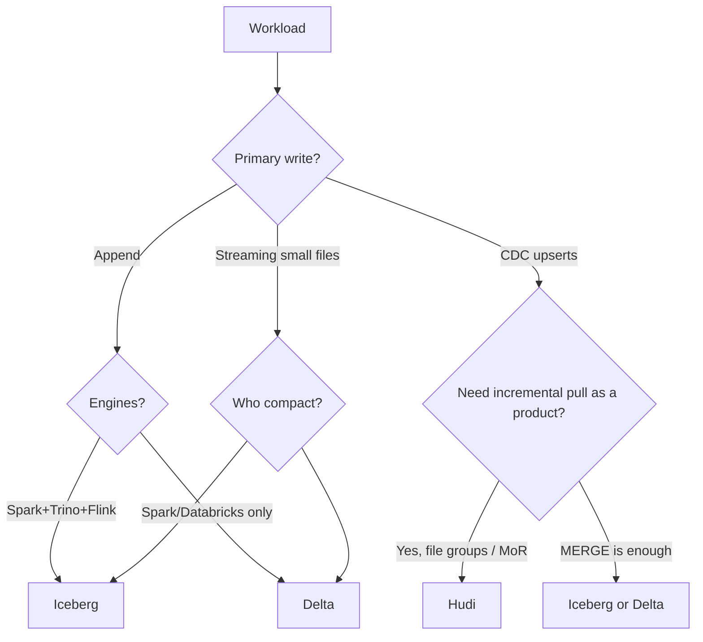

# Choosing a Table Format

Raw Parquet on S3. Concurrent readers, writers, CDC updates, schema change, mid-job crash. You already know you need a table format. The remaining question is not:

> Which table format is best?

That question has no answer. The right question is:

> **Given my workload, what properties do I need from a table format?**

Append-only SaaS events, e-commerce CDC, and observability compaction are three different property lists. Iceberg, Hudi, and Delta each fail some of them on purpose.

---

## Use Case Filter (start here)

**SaaS analytics, append-heavy, Spark + Trino.** You need snapshot isolation, hidden partitioning, Trino planning. Iceberg-shaped.

**E-commerce CDC, upserts, incremental index build.** You need record keys, MoR, incremental pull. Hudi-shaped (or Delta CDF / Iceberg MERGE if the team already lives there).

**Databricks-centric metrics.** You need MERGE, OPTIMIZE, notebooks. Delta-shaped.

**Observability, huge append, few updates.** You need cheap commits and compaction, not file-group indexes. Iceberg or Delta; Hudi is extra machinery.

Walk the questions below; do not skip to a vendor slide.

---

## Why Choosing Is Hard

All three give you:

- A pointer that *is* the table
- Snapshot isolation for readers
- Schema tracking
- Compaction hooks
- Time travel until you expire/VACUUM

They differ in **log shape**, **upsert implementation**, **engine coverage**, **partition evolution**, and **incremental APIs**. Those differences show up at 100× as engine mismatches and write amplification, not as blog benchmarks.

---

## Intuition

Pick the constraint that will kill you first:

If two answers conflict (CDC + Trino + Flink), you are buying **engineering**, not a logo: Iceberg MERGE/Flink writes, or Hudi plus weaker ad-hoc SQL, or Delta plus a Databricks SQL warehouse.

---

## Internals Cheat Sheet

| Mechanism | Iceberg | Hudi | Delta |
|-----------|---------|------|-------|
| Where is the table? | Catalog → metadata JSON → snapshot tree | `.hoodie` timeline + file groups | `_delta_log` JSON + checkpoints |
| Commit | CAS metadata pointer | Complete an instant | Create `N+1.json` |
| Upsert | MERGE rewrite + delete files | CoW rewrite or MoR logs | MERGE rewrite + optional DVs |
| Incremental | Snapshot diff / CDC plans | Incremental query by instant | Change Data Feed |
| Partition evolution | First-class specs | Limited | Limited |
| Hidden partitions | Yes (`day(ts)`) | No (partition path) | No (columns) |
| Multi-engine | Strong | Spark-first, others vary | Spark/Databricks-first, growing |

Details: [Iceberg](iceberg.md), [Hudi](hudi.md), [Delta](delta.md), [why formats](why-table-formats.md).

---

## The Decision Questions

Work through these questions:

### 1. What is the write pattern?

| Write Pattern | Implication |
|--------------|-------------|
| Append-only (Kafka ingestion, batch ETL) | All three formats work well |
| High-frequency upserts (CDC from OLTP) | Hudi (MoR) or Iceberg + Flink |
| Occasional updates, mostly reads | Delta Lake or Iceberg |
| Row-level deletes (GDPR compliance) | All three support it; Hudi is optimised for it; Iceberg/Delta use delete files / DVs |

### 2. Which engines need to read this table?

| Engine Access | Recommendation |
|--------------|----------------|
| Spark only | Delta Lake (native integration) |
| Spark + Trino + Flink | Iceberg |
| Spark + Trino | Both work; Iceberg has stronger Trino support |
| Databricks | Delta Lake |

### 3. Do you need streaming incremental reads?

Hudi's incremental read feature is the strongest. Iceberg supports incremental reads via snapshots. Delta Lake supports it via Change Data Feed.

### 4. How important is operational simplicity?

- **Simplest**: Delta Lake (minimal configuration, especially on Databricks)
- **Most features**: Iceberg (partition evolution, hidden partitioning, engine-agnostic)
- **Most complex for high-update workloads**: Hudi (CoW/MoR decisions, compaction tuning)

### 5. Who is allowed to MERGE?

One writer type per table is a valid architecture. Many Flink tasks + nightly Spark MERGE on the same Iceberg partition is a conflict retry mill. Hudi file groups isolate keys; they do not remove compaction.

### 6. What is the GDPR SLO?

If deletes must be **logical in minutes** and **physical in days**, DVs / position deletes / MoR logs all work. If legal requires physical purge this week, schedule rewrite + expire/VACUUM/clean and prove it with a query on the old snapshot (should fail after expire).

---

## How: Map a Real Pipeline

**SaaS analytics (append-heavy, multi-engine)**

Kafka → Spark (append) → **Iceberg** → Trino (ad-hoc) + ClickHouse (dashboards)

Why Iceberg: Trino reads it natively, Spark writes natively, no updates required. Airflow schedules compaction and `expire_snapshots`, and does not pandas-scan the lake.

**E-commerce CDC pipeline**

PostgreSQL → Debezium CDC → Kafka → **Hudi** (MoR) → Spark for analytics + incremental to search

Why Hudi: order records are frequently updated (status changes), record keys are natural (`order_id`), incremental reads needed downstream. If the same data must also be Trino's source of truth, either compact to CoW/RO often or land a second Iceberg snapshot table — two tables can be cheaper than one unhappy table.

**Databricks-centric data platform**

Spark batch ETL → **Delta Lake** → Spark SQL for analytics

Why Delta: native Databricks integration, excellent Spark support, OPTIMIZE/VACUUM tooling.

**Observability**

Agents → Kafka → Flink append → Iceberg hour partitions → Trino last-15-minutes

Why not Hudi: no record key that is worth indexing; compaction of tiny files is the main job. Delta if the query layer is Databricks SQL.

---

## Workload Matrix (not a scoreboard)

| Need | Iceberg | Hudi | Delta |
|------|---------|------|-------|
| Append + multi-engine | Strong | Possible, heavier | Improving |
| CDC upserts | MERGE / Flink | Designed for this | MERGE / CDF |
| Incremental consumers | Snapshot-based | First-class | CDF |
| Hidden partition / evolution | Yes | Weak | Weak |
| Spark DX | Good | Good | Best on Databricks |
| Ops surface | Snapshots, manifests, orphans | CoW/MoR, timeline, clean | Log, OPTIMIZE, VACUUM, protocol |

Use the matrix to **eliminate** a format, not to rank them 1–2–3.

---

## Gotchas When Choosing

- **Picking Hudi for append-only** because "Uber scale." You inherited CoW/MoR without a key.
- **Picking Iceberg for CDC** without a compaction/delete-file plan. MERGE will rewrite partitions; that can be fine at hourly CDC, not at 50k upserts/s without design.
- **Picking Delta** then requiring EMR 6 + Trino + Flink next year. Protocol and engine lag become the project.
- **Two formats for the same entity** without a pipeline (Hudi orders + Iceberg orders) — divergence.
- **Format war in a platform team** while Airflow still processes 1 TB in Python. Format will not save that.

!!! production-gotcha "Migration as a rewrite"
    Switching Iceberg ↔ Delta is a new table and a copy (or dual-write). Budget it as a data movement project, not a config flag. Dual-write until checksums match, then swing readers.

---

## Failure Modes of a Bad Fit

| Bad fit | Symptom |
|---------|---------|
| Hudi CoW + hot CDC | Spark upsert jobs never catch Kafka |
| Iceberg + uncompacted streaming | Trino planning minutes, 200k files |
| Delta + old Trino | Cannot read DVs / protocol |
| Any format + prefix listing jobs | Duplicate rows, fighting the log |
| Any format + VACUUM/expire too fast | Long queries die |

Debugging "the format is slow" almost always means **small files, wrong write pattern, or wrong engine version**.

---

## Debugging a Choice In Production

1. Write down: write QPS, % updates, engines, incremental consumers, GDPR.
2. Measure: files per partition, commit conflict retries, merge CPU, query engines' errors.
3. If conflicts dominate, reduce writers or switch to MoR/DVs, do not "tune Spark shuffle" first.
4. If Trino cannot see Spark commits, you have a **catalog** problem, not a format beauty contest.

---

## Scale: 10× / 100× / 1000×

| Scale | Choice advice |
|-------|----------------|
| **10×** | Pick the format your engines already speak. Run compaction. |
| **100×** | Write pattern dominates: CDC → Hudi/MERGE design; multi-engine → Iceberg; Databricks → Delta. |
| **1000×** | You will run a **maintenance platform** (compact, expire, orphan delete) regardless of logo. Format differences are isolation and incremental APIs. Mixing engines without a catalog strategy fails first. |

At 1000×, teams sometimes run **Iceberg for the lake + an OLAP serving store** (ClickHouse/Pinot). That is not a format defeat; it is workload split (scan vs millisecond dashboards).

---

## Catalog and Governance Constraints

Format choice is often actually catalog choice:

| Catalog gravity | Format that usually follows |
|-----------------|-----------------------------|
| Unity Catalog / Databricks | Delta (Iceberg via UniForm/compat is a project) |
| AWS Glue + Athena/Trino + EMR | Iceberg (or Hive for legacy) |
| Nessie / REST / Polaris | Iceberg |
| HMS only, Spark jobs | Any; Iceberg/Hudi/Delta all have HMS adapters of varying quality |

If security said "one catalog, row filters, audited `SELECT`," pick the catalog first, then the format it first-classes. Do not choose Hudi because of CDC and then discover the catalog cannot grant Trino access.

---

## Cost Shape (not a benchmark)

You pay S3 GET/PUT, commit conflicts (wasted Spark), and query scan bytes.

- **Append Iceberg/Delta:** PUT data files + one metadata commit. Cheap unless files are tiny (then you pay GETs later).
- **CoW Hudi / Delta MERGE:** rewrite whole files for a few rows. Cost tracks *file size × update rate*.
- **MoR / DVs:** cheap writes, more read CPU and later compaction PUT.

A CDC table with 128 MB files and 1% of rows updated per hour is a CoW tax. That fact, not brand preference, should push MoR or DVs.

---

## Migration Without a Flag Day

1. Dual-write for one pipeline (CDC → Hudi and CDC → Iceberg, or Spark writes both).
2. Row-count and key checksum per `ds`.
3. Swing **one engine** of readers (Trino first, Spark jobs second, or the reverse).
4. Keep the old table until time-travel SLOs expire.

Never `distcp` Parquet without replaying a log. You will copy orphans and miss deletes.

---

## Trade-offs (the only honest summary)

If you are starting fresh and need multi-engine access: **Iceberg** is the safest choice.

If your stack is Databricks: **Delta Lake** wins for operational simplicity.

If your primary workload is CDC with high-frequency upserts: consider **Hudi**, but verify your team has the operational expertise.

All three are production-grade. The differences matter at the margins — and at the margins of **your** workload, not the industry's.

You give up, for all three: "files are the table," and you take on compaction and snapshot hygiene.

---

## Alternatives to Picking One Lake Format

- **Warehouse as the system of record** — extra copy, less object-storage ops.
- **Split serving**: Kafka → Flink → ClickHouse for dashboards; lake format for historical.
- **OLTP + CDC only to search** — lake stays append Iceberg.
- **No format yet** — acceptable for a single-writer lab; not for concurrent production. See [why table formats exist](why-table-formats.md).

---

## How to Apply This at Work

In a design review, forbid "we should use X because it's winning." Require a filled table:

| Question | Answer |
|----------|--------|
| Write pattern | append / CDC / mixed |
| Engines this year | |
| Engines we are honest about next year | |
| Incremental consumer? | |
| GDPR physical SLO | |
| Who compact? | Airflow Spark job / platform |
| Primary key? | |

Then pick. Revisit when an engine or write pattern actually changes.

If the table is blank, you are choosing a brand. If two rows conflict (CDC *and* three engines), name the conflict in the design: two tables, or extra compaction budget, or a serving store. Silence is how "one format for the company" ships.

Staff-level output is not a winner. It is a **workload → properties → format** sentence you can defend in six months when CDC QPS 10×s.

---

## One-Paragraph Decision Records

Copy these into an ADR; replace the nouns.

- "Events are append-only, Spark writes, Trino reads, we will evolve from day to hour partitions → **Iceberg**."
- "Orders have `order_id`, 2k upserts/s, Elasticsearch needs a 5-minute incremental cursor → **Hudi MoR** (or Delta CDF if we stay on Databricks)."
- "Dimension MERGE nightly, all jobs on Databricks SQL → **Delta**, OPTIMIZE weekly, VACUUM 7d."
- "Logs at 5M events/s, last-15-minute dashboards in ClickHouse, lake is historical → **Iceberg** in the lake, not Hudi."

If you cannot write one of those sentences, you are not ready to create the table.

---

## Exercise

Team A: SaaS events, Spark+Trino, append, 20 TB, hidden `day(event_time)` desired.  
Team B: orders CDC 2k updates/s, Spark only, incremental to Elasticsearch.  
Team C: Databricks, MERGE dimensions nightly, no Trino.

A platform lead wants **one format for all three** "for simplicity."

??? question "What does each team lose if you force Iceberg-only, Delta-only, or Hudi-only? What is a defensible platform policy that is not 'one winner'?"
    Workload over uniformity.

    ??? success "Answer"
        Iceberg-only: A is happy; B must build MERGE/Flink+delete-file compaction and a snapshot-diff incremental; C loses Databricks-native DX. Delta-only: C is happy; A fights Trino/hidden partitions; B uses MERGE+CDF (viable) but not MoR file groups. Hudi-only: B is happy; A pays CoW/MoR and weak hidden partitioning for append; C is non-idiomatic on Databricks. Defensible policy: **Iceberg default for multi-engine append lakes; Hudi (or Delta CDF) allowed for keyed CDC tables; Delta allowed in Databricks workspaces**; shared rules (no prefix listing, compaction SLO, catalog per domain, Airflow submits Spark). Uniformity of *operations* beats uniformity of *logo*.
