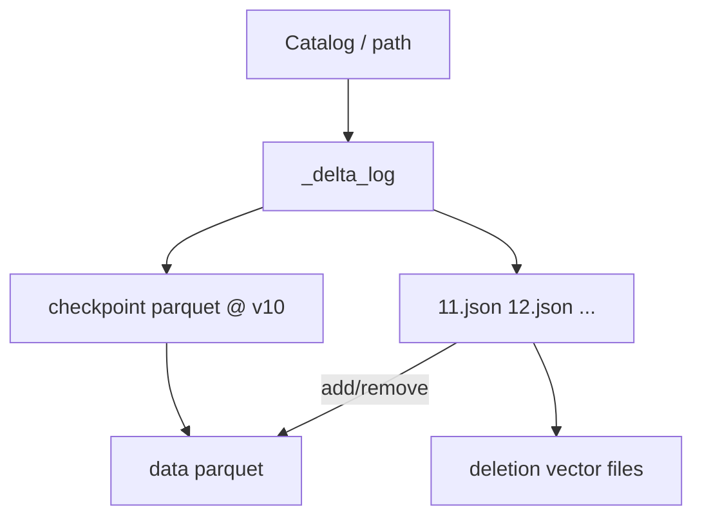

# Delta Lake

2:00 AM. `VACUUM` runs with the default 7-day retention, same as every week. At 2:03, a Trino query that has been running since 11 PM — pinned to a version from six hours ago — throws `FileNotFoundException`. The analyst who kicked it off is asleep.

What happened?

A. The query's snapshot was already stale; this is expected behavior.
B. Someone pointed the query at the wrong table.
C. VACUUM deleted files the query's pinned version still needed, because nothing newer than the retention window referenced them anymore.

Pick one before reading on.

It's C, and it only makes sense once you know where Delta actually keeps "the table." Spark wrote `part-00077.parquet` and died. Another Spark job lists `s3://orders/` and counts yesterday. Concurrent OPTIMIZE rewrites files. VACUUM runs because "S3 is expensive." **Where is the table?** In Delta, it is the **transaction log**: the sequence of JSON commits (and checkpoints) under `_delta_log/`. The Parquet files are payloads. If they are not named in the log, they are not in the table — and if VACUUM decides they are not needed, a long-running reader still holding an old version finds out the hard way.

---

## Use Case

**SaaS analytics on Databricks / Spark-centric stacks.** Batch ETL into `delta.` tables, SQL in notebooks, BI on Spark or a SQL warehouse that speaks Delta.

**E-commerce MERGE.** CDC applied with `DeltaTable.merge`. Change Data Feed for downstream incremental jobs.

**Observability.** Append + OPTIMIZE + ZORDER on `service, hour`. Deletion vectors for cheap row deletes without rewriting 256 MB files.

If Trino + Flink + Spark must share one open spec, read [Iceberg](iceberg.md) first. Delta is the right default when **Spark is the gravity well**.

---

## Why This Is Hard

Object storage cannot atomically "replace a directory." Delta's trick is: **never replace the directory**. Only append a commit file `00000000000000000023.json` whose presence (create-if-not-exists) is the atomic operation. Readers reconstruct the table by replaying the log.

Hard parts: log length (hence checkpoints), concurrent commits (lost update on the same version number), VACUUM racing readers, and small files from streaming.

---

## Intuition

Delta is Git with a linear `main` and no branches in the original protocol: commit N+1 names files added and removed relative to N. Checkpoints are **squash**: a Parquet snapshot of the current file set so you do not replay 10,000 JSON files.

```
version 10 checkpoint: {file-a, file-b, file-c}
version 11 JSON: add file-d, remove file-b
current table = {file-a, file-c, file-d}
```

Time travel = stop replay at version K. VACUUM = delete files not in any version inside the retention window.

---

## Internals: The Transaction Log

Delta Lake stores all table changes in a **transaction log** — a directory `_delta_log/` containing JSON files describing every operation.

```
s3://orders/
    _delta_log/
        00000000000000000000.json   (initial table creation)
        00000000000000000001.json   (first write)
        00000000000000000002.json   (second write)
        00000000000000000010.checkpoint.parquet  (checkpoint at version 10)
        _last_checkpoint            (hint)
    part-0001.parquet
    part-0002.parquet
    ...
```

To determine the current state of the table, Delta reads the transaction log in order and replays the operations.

### A transaction log entry

```json
{
  "add": {
    "path": "part-0003.parquet",
    "size": 134217728,
    "dataChange": true,
    "stats": "{\"numRecords\":1000000,...}"
  }
}
```

An `add` entry means "this file is now part of the table."

```json
{
  "remove": {
    "path": "part-0001.parquet",
    "dataChange": true
  }
}
```

A `remove` entry means "this file is no longer part of the table" (e.g., after a DELETE or OPTIMIZE).

Other actions: `metaData` (schema), `protocol` (min reader/writer versions), `commitInfo`, `txn` (app-id idempotent writes).



---

## Checkpoints

Reading millions of JSON log entries would be slow. Delta Lake creates a **checkpoint** every 10 commits by default: a Parquet file summarising all active `add` and `remove` entries.

To reconstruct the table state:
1. Find the latest checkpoint (`_last_checkpoint` hint, then verify)
2. Read all JSON log entries after that checkpoint
3. Apply them to the checkpoint state

Broken `_last_checkpoint` is recoverable: list `_delta_log` and take the newest checkpoint + JSON. Do not delete JSON that checkpoints still need.

---

## Optimistic Concurrency

Writer reads version N, writes data files, tries to create `N+1.json`. If that key already exists, another writer won → **retry**: rebase adds/removes on the new N+1.

Streaming sinks use **idempotent `txn` app-id / version** so retry of the same micro-batch does not double-append.

---

## Time Travel

Delta Lake supports time travel through the transaction log:

```python
# By version
df = spark.read.format("delta").option("versionAsOf", 5).load("s3://orders/")

# By timestamp
df = spark.read.format("delta").option("timestampAsOf", "2024-01-15").load("s3://orders/")
```

```sql
SELECT * FROM orders VERSION AS OF 5;
SELECT * FROM orders TIMESTAMP AS OF '2024-01-15';
DESCRIBE HISTORY orders;
```

History is the log. VACUUM erases the ability to travel outside retention.

---

## ACID Operations

```python
from delta.tables import DeltaTable

dt = DeltaTable.forPath(spark, "s3://orders/")

# UPSERT (MERGE)
dt.alias("target").merge(
    source=updates.alias("source"),
    condition="target.order_id = source.order_id"
).whenMatchedUpdateAll() \
 .whenNotMatchedInsertAll() \
 .execute()

# DELETE
dt.delete("status = 'CANCELLED' AND order_date < '2023-01-01'")
```

MERGE is CoW unless deletion vectors apply: rewrite files that contain matched rows, `remove` old, `add` new, one commit.

---

## Deletion Vectors (conceptual)

Historically every DELETE/UPDATE rewritten whole Parquet files (write amplification). **Deletion vectors (DVs)** store a bitmap of deleted row indexes alongside the data file. A commit `add`s a DV file (or references a DV) and does **not** rewrite the Parquet.

Readers: scan Parquet, skip rows set in the DV. OPTIMIZE / `REORG` later rewrites files to drop dead rows physically so VACUUM can delete the old Parquet.

Accurate mental model:

- DVs are **logical deletes**, like Iceberg position deletes or Hudi logs, not magic in-place Parquet edits.
- They require a **newer protocol version**. Old readers cannot open the table — this is the multi-engine tax.
- They do not replace VACUUM. They delay rewrite; they add objects to maintain.

---

## VACUUM

Deleted files remain on disk (they are just removed from the transaction log). `VACUUM` removes files that are no longer part of any valid table version:

```python
dt.vacuum(retentionHours=168)  # delete files older than 7 days
```

!!! production-gotcha "VACUUM retentionHours=0"
    Do not run VACUUM with `retentionHours=0`. This deletes all non-current files, making time travel impossible and potentially breaking concurrent readers. Default minimum is 7 days. A long Spark query that opened version N two hours ago still needs those files.

VACUUM does not shrink the log by itself; old JSON may remain. Do not `aws s3 rm` `_delta_log`.

---

## OPTIMIZE

Merge small files into larger ones:

```python
dt.optimize().executeCompaction()

# Or with Z-ordering (co-locate related data)
dt.optimize().executeZORDERBy("customer_id", "order_date")
```

Z-ordering rearranges data within files so that records with similar key values are stored together. This improves query performance for filters on the Z-ordered columns (better min/max skipping, not a B-tree index).

OPTIMIZE is a commit: `remove` small files, `add` large ones. Readers on old versions still pin the small files until VACUUM.

---

## Change Data Feed

```python
spark.read.format("delta") \
  .option("readChangeFeed", "true") \
  .option("startingVersion", 12) \
  .load("s3://orders/")
```

Rows carry `_change_type` (insert/update/delete). This is Delta's incremental pull, analogous to Hudi incremental queries. Downstream must store the last version cursor.

---

## How: Spark Daily Overwrite (idempotent)

```python
metrics.write.format("delta").mode("overwrite") \
    .option("replaceWhere", f"dt = '{ds}'") \
    .save("s3://lake/daily_metrics")
```

`replaceWhere` overwrites one partition in a single commit — Airflow retries do not duplicate the day. Do this in SparkSubmit, not a PythonOperator loop.

---

## When to Use Delta Lake

- Spark-centric workloads (Delta is natively integrated with Spark/Databricks)
- Need simple ACID operations without complex configuration
- Databricks environment (Delta Lake is the default)

---

## Iceberg vs Delta: The Practical Difference

For most workloads, both work well. The key differences:

| Dimension | Iceberg | Delta Lake |
|-----------|---------|-----------|
| Engine support | Spark, Trino, Flink, Hive, Presto | Primarily Spark (improving) |
| Partition evolution | Yes, first-class | Limited |
| Hidden partitioning | Yes | No (partition columns are real) |
| Spark integration | Good | Excellent (native) |
| Databricks | Works | First-class |
| Log shape | Snapshot tree (manifests) | Linear JSON + checkpoints |
| Incremental | Snapshot diff | CDF |

If you use Databricks: Delta Lake.
If you need multi-engine access (Trino + Spark + Flink): Iceberg.

Not "which is best" — [choose by workload](comparison.md).

---

## Gotchas

- **Readers that list Parquet and skip `_delta_log`** — they see orphans and OPTIMIZE debris.
- **VACUUM vs long queries / streaming checkpoints.**
- **Protocol upgrade** (DVs, generated columns) bricks old EMR.
- **`overwrite` without `replaceWhere`** — wipes the table on a daily job.
- **ZORDER every hour on the full table** — write amplification worse than small files.
- **Concurrent MERGE** on the same keys — retries, possible starvation.

---

## Failure Modes

| Failure | Log evidence |
|---------|----------------|
| Job crash | Data files on S3, no new JSON version |
| Commit conflict | Failed create of `N+1.json` |
| Broken table | Missing JSON in the sequence; incomplete checkpoint |
| Exploding S3 | No VACUUM, or too much time travel |
| Slow reads | No OPTIMIZE; no stats; wrong partition column |

---

## Debugging

```sql
DESCRIBE HISTORY orders;
DESCRIBE DETAIL orders;
```

```bash
# list versions
aws s3 ls s3://orders/_delta_log/ | tail
```

Spark: `spark.read.json("s3://orders/_delta_log/000...json")` and inspect `add`/`remove`. Compare file counts in DETAIL vs S3 listing — the delta is orphans or in-flight writes.

---

## Scale: 10× / 100× / 1000×

| Scale | Practice |
|-------|----------|
| **10×** | Checkpoints default, OPTIMIZE daily, VACUUM 7d |
| **100×** | Partition well, `replaceWhere`, CDF, auto-optimize cautiously |
| **1000×** | Liquid clustering / ZORDER on hot filters, DVs for GDPR, dedicated OPTIMIZE, watch protocol vs engines |

At 1000×, JSON replay without checkpoints would be unusable — same reason Iceberg uses manifests.

---

## Trade-offs

| Gain | Cost |
|------|------|
| Simple Spark DX | Multi-engine lag |
| Linear log easy to read | Partition evolution weaker than Iceberg |
| CDF | Version cursors to store |
| DVs | Protocol + reader support |
| VACUUM control | Footguns |

---

## Alternatives

- Iceberg for multi-engine and hidden partitions
- Hudi for CDC incremental + MoR file groups
- Warehouse COPY
- Raw Parquet if a single writer and you accept [the prefix lie](why-table-formats.md)

---

## How to Apply This at Work

1. Treat `_delta_log` as the database; back it up with the data.
2. Ban `VACUUM 0` in runbooks.
3. Every Airflow write uses `replaceWhere` or MERGE on keys.
4. OPTIMIZE as a scheduled job, not a side effect of notebooks.
5. Before enabling DVs, inventory every reader engine's protocol.

---

## Exercise

Streaming job appends 1 MB files for 48 hours. OPTIMIZE runs once. An engineer sets `retentionHours=0` to "clean S3" while a 3-hour Trino-on-Spark query is reading `versionAsOf` 12 hours ago. CDF consumers cursor at version 4000.

??? question "What breaks for the long query, the CDF consumer, and the table's time travel? What should VACUUM and OPTIMIZE have been?"
    Pin versions to files.

    ??? success "Answer"
        VACUUM 0 deletes all non-current Parquet. The long query's version still references those files → read failures. Time travel to 12 hours ago is gone. CDF at 4000 may still work if 4000 is current, but historical change versions are gone if their files were vacuumed. OPTIMIZE once after 48h left a mountain of tiny files until then — should have been hourly on **old** partitions. VACUUM should stay ≥ 7 days (or ≥ longest query + streaming checkpoint + CDF lag). Never 0.
