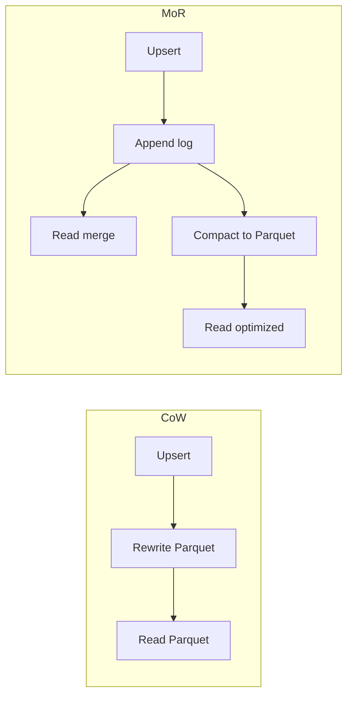

# Apache Hudi

9:03 AM. A support ticket: order 8831 shows `PENDING` in the product dashboard but Postgres has said `PAID` for forty minutes. Same lake, same partition. You already ruled out Iceberg and Delta for this table months ago for a reason that's about to become obvious.

What's actually going on?

A. The CDC connector silently dropped an event.
B. Trino is reading a stale snapshot.
C. The row lives inside a 128 MB Parquet file next to 500,000 others, and nothing has rewritten that file since the status changed — "append-only" and "this row just changed" don't mix without something built for it.

It's C. `PENDING → PAID → SHIPPED → RETURNED` — the row in Postgres changed; a Parquet file on S3 did not, and a job can die mid-upsert leaving both readers and the question of **where is order_id 8831** unanswered. Iceberg and Delta Lake are excellent for append-heavy workloads and batch ETL, but a database CDC stream producing INSERT/UPDATE/DELETE, a GDPR account deletion, or a late-arriving correction to a three-day-old record are **mutation-heavy** workloads — they need efficient upserts and deletes, not just appends. Hudi was designed at Uber for exactly this: ingesting database CDC streams into a data lake efficiently.

---

## Start with the situation { #use-case }

**E-commerce CDC.** Debezium → Kafka → Spark/Flink Hudi upsert. Record key `order_id`. Downstream jobs **incrementally pull** only the last 15 minutes of changes into a search index or warehouse, instead of scanning 20 TB.

**SaaS analytics.** Tenant-level GDPR deletes. Hudi deletes by key, then compaction drops the rows.

**Observability.** Usually a poor Hudi fit: append-only logs want [Iceberg](iceberg.md) snapshots, not record keys.

Hudi's complexity is justified when **the primary key is real and updates are frequent**.

---

## Why the obvious approach breaks { #why-this-is-hard }

Updating 1 row in a 128 MB Parquet file means rewriting 128 MB (Copy-on-Write) or writing a small log and paying merge on read (Merge-on-Read). Do that 50,000 times a minute and you either melt write I/O or melt read CPU.

You also need:

- A **timeline** of instants so "what changed since T" is defined
- **File groups** so two updates to different keys do not rewrite the whole table
- **Precombine** so two versions of the same key in one batch collapse
- Compaction so MoR reads stay bounded

Without those, CDC-into-Parquet is "rewrite the day, pray."

---

## Build the mental picture { #intuition }

Hudi slices a partition into **file groups**. Each group has a base Parquet file and, in MoR, a tail of log files. A record key hashes to a group. Upserting order 8831 only touches **that group**.

```
Partition dt=2024-01-15
  File group 0: base_0.parquet + .log.1 + .log.2
  File group 1: base_1.parquet
  File group 2: base_2.parquet + .log.1
```

The **timeline** is the commit log: `commit`, `deltacommit`, `compaction`, `clean`, `rollback`. The table *is* the latest completed instant's view of all file groups.

---

## Internals: CoW vs MoR

Hudi supports two storage types with different read/write trade-offs.

### Copy-on-Write (CoW)

On every upsert, rewrite the affected Parquet files immediately.

```
File-001: [record A, record B, record C]
Upsert record B (new value) →
New File-001: [record A, record B_new, record C]
```

- **Writes**: more expensive (full file rewrite)
- **Reads**: fast (no merge needed, files are always clean)
- **Best for**: read-heavy workloads, infrequent updates

### Merge-on-Read (MoR)

Write updates to small delta files (log files). Merge on read.

```
File-001 (base): [record A, record B, record C]
Log file: [UPDATE record B → new value]

On read: merge base + log → [record A, record B_new, record C]
```

- **Writes**: fast (append to log file)
- **Reads**: slower (must merge base + log)
- **Best for**: write-heavy workloads, streaming ingestion

Periodically run compaction to merge log files into base files, improving read performance.

MoR actually exposes two query types: **read-optimized** (base files only, slightly stale) and **snapshot** (base+log, latest). Pick explicitly or you will debug "missing updates" that are sitting in logs.



---

## The Timeline

Hudi maintains a **timeline** of all actions on the table:

```
2024-01-15T10:00:00.000Z commit (writes records)
2024-01-15T10:05:00.000Z commit
2024-01-15T10:10:00.000Z compaction
2024-01-15T10:15:00.000Z commit
2024-01-15T10:20:00.000Z clean (removes old files)
```

The timeline allows:
- Incremental queries: "give me all changes since timestamp T"
- Point-in-time queries (like Iceberg's time travel)
- Compaction scheduling
- Rollback of a failed instant

Instants go `requested → inflight → completed`. A crash leaves inflight files; **rollback** restores the last completed instant. That is "where is the table" after mid-job failure: **the last completed instant**, not the prefix.

`clean` is Hudi's VACUUM: drop file versions older than the retention policy. Too aggressive: incremental consumers that lag cannot read old instants.

---

## File Groups, Record Keys, Precombine

Hudi needs to identify records for upsert:

- **Record key**: the primary key of each record (`hoodie.datasource.write.recordkey.field`)
- **Precombine field**: used to resolve conflicts when multiple versions of the same record exist in one batch (`hoodie.datasource.write.precombine.field` — usually a timestamp)
- **Partition path**: Hive-style or custom, e.g. `dt`

```python
hudi_options = {
    'hoodie.table.name': 'orders',
    'hoodie.datasource.write.recordkey.field': 'order_id',
    'hoodie.datasource.write.precombine.field': 'updated_at',
    'hoodie.datasource.write.operation': 'upsert',
    'hoodie.datasource.write.table.type': 'MERGE_ON_READ',
}

orders_df.write.format("hudi") \
    .options(**hudi_options) \
    .mode("append") \
    .save(table_path)
```

`mode("append")` here means "add an instant," not "blindly add files." The operation `upsert` tags records into file groups and writes new base or log files.

**Index** (simple, bloom, HBase, record-level) finds which file group holds a key. A wrong index on a huge table turns upserts into global scans.

Key design: composite keys (`order_id` + `line_id`) must be stable. Changing the key scheme is a new table.

---

## Incremental Processing

A key Hudi feature: incremental reads. Instead of reading the full table, read only changes since a specific commit.

```python
# Read only records changed since last commit
hudi_options = {
    'hoodie.datasource.query.type': 'incremental',
    'hoodie.datasource.read.begin.instanttime': '20240115100000',
}
changes = spark.read.format("hudi").options(**hudi_options).load(table_path)
```

This enables efficient downstream pipelines that only process what changed, not the full table.

SaaS metrics jobs: incremental pull → aggregate → merge into a metrics table. Observability: usually not needed (append Iceberg + query the hour). CDC into search: this is the feature you bought Hudi for.

Commit times are the cursor. Store the last instant in the downstream (or Airflow Variable / table), not `datetime.now()`.

---

## How: Spark CDC Upsert

```python
# Spark job submitted by Airflow, --date is the Kafka dump hour
cdc = spark.read.parquet(f"s3://cdc/orders/hr={hour}/")
# op = c|u|d from Debezium

cdc = cdc.withColumn("updated_at", col("ts_ms"))

cdc.write.format("hudi") \
    .options(**{
        **hudi_options,
        "hoodie.datasource.write.payload.class":
            "org.apache.hudi.common.model.DefaultHoodieRecordPayload",
    }) \
    .mode("append") \
    .save("s3://lake/orders")
```

Deletes: map Debezium `op=d` to Hudi delete operation or a payload that implements delete. Then **compaction + clean** so GDPR is physical.

Idempotency: re-reading the same hour upserts the same keys with the same `updated_at`; precombine keeps one row. That is why the precombine field must be monotonic per key, not ingest time (ingest time changes on retry).

---

## When to Use Hudi

- CDC ingestion from databases (inserts, updates, deletes)
- GDPR compliance requiring row-level deletes
- Streaming writes with frequent updates to existing records
- Need efficient incremental processing downstream

---

## When NOT to Use Hudi

- Append-only workloads (Iceberg or Delta are simpler)
- No need for row-level updates
- Team unfamiliar with CoW/MoR trade-offs

Hudi's operational complexity is higher than Iceberg or Delta for simple append workloads. Choose the simplest tool that solves the problem.

---

## Where teams get caught { #gotchas }

- **CoW on a hot CDC table** — write amplification explodes; switch MoR or you will page on Spark duration.
- **MoR without compaction** — snapshot reads become merge storms; RO views lie.
- **Wrong precombine** — old Kafka replay overwrites new state.
- **Changing record key** — duplicates, not an error.
- **Cleaning too fast** — incremental consumers fail with missing instants.
- **Small file groups** — too many groups: listing and indexing hurt. Tune max file size.
- **Airflow pandas upsert** — do not. Submit Spark.

!!! production-gotcha "Snapshot query vs read-optimized"
    Dashboards on `_ro` tables will not see the last 20 minutes of payments. Finance will. Document which view is which, or compact often enough that the gap is within SLO.

---

## Failure Modes

| Failure | Cause |
|---------|--------|
| Duplicate orders | No record key / append operation instead of upsert |
| Lost updates | Precombine on processing time; retry |
| Inflight forever | Writer crash; need rollback |
| Read timeout | Uncompacted logs |
| Incremental holes | Clean dropped instants still in use |
| Index rebuild from hell | Bloom index on huge random keys; consider a better index |

---

## How to investigate { #debugging }

- Inspect `.hoodie/` timeline files: which instant is inflight?
- `hoodie_metadata` / CLI `show commits`, `show filesize`.
- Compare record counts CoW-equivalent vs MoR snapshot vs RO.
- Spark UI: upsert clustering vs global sort.
- For a single `order_id`, find file group and dump base+log.

If Spark and Hive disagree, one is on RO and one is on snapshot.

---

## Scale: 10× / 100× / 1000×

| Scale | Hudi shape |
|-------|------------|
| **10×** | CoW, hourly Spark upsert, bloom index, compact weekly |
| **100×** | MoR streaming ingest, async compaction, incremental downstream |
| **1000×** | Metadata table enabled, partition-level parallelism, dedicated compaction cluster, careful clean vs consumer lag, possibly record-level index |

At 1000× CDC, many teams still pick **Flink + Iceberg equality deletes** or **Delta MERGE** — valid. Hudi wins when incremental pull and file-group upserts are the product requirement.

---

## Trade-offs

| Choice | Gain | Cost |
|--------|------|------|
| CoW | Fast reads | Slow writes |
| MoR | Fast writes | Merge CPU, two query modes |
| Incremental | Cheap downstream | Cursor ops, clean vs lag |
| Record keys | True upserts | Key design is forever |
| vs Iceberg | CDC tooling | Multi-engine / partition evolution weaker historically |

---

## Alternatives

- **Iceberg MERGE + Flink** — better engine mix, improving row-level deletes; incremental is snapshot-diff not first-class CDC feed.
- **Delta MERGE + CDF** — Spark/Databricks shops; Change Data Feed ≈ incremental.
- **Operational DB / search as the serving layer** — lake remains append-only; CDC goes to Elasticsearch. Valid split.
- **Warehouse MERGE** — cost.

See [comparison](comparison.md) for workload, not winners.

---

## How to Apply This at Work

1. Write down the record key and precombine field before choosing Hudi.
2. Measure update rate per partition. High → MoR.
3. Budget compaction as a production job (Airflow), not "we'll run it when reads are slow."
4. Treat `.hoodie` timeline like Kafka offsets: back it up, do not `rm`.
5. If you have no incremental consumer and few updates, you wanted Iceberg.

---

## Check your understanding { #exercise }

CoW table `orders`, record key `order_id`, precombine `ingested_at` (time the Spark job ran). Airflow retries a failed hour. Kafka dump for that hour is replayed. Meanwhile a later hour already wrote `SHIPPED`.

??? question "What is the row state after the retry, and which two Hudi knobs/fields fix it?"
    Think precombine and instants.

    ??? success "Answer"
        Retry upserts the old `PAID` row with a *newer* `ingested_at`, so precombine **wins the stale CDC** and the order goes backwards. Fixes: (1) precombine on source `updated_at` / Debezium `ts_ms`, never job time; (2) upsert remains idempotent for the same batch because `updated_at` is unchanged. Optional: operation `upsert` not `insert`; do not clean instants the retry still needs. CoW vs MoR does not save a wrong precombine.
