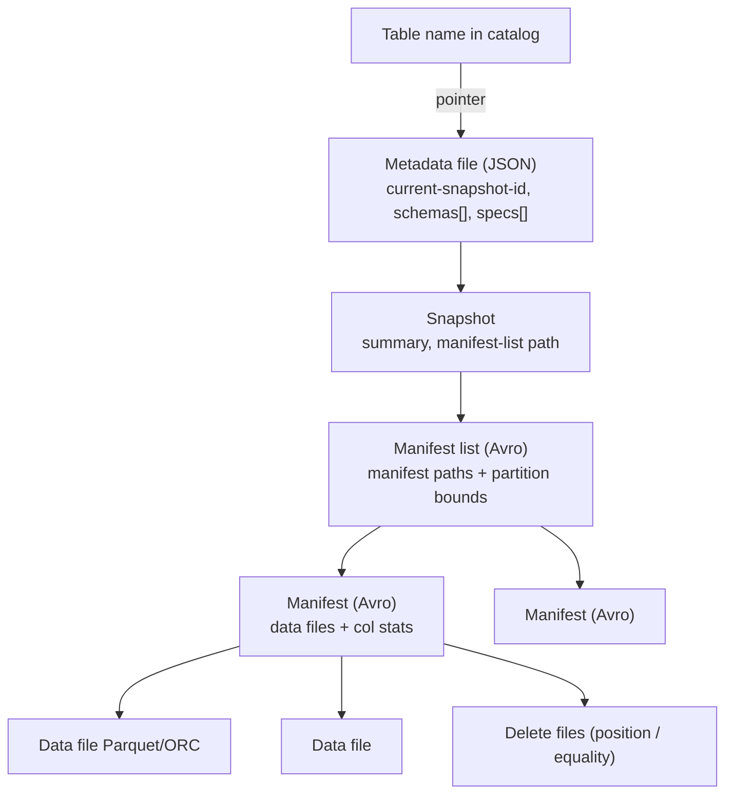

# Apache Iceberg

2:17 AM. Flink's CDC writer and the nightly Spark MERGE both try to commit to `lake.orders` in the same 90-second window. One succeeds. The other logs `CommitFailedException` and retries a few seconds later. Nobody loses data — but only because of one specific design decision upstream.

Which decision?

A. Iceberg locked the table for the duration of the Spark job.
B. The two engines simply happened not to touch the same files.
C. Iceberg used optimistic concurrency: the losing writer re-read the new metadata pointer and retried its commit against it.

Pick one.

It's C. Raw Parquet on S3 has concurrent readers (Trino), writers (Spark nightly, Flink CDC), updates, a schema change, a job that dies after 80 files — and no concept of "the table" to arbitrate any of it. Apache Iceberg adds a metadata layer that defines what the table is at any point in time, so multiple engines that would otherwise just see raw files with no transaction semantics can coordinate through it. **Where is the table?** Iceberg answers: *the current metadata file's current snapshot*, not the directory.

!!! note "This is SaaSCo at Stage 4"
    [SaaSCo: The Evolving Company](../architectures/saasco-evolution.md#stage-4-multiple-writers-collide-iceberg-appears-phase-6) hits exactly this wall once a second writer joins the nightly Spark job: raw Parquet has no atomic commit, and "where is the table?" stops having a good answer.

---

## Use Case

**SaaS analytics, multi-engine.** Spark writes events. Trino serves dashboards. Flink may append. No vendor lock to one engine's log format. Hidden partitioning on `ts` so analysts write `WHERE ts BETWEEN ...` and still prune files.

**E-commerce.** Daily `orders` snapshots plus occasional MERGE from CDC. Partition evolution from day to hour as volume grows — without rewriting 2019.

**Observability.** Append-heavy logs, compaction of tiny files, snapshot expiration so time travel is days not years.

If the workload is high-frequency upserts with incremental pull as a first-class consumer, also evaluate [Hudi](hudi.md). If the shop is Databricks-only, [Delta](delta.md) may be simpler. Iceberg is the default when **engines are plural**.

---

## Why This Is Hard

A table is millions of Parquet files, several schemas, two partition specs, and writers that crash. You need:

- metadata-driven planning with manifest- and file-level pruning, not `LIST` the bucket
- Schema change that does not rewrite 80 TB
- Partition change that does not rewrite 80 TB
- Isolation when Spark and Flink commit
- A way to undo a bad load (time travel) and then *forget* it (expire snapshots)

Iceberg's bet: **immutable metadata tree + atomic pointer swap.**

---

## Intuition

Think of Git. Data files are blobs. Manifests are trees. A snapshot is a commit. The metadata file is `HEAD`. Compaction is rewriting blobs and making a new commit that drops the old blob names. Time travel is `checkout`. Optimistic concurrency is "rebase and retry if `HEAD` moved."

Readers never `git pull` a half-commit. Unreferenced blobs are garbage (`expire_snapshots` + delete orphans).

---

## Internals: The Metadata Hierarchy

This tree **is** the table. Draw it until you can debug from it.



- **Table**: logical name, points to current metadata file
- **Metadata file**: defines current snapshot, schema, partition spec (and historical schemas/specs)
- **Snapshot**: a point-in-time view of the table; points to manifest list
- **Manifest list**: list of all manifest files in this snapshot, with partition stats for pruning
- **Manifest file**: list of data files, with per-file stats (min/max values per column)
- **Data files**: actual Parquet/ORC files
- **Delete files** (v2+): row-level deletes without rewriting the data file yet

Planning a `WHERE ts = '2024-01-15'` query:

1. Catalog → metadata file → snapshot.
2. Manifest list: skip manifests whose partition bounds miss the day.
3. Manifests: skip files whose min/max miss the predicate.
4. Open remaining Parquet.

That is hidden partitioning + file pruning. No `dt=` in the SQL required if `ts` is the source column.

New commits **add a metadata file** and CAS-update the catalog pointer. Old metadata files remain until expired. Data files are immutable; a MERGE writes new files and a snapshot that no longer lists the old ones.

---

## Snapshot Isolation

When a writer commits, it creates a new snapshot. The old snapshot remains valid.

```
Time →

Snapshot 1: [file-001, file-002, file-003]
         ↓ (write adds file-004, file-005)
Snapshot 2: [file-001, file-002, file-003, file-004, file-005]
```

Readers holding Snapshot 1 continue to see the consistent Snapshot 1 view. Readers that start after the commit see Snapshot 2.

If the write fails partway through, Snapshot 2 is never committed. Readers see only Snapshot 1. Partial writes are invisible.

---

## Time Travel

Because Iceberg retains historical snapshots, you can query past states:

```sql
-- Trino
SELECT count(*) FROM events
FOR TIMESTAMP AS OF TIMESTAMP '2024-01-15 10:00:00';

-- Trino, by snapshot ID
SELECT count(*) FROM events
FOR VERSION AS OF 8735625985;

-- Spark SQL
SELECT count(*) FROM events
TIMESTAMP AS OF '2024-01-15 10:00:00';

-- Spark SQL, by snapshot ID
SELECT count(*) FROM events
VERSION AS OF 8735625985;
```

**Use cases**:
- Debugging: "What did the table look like before that bad load?"
- Auditing: "What data did the report use last Monday?"
- Reproducible ML: pin training data to a specific snapshot

Snapshots are not free. Each one pins data files. **Expire** them.

```sql
CALL lake.system.expire_snapshots(
  table => 'events',
  older_than => TIMESTAMP '2024-01-01',
  retain_last => 10
)
```

---

## Schema Evolution

Iceberg handles schema evolution correctly:

```sql
-- Safe: adds a column, old files simply lack it (read as NULL)
ALTER TABLE events ADD COLUMN error_message STRING;

-- Safe: drop a column — old data still accessible via ID-based columns
ALTER TABLE events DROP COLUMN legacy_field;

-- Safe: rename a column
ALTER TABLE events RENAME COLUMN user_id TO customer_id;
```

Iceberg tracks columns by numeric ID, not by name. Renaming a column does not break existing files because the mapping from name → ID is maintained.

Incompatible type changes (string → int) are still rewrites or projections. "Schema evolution" is not "anything goes."

---

## Partition Evolution

One of Iceberg's most powerful features: change the partitioning scheme without rewriting existing data.

```sql
-- Table initially partitioned by day
CREATE TABLE events (ts TIMESTAMP, ...)
PARTITIONED BY (day(ts));

-- After data growth, switch to hourly partitioning
-- Old data stays day-partitioned; new data is hour-partitioned
ALTER TABLE events SET PARTITION SPEC (hour(ts));
```

Iceberg maintains partition metadata per file. A query filtering by hour will:
- Prune day-level partitions efficiently (can skip whole days)
- Use hour-level partitions on new data

Hive cannot do this: `dt=` is a directory convention. Iceberg stores the spec id on each manifest entry.

---

## Hidden Partitioning

Traditional Hive-style partitioning requires explicit partition columns:

```
s3://events/year=2024/month=01/day=15/file.parquet
```

Iceberg supports **hidden partitioning**: the partition is derived from a column, not stored as a separate directory (the physical layout may still nest, but SQL does not need a redundant `dt` column).

```sql
PARTITIONED BY (bucket(16, customer_id), day(ts))
```

Queries automatically benefit from partition pruning without needing partition predicates in SQL:

```sql
-- Iceberg automatically prunes based on day(ts) even though ts is not a partition column
SELECT * FROM events WHERE ts BETWEEN '2024-01-15' AND '2024-01-16';
```

Analysts stop writing `AND dt = '2024-01-15'` that disagrees with `ts`. That class of silent full-scan is gone.

---

## Compaction

Over time, many small files accumulate (from streaming ingestion, frequent writes). This degrades query performance.

Iceberg supports compaction to rewrite small files into larger ones:

```sql
-- Spark
CALL catalog.system.rewrite_data_files(
  table => 'events',
  strategy => 'binpack',
  options => map('target-file-size-bytes', '134217728')  -- 128 MB
);
```

`binpack` is size-based. `sort` / Z-order-like clustering improves min/max pruning for `tenant` filters. Compaction is a **new snapshot** that replaces many small files with fewer large ones. Readers on old snapshots still see the small files until expiration.

---

## Optimistic Concurrency

Multiple writers can attempt concurrent commits. Iceberg uses optimistic concurrency:

1. Writer reads current metadata
2. Writer makes changes, prepares new snapshot
3. Writer attempts to swap the metadata pointer atomically
4. If another writer committed in between, the transaction conflicts → retry

This works well for occasional concurrent writes. If you need high-frequency concurrent writes from many writers, consider a different approach (e.g., Hudi's merge-on-read) or a **single streaming writer** plus batch MERGE.

Commit retries re-plan against the new `HEAD`. Two MERGEs rewriting the same file set will retry more; two appends conflict less (Iceberg can merge snapshot changes depending on isolation).

---

## How: Spark + Iceberg (SaaS daily load)

```python
# spark-submit job, launched from Airflow — not pandas on the worker
from pyspark.sql import SparkSession

spark = SparkSession.builder \
    .config("spark.sql.catalog.lake", "org.apache.iceberg.spark.SparkCatalog") \
    .config("spark.sql.catalog.lake.type", "rest") \
    .getOrCreate()

ds = sys.argv[sys.argv.index("--date") + 1]

spark.sql(f"""
MERGE INTO lake.events t
USING (SELECT * FROM parquet.`s3://landed/dt={ds}`) s
ON t.event_id = s.event_id AND t.ts >= TIMESTAMP '{ds}' AND t.ts < TIMESTAMP '{ds}' + INTERVAL 1 DAY
WHEN MATCHED THEN UPDATE SET *
WHEN NOT MATCHED THEN INSERT *
""")

spark.sql(f"""
SELECT COUNT(*) FROM lake.events
WHERE ts >= TIMESTAMP '{ds}' AND ts < TIMESTAMP '{ds}' + INTERVAL 1 DAY
""").show()
```

Airflow: `SparkSubmitOperator` + validate count. Idempotency is the MERGE (or `INSERT OVERWRITE` of the day partition). See [Airflow idempotency](../airflow/idempotency.md).

---

## Gotchas

- **Forgetting snapshot expiration.** Storage and commit times grow without bound.
- **Orphan files.** Crashed jobs leak objects. `remove_orphan_files` with a *conservative* older_than so you do not delete a writer's in-flight files.
- **Compaction vs streaming.** Compacting the hot partition while Flink writes increases conflicts. Compact older partitions.
- **Equality deletes** piling up: reads merge many delete files. Compact deletes into data files.
- **Hive catalog + object-store eventually consistent CAS** — use a catalog with real atomic pointer updates (REST, JDBC, Nessie, Glue with the right contract).
- **`write.distribution-mode=none`** on huge MERGE: tiny files, then you pay compaction forever.

!!! production-gotcha "expire_snapshots then VACUUM-by-hand"
    Expire only drops metadata references. Schedule orphan deletion separately, with delay. Hand-deleting "old" Parquet is how you brick time travel and live readers.

---

## Failure Modes

| Failure | What you see |
|---------|----------------|
| Commit conflict storm | Streaming + batch MERGE same partition |
| Query scans 50k files | No compaction, bad spec |
| Wrong NULLs after rename | Engine reading by name (not Iceberg) |
| Trino ≠ Spark counts | Different catalogs or `as-of` |
| Sudden S3 bill | Snapshots pinning files; failed jobs' orphans |
| Planning takes minutes | Manifest explosion; need metadata compaction (`rewrite_manifests`) |

---

## Debugging

```sql
SELECT * FROM lake.events.snapshots ORDER BY committed_at DESC LIMIT 20;
SELECT * FROM lake.events.files LIMIT 20;
SELECT * FROM lake.events.manifests;
SELECT * FROM lake.events.history;
```

Compare `added_data_files` / `deleted_data_files` on the snapshot summary. If a "small" MERGE rewrote 8,000 files, the ON clause is not partition-pruned — fix predicates to include the partition transform (`ts` range).

Spark UI is secondary. **Snapshot summary is primary.**

---

## Scale: 10× / 100× / 1000×

| Scale | Iceberg practice |
|-------|------------------|
| **10×** | One Spark writer, nightly `rewrite_data_files`, retain 7 days of snapshots |
| **100×** | REST catalog, hidden partitions, partition evolution, separate compact jobs, Flink append |
| **1000×** | Manifest rewriting, partition-level compaction, single-writer per hot table or MoR-style deletes, catalog HA, metrics on files-per-partition |

At 1000×, metadata JSON is not the bottleneck — **millions of file entries** are. That is why the tree has manifest lists, not a flat file list like early Delta JSON (Delta later added checkpoints for the same reason).

---

## Trade-offs

| Strength | Cost |
|----------|------|
| Multi-engine | Catalog + version alignment |
| Hidden / evolved partitions | Ops must understand specs |
| Optimistic concurrency | Not a row store; CDC may prefer Hudi MoR |
| Time travel | Storage until expire |
| Open spec | You run compaction |

---

## Alternatives

- **Delta Lake** — stronger Databricks/Spark DX; weaker historical multi-engine story (improving). No hidden partition transforms in the Iceberg sense.
- **Hudi** — better incremental-pull / upsert tooling for CDC; CoW/MoR ops burden.
- **Warehouse** — less metadata ops, more $ and lock-in.
- **Raw Parquet** — [why formats exist](why-table-formats.md).

Do not pick Iceberg because it "won the internet." Pick it because Trino + Spark + Flink must share a snapshot.

---

## How to Apply This at Work

When adopting Iceberg:

1. Configure snapshot expiration — keep N snapshots to limit storage cost
2. Run compaction regularly (weekly or daily for high-write tables)
3. Enable partition evolution as data volume grows
4. Use `FOR VERSION AS OF` for debugging data quality issues
5. Monitor orphan file accumulation (files not referenced by any snapshot)
6. Point **all** engines at one catalog
7. Put MERGE/compaction in Spark jobs scheduled by Airflow, not in workers

---

## Exercise

Table `events` partitioned by `day(ts)`. Flink appends 2 MB files every minute. A daily Spark MERGE for late data rewrites the last three days. Trino p95 jumps from 2s to 40s. Snapshot count is 20,000.

??? question "Name the metadata-tree symptoms (files, manifests, snapshots) and the three maintenance actions, in order, that restore Trino without blocking Flink on today's partition."
    Use the hierarchy.

    ??? success "Answer"
        Symptoms: tens of thousands of tiny **data files** in recent day partitions; **manifests** bloated; **snapshots** pin old small files so even "compacted" tables stay large on disk. Actions: (1) `expire_snapshots` retaining a short window so old small files can die. (2) `rewrite_data_files` **on partitions older than a few hours**, not the minute Flink is writing — avoids commit conflicts. (3) `rewrite_manifests` so planning stops reading thousands of manifest files. Optional: raise Flink file size / roll interval. Do not `s3 rm` small files by hand.
