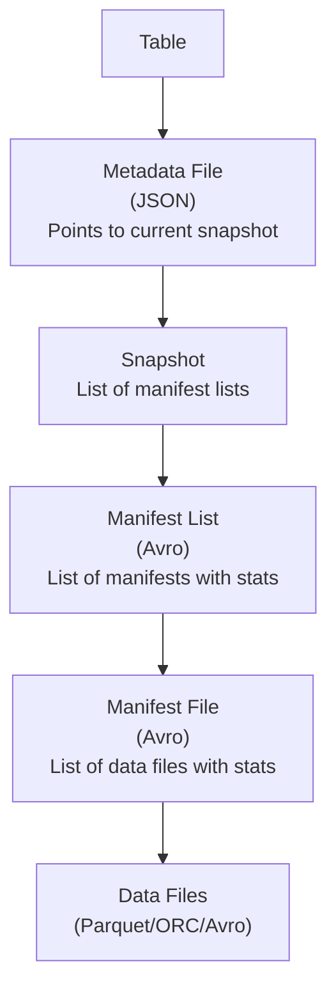

# Apache Iceberg

## The Problem

Raw Parquet files on object storage have no concept of "the table." Multiple engines (Spark, Trino, Flink) cannot coordinate — they each see the raw files and have no transaction semantics.

Apache Iceberg adds a metadata layer that defines what the table is at any point in time.

---

## The Metadata Hierarchy



- **Table**: logical name, points to current metadata file
- **Metadata file**: defines current snapshot, schema, partition spec
- **Snapshot**: a point-in-time view of the table; points to manifest list
- **Manifest list**: list of all manifest files in this snapshot, with partition stats for pruning
- **Manifest file**: list of data files, with per-file stats (min/max values per column)
- **Data files**: actual Parquet/ORC files

---

## Snapshot Isolation

When a writer commits, it creates a new snapshot. The old snapshot remains valid.

```
Time →

Snapshot 1: [file-001, file-002, file-003]
         ↓ (write adds file-004, file-005)
Snapshot 2: [file-001, file-002, file-003, file-004, file-005]
```

Readers holding Snapshot 1 continue to see the consistent Snapshot 1 view. Readers that start after the commit see Snapshot 2.

If the write fails partway through, Snapshot 2 is never committed. Readers see only Snapshot 1. Partial writes are invisible.

---

## Time Travel

Because Iceberg retains historical snapshots, you can query past states:

```sql
-- Trino / Spark SQL
SELECT count(*) FROM events
FOR SYSTEM_TIME AS OF TIMESTAMP '2024-01-15 10:00:00';

-- Or by snapshot ID
SELECT count(*) FROM events
FOR VERSION AS OF 8735625985;
```

**Use cases**:
- Debugging: "What did the table look like before that bad load?"
- Auditing: "What data did the report use last Monday?"
- Reproducible ML: pin training data to a specific snapshot

---

## Schema Evolution

Iceberg handles schema evolution correctly:

```sql
-- Safe: adds a column, old files simply lack it (read as NULL)
ALTER TABLE events ADD COLUMN error_message STRING;

-- Safe: drop a column — old data still accessible via ID-based columns
ALTER TABLE events DROP COLUMN legacy_field;

-- Safe: rename a column
ALTER TABLE events RENAME COLUMN user_id TO customer_id;
```

Iceberg tracks columns by numeric ID, not by name. Renaming a column does not break existing files because the mapping from name → ID is maintained.

---

## Partition Evolution

One of Iceberg's most powerful features: change the partitioning scheme without rewriting existing data.

```sql
-- Table initially partitioned by day
CREATE TABLE events (ts TIMESTAMP, ...)
PARTITIONED BY (day(ts));

-- After data growth, switch to hourly partitioning
-- Old data stays day-partitioned; new data is hour-partitioned
ALTER TABLE events SET PARTITION SPEC (hour(ts));
```

Iceberg maintains partition metadata per file. A query filtering by hour will:
- Prune day-level partitions efficiently (can skip whole days)
- Use hour-level partitions on new data

---

## Hidden Partitioning

Traditional Hive-style partitioning requires explicit partition columns:

```
s3://events/year=2024/month=01/day=15/file.parquet
```

Iceberg supports **hidden partitioning**: the partition is derived from a column, not stored as a separate directory.

```sql
PARTITIONED BY (bucket(16, customer_id), day(ts))
```

Queries automatically benefit from partition pruning without needing partition predicates in SQL:

```sql
-- Iceberg automatically prunes based on day(ts) even though ts is not a partition column
SELECT * FROM events WHERE ts BETWEEN '2024-01-15' AND '2024-01-16';
```

---

## Compaction

Over time, many small files accumulate (from streaming ingestion, frequent writes). This degrades query performance.

Iceberg supports compaction to rewrite small files into larger ones:

```sql
-- Spark
CALL catalog.system.rewrite_data_files(
  table => 'events',
  strategy => 'binpack',
  options => map('target-file-size-bytes', '134217728')  -- 128 MB
);
```

---

## Optimistic Concurrency

Multiple writers can attempt concurrent commits. Iceberg uses optimistic concurrency:

1. Writer reads current metadata
2. Writer makes changes, prepares new snapshot
3. Writer attempts to swap the metadata pointer atomically
4. If another writer committed in between, the transaction conflicts → retry

This works well for occasional concurrent writes. If you need high-frequency concurrent writes from many writers, consider a different approach (e.g., Hudi's merge-on-read).

---

## How to Apply This at Work

When adopting Iceberg:

1. Configure snapshot expiration — keep N snapshots to limit storage cost
2. Run compaction regularly (weekly or daily for high-write tables)
3. Enable partition evolution as data volume grows
4. Use `FOR VERSION AS OF` for debugging data quality issues
5. Monitor orphan file accumulation (files not referenced by any snapshot)
