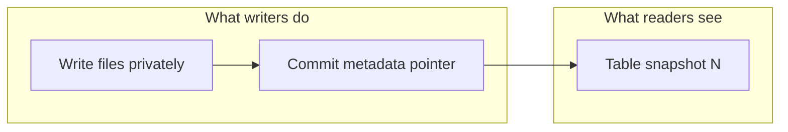

# Lakehouse

!!! info "Version and source policy"
    Format specifications, protocol features, and engine support evolve independently. Check [Versions & Primary Sources](../reference/version-matrix.md).

03:14 AM. Spark job status: `SUCCESS`. Files written: 13,429. Trino query for yesterday's revenue: **₹0**. You check S3 — the files are all there, sitting in the prefix.

What happened?

A. Trino's result cache is serving a stale answer.
B. The commit that should have published those 13,429 files never happened — they landed on S3, but nothing ever named them "the table."
C. A schema mismatch is silently dropping every row.

Pick one before reading on.

It's B. Concurrent readers, writers, updates, a schema change, a job that dies after writing half the files — none of it matters until you can answer **where is the table?** with a pointer, not a directory listing. Until then you do not have a table. You have a pile of files. That question is the lakehouse. Not "warehouse vs lake marketing." A **table format** — Iceberg, Hudi, Delta — is the metadata layer that names which files are the table *right now*, after a crash, during a write, and as of last Tuesday.

---

## Running Systems

**SaaS analytics.** Events land as Parquet every five minutes. Trino serves the product dashboard. Spark computes daily metrics. A job fails at 10:07. Dashboards must not see half of 10:00–10:05.

**E-commerce CDC.** Orders change status twenty times. Postgres is the OLTP source. The lake must upsert, delete for GDPR, and still let Spark scan yesterday in seconds.

**Observability.** High-ingest logs, mostly append, aggressive compaction, time-bounded queries. Writers never stop; readers need a consistent hour.

Warehouse-only (Snowflake/BigQuery) hides this behind a proprietary catalog. The lakehouse bet is: **object storage + open table format + multiple engines**.

---

## The Evolution of Data Storage

**Data Warehouse** (traditional): structured, governed, expensive, fast for analytics.

**Data Lake** (raw storage): cheap, flexible, any format — but no reliability guarantees, no transactions, schema chaos.

**Lakehouse**: bring warehouse-quality reliability and governance to data lake infrastructure. Cheap object storage. Open formats. ACID transactions. Multiple engines.

The warehouse did not become cheap object storage. The lake grew a transaction log.

If the commit never happens, the files are garbage (orphans), not "the table."

---

## What This Module Covers

| Topic | What You Will Learn |
|-------|-------------------|
| [Why Table Formats Exist](why-table-formats.md) | The problems raw Parquet cannot solve |
| [Apache Iceberg](iceberg.md) | Metadata hierarchy, time travel, partition evolution |
| [Apache Hudi](hudi.md) | CDC, upserts, CoW vs MoR |
| [Delta Lake](delta.md) | Transaction log, checkpoints, Spark integration |
| [Choosing a Format](comparison.md) | Workload-based decision guide |

There is no "best format." [Comparison](comparison.md) is choose-by-workload: append vs CDC vs streaming vs multi-engine.

---

## The Core Value Proposition

With a table format, your data lake gains:

- **Snapshot isolation**: readers see a consistent view while writers are writing
- **Schema enforcement**: you cannot accidentally write the wrong schema
- **Time travel**: `SELECT * FROM events AS OF '2024-01-15'`
- **Efficient updates**: update or delete specific records without rewriting entire partitions
- **Partition pruning**: the format knows exactly which files contain which data

These properties were previously available only in data warehouses. Lakehouses bring them to open-format, multi-engine architectures.

---

## Intuition: The Pointer Is the Table

Hive said "the table is every file under this prefix." That definition cannot:

- hide `part-007` from a crashed job
- rename a column without breaking readers
- change daily partitions to hourly without rewriting history
- let Trino and Spark agree mid-write

Table formats add an **authoritative snapshot**: a small metadata object that lists the data files (and column stats) that constitute version N. Commit = atomically publish N+1.

Iceberg: metadata JSON → snapshot → manifest list → manifests → Parquet.  
Delta: `_delta_log/*.json` (+ checkpoints).  
Hudi: a **timeline** of instants plus file groups.

Different layouts, same idea: **do not trust the directory**.

---

## Engines vs Storage

Spark, Trino, Flink, and [Airflow](../airflow/index.md) are not the table. They **read and write** the table.

| Engine | Typical role on a lakehouse |
|--------|-----------------------------|
| Spark | Batch ETL, compaction, MERGE |
| Flink | Streaming upserts, CDC |
| Trino | Ad-hoc and BI on snapshots |
| Airflow | Schedule compaction, expire snapshots, *not* pandas-scan 1 TB |

If Airflow workers loop Parquet rows, you skipped both Spark *and* the table format.

---

## Workload Sketch

| Workload | Pain on raw Parquet | Format feature you actually need |
|----------|---------------------|----------------------------------|
| SaaS append events | Mid-job files visible | Atomic snapshot |
| E-commerce CDC | Update-in-place impossible | MERGE / upsert / MoR |
| Observability | Millions of tiny files | Compaction + stats |
| GDPR delete | Rewrite the prefix | Position deletes / DVs / log files |
| Multi-engine BI | Each engine lists S3 differently | Open spec + catalog |

Details: [Iceberg](iceberg.md), [Hudi](hudi.md), [Delta](delta.md).

---

## What Still Hurts

Table formats are not warehouses. You operate:

- **Compaction** (small files)
- **Snapshot expiration / VACUUM** (storage and time-travel window)
- **Catalog** (Hive REST, Nessie, Glue, Unity) so engines find the current metadata pointer
- **Concurrency** (optimistic retry vs writer scaling)
- **Orphan files** after crashed jobs

Skip maintenance and you have Hive with extra JSON.

---

## Catalog vs Format vs Engine

Three names get collapsed in slideware. Keep them separate.

| Layer | Job | Failure if confused |
|-------|-----|---------------------|
| **Engine** | Spark / Trino / Flink execute jobs | "Iceberg is slow" when the join is a shuffle |
| **Format** | Which files are version N | Listing S3 as the source of truth |
| **Catalog** | `db.table` → metadata location | Spark and Trino on different Glue DBs |

A correct Iceberg table on a split-brain catalog is two tables. Fix the pointer, not the Parquet.

Airflow belongs *next to* this stack: schedule compaction, expire snapshots, run quality counts. It must not be the engine that reads 1 TB. See [Airflow](../airflow/index.md).

---

## A Day in a Running Lakehouse

**02:00** Spark daily MERGE for SaaS metrics commits snapshot 4412.  
**02:08** Airflow validate task reads `COUNT(*)` for `ds` via Spark SQL, not pandas.  
**02:10** Trino dashboards already see 4412; a still-running ad-hoc query stays on 4411.  
**09:00** Compaction rewrites yesterday's 4,000 tiny files into 30; snapshot 4418.  
**09:30** Expire snapshots older than 7 days; orphan deletion with a 2-day delay.  
**12:00** Flink CDC writer conflicts once, retries, commits 4420.

If any of those steps "lists the bucket to see if the job worked," the design has regressed to a prefix.

---

## How to Apply This at Work

When someone says "it's just Parquet on S3":

1. Who publishes the list of files a reader may see?
2. What happens if the Spark job dies at 90%?
3. How do we rename `user_id` without rewriting 80 TB?
4. How does a GDPR delete finish this week?
5. Can Trino and Spark commit in the same table?

If (1) is "list the prefix," you are not in production yet. Start at [why table formats](why-table-formats.md).

---

## Exercise

A Spark job writes `s3://events/dt=2024-01-15/part-{000-199}`. It dies after 80 files. A Trino query for that day returns partial counts. A retry appends `part-{000-199}` again.

??? question "What is 'the table' in this design, and what two properties of a lakehouse commit would have prevented both the partial read and the duplicate files?"
    Directory listing vs snapshot.

    ??? success "Answer"
        The table is "whatever objects match the prefix" — there is no table. A lakehouse commit would (1) **atomically add only complete files to a new snapshot**, so Trino reading the current snapshot never sees the 80 orphans, and (2) **replace or MERGE the day's files in one snapshot** so retry does not double objects. Orphans can be deleted later by maintenance; they are not readable as data.
