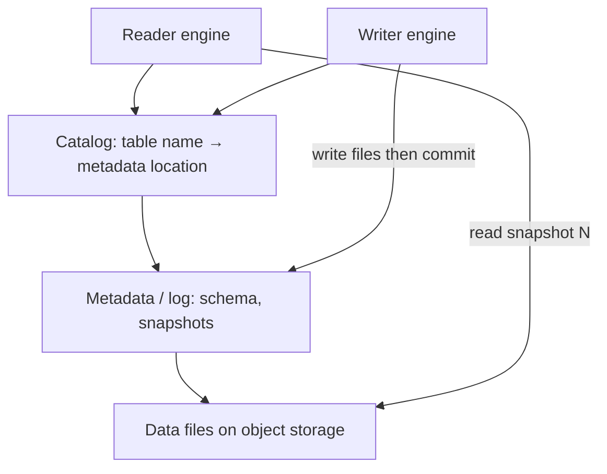

# Why Table Formats Exist

11:40 PM. A retried Spark job just doubled the row count in `s3://orders/dt=2024-01-15/`. The retry itself is idempotent at the application level — it computes the same rows every time. Support opens a ticket: why are there two rows per order?

Which is it?

A. The retry re-ran with different partition boundaries.
B. Kafka redelivered the same batch to a downstream consumer.
C. There is no atomic commit for this directory — the retry just added a second set of files next to the first attempt's, and nothing ever named which files were "the table."

Sit with an answer before reading on.

It's C, and it is the same root cause behind every failure mode on this page: concurrent readers, writers, updates, a schema change, a job that dies mid-write. Ask **where is the table?** and if the answer is "the prefix `s3://events/`," you cannot name a consistent snapshot, you cannot hide the crashed job's files, and you cannot tell Spark and Trino they are talking about the same thing. Table formats exist because **object storage lists files; it does not run transactions.**

---

## Start with the situation { #use-case }

**SaaS analytics.** Five-minute micro-batches of events. Product analytics on Trino. Nightly Spark jobs. Partial hours must never appear in dashboards.

**E-commerce CDC.** `UPDATE orders SET status='SHIPPED'`. The lake is not a database; a "row" lives inside a 128 MB Parquet file next to 500,000 other rows. You still have to change that row.

**Observability.** Writers always on. Compaction must rewrite small files without blocking queries for the last 15 minutes.

Hive-style "every file in the partition directory" fails all three at once.

---

## Why the obvious approach breaks { #why-this-is-hard }

Imagine your data lake looks like this:

```
s3://events/
    part-001.parquet   (written by Spark job at 9 AM)
    part-002.parquet   (written by Spark job at 9 AM)
    part-003.parquet   (written by Spark job at 10 AM)
    part-004.parquet   (written by Spark job at 10 AM)
```

This seems fine. But now consider concurrent operations:

- **Readers** querying the table while writers append new files
- **Writers** attempting to update a record (update which file? rewrite it? what if another reader is mid-scan?)
- **Schema changes**: a field is renamed — which files have the old schema, which have the new?
- **Failed jobs**: a job wrote part-005 and part-006 then crashed — those files are partial results
- **Deletion requests** (GDPR): remove all records for user X — scan all files? rewrite all of them?

**Where is the table?** There is no single definition of "what the table looks like right now." There is only a pile of files.

Object storage makes it harder: no `rename` of directories that is atomic across keys, eventually consistent listings on some stores, no row locks. You cannot "LOCK TABLE" on S3.

---

## Build the mental picture { #intuition }

A table is a **named snapshot of files**, not a folder.

```
Table events @ snapshot 42  →  {file-a, file-b, file-c}
Writer adds file-d, file-e  →  still snapshot 42 for readers
Commit                      →  snapshot 43 → {a,b,c,d,e}
Crash before commit         →  snapshot 42; d,e are orphans
```

Readers pin a snapshot. Writers only publish by swinging a pointer (single-object overwrite, catalog CAS, or log commit). That is ACID isolation for a lake: **snapshot isolation**, not serializable row locks.

Hive Metastore stored partition *locations*. It did not store the *file set* with stats and a schema-by-id. Listing S3 was the source of truth. Table formats invert that: **metadata is the source of truth; S3 is the payload.**

---

## Internals: What the Metadata Layer Must Store

A usable table format records:

1. **Schema** with stable column IDs (so rename ≠ rewrite).
2. **Partition spec** (and history of specs — evolution).
3. **Current snapshot / version** and a log of previous ones (time travel).
4. **File list** with size, row count, min/max column stats (skip files).
5. **Delete artifacts** (position deletes, deletion vectors, log records) if updates exist.
6. **A commit protocol** two writers can race without corrupting the pointer.



The **catalog** (Glue, Hive REST, Nessie, Unity, JDBC) holds the pointer. The **format** defines the files behind the pointer. Mixing catalogs is an operational problem; mixing formats in one table is not a thing.

---

## What Table Formats Add

A table format provides:

1. **A transactional metadata layer** — an authoritative definition of which files constitute the table at a given point in time
2. **ACID semantics** — readers see a consistent snapshot; partial writes are invisible
3. **Schema evolution** — the format tracks schema changes over time
4. **Partition evolution** — the partitioning scheme can change without rewriting all data
5. **Time travel** — query the table as it existed at any past point
6. **Compaction/maintenance** — merge small files, remove deleted data

Without (1)–(2) you cannot run concurrent Spark and Trino. Without (3) analytics teams fork tables. Without (6) streaming ingest dies of small files.

---

## The Hive Answer (Incomplete)

```
s3://events/dt=2024-01-15/part-000.parquet
```

Hive partitions *prune directories*. That helps. It does not:

- hide in-progress writes (unless you use a staging dir and a *non-atomic* rename)
- support two partition schemes at once
- encode column renames
- give file-level min/max without opening footers on every file (and even then, not transactionally)

`_SUCCESS` files are a convention, not isolation. A reader that ignores `_SUCCESS` is correct Hive behaviour.

---

## How: From Prefix to Table (Spark + Iceberg example)

```python
# Before: directory is the table
spark.read.parquet("s3://events/dt=2024-01-15/")

# After: snapshot is the table
spark.sql("""
CREATE TABLE lake.events (
  ts TIMESTAMP, tenant STRING, user_id STRING, event STRING
) USING iceberg
PARTITIONED BY (days(ts))
LOCATION 's3://events/'
""")

df.writeTo("lake.events").append()
# crash here: uncommitted files are not in the snapshot

spark.sql("SELECT COUNT(*) FROM lake.events")  # current snapshot
spark.sql("""
  SELECT COUNT(*) FROM lake.events
  TIMESTAMP AS OF '2024-01-15 10:00:00'
""")
```

SQL-shaped Delta and Hudi look similar; the log layout differs. See [Iceberg](iceberg.md), [Delta](delta.md), [Hudi](hudi.md).

---

## Concurrent Readers and Writers

Snapshot isolation:

| T | Writer | Reader A (started early) | Reader B (started late) |
|---|--------|--------------------------|-------------------------|
| 0 | Snapshot 5 current | | |
| 1 | Writes files | Reads snapshot 5 | |
| 2 | Commit snapshot 6 | Still 5 | Reads 6 |
| 3 | Crash on next job | 5 or 6, never half | 6 |

No reader sees a file not in its snapshot. This is the property raw Parquet cannot name.

Writers still **conflict** if they rewrite the same files (CoW upserts) or the same metadata pointer. Optimistic concurrency: retry the commit. High-frequency CDC may need MoR (Hudi) or a single-writer stream (Flink).

---

## Updates, Deletes, Schema Change, Mid-Job Failure

**Updates.** Rewrite the Parquet file (Copy-on-Write) or record a delta (Merge-on-Read / deletion vectors). The snapshot lists base files + delete files.

**GDPR.** Position delete or DV: "file-a, row 15 is gone." Readers merge deletes. Compaction later drops the row physically so `VACUUM` can reclaim.

**Schema change.** Add column: old files lack it → NULL by ID. Rename: change name→ID map, do not rewrite. Hive-by-name: rename looks like drop+add and silently NULL-fills.

**Mid-job failure.** Files on S3 are not in the snapshot. Schedule orphan cleanup. Do not `ls` the prefix to "fix" the table.

---

## Where teams get caught { #gotchas }

- **Listing S3 in jobs** "to find new files" fights the format. Use snapshots or CDC feeds.
- **Two writers, append mode, no retry** — lost updates on the pointer.
- **Time travel forever** — storage grows with every snapshot's unreferenced files until expiration/VACUUM.
- **Small files** — 10,000 × 2 MB Parquet: the metadata is correct and queries still die. Compaction is part of the format's *contract with ops*.
- **Catalog outage** — data files are intact; nobody can find the pointer. Back up the catalog.
- **Mixing engines with different format versions** — old Trino cannot read new deletion vectors.

!!! production-gotcha "Deleting 'extra' Parquet with aws s3 rm"
    Ops sees files not in the latest snapshot and purges them. A long-running reader still on snapshot N−3 fails. Time travel breaks. Only expire snapshots, then remove files the format says are dead.

---

## Failure Modes

| Failure | Raw prefix | Table format |
|---------|------------|--------------|
| Job crash at 90% | Readers see 90% | Readers see last commit |
| Two overwrites | Last listing wins, torn | One commit wins, other retries |
| Rename column | Wrong data | ID-stable schema |
| GDPR | Rewrite prefix | Deletes + compaction |
| Engine mix | Each lists differently | Shared snapshot |

Debugging starts at **current snapshot id**, not at S3 console.

---

## How to investigate { #debugging }

1. Print current snapshot/version (`SHOW SNAPSHOTS` / `DESCRIBE HISTORY`).
2. Diff file lists between N and N+1: adds/removes.
3. Look for jobs that write to the *path* instead of the *table*.
4. Check catalog pointer vs metadata file the engine loaded.
5. Metrics: number of files per partition, average file size, snapshot count, orphan count.

If Trino and Spark disagree, they are not on the same catalog or the same format version.

**SaaS analytics:** compare dashboard counts to the snapshot committed at 02:05, not to `aws s3 ls`.  
**E-commerce CDC:** a duplicate `order_id` is a missing MERGE/upsert, not "Spark ran twice" — though retries without idempotent commits cause both.  
**Observability:** p95 creep with flat row count is small files; the format is doing isolation correctly and still needs compaction.

```text
current snapshot / version
  → added files, removed files
    → min/max stats vs your predicate
      → only then open Parquet
```

---

## Catalog Failures Are Table Failures

The format can be perfect and production still down:

- Glue eventual consistency on the pointer (rare, ugly)
- Two catalogs registered for one S3 prefix
- Permissions: Spark can write metadata, Trino cannot read it
- Rest catalog outage: engines fail open or stale depending on cache

Treat catalog HA like metadata-DB HA in [Airflow](../airflow/index.md): it is on the commit path.

---

## Scale: 10× / 100× / 1000×

| Scale | Prefix-as-table | With a format |
|-------|-----------------|---------------|
| **10×** (TB, batch) | Painful but heroic jobs work | Snapshot + nightly compaction |
| **100×** (10–100 TB, mixed engines) | Concurrent read/write corruption | Catalog + file stats + partition evolution |
| **1000×** (PB, CDC + streaming) | Not a system | Maintenance SLOs, MoR/DVs, expire snapshots, dedicated compactors |

At 1000× the metadata itself can be large (millions of files). Manifest lists, Delta checkpoints, Hudi timeline archival exist because **the file list is a dataset**.

---

## Trade-offs

| Approach | Gain | Cost |
|----------|------|------|
| Raw Parquet | Simple, any tool that reads Parquet | No table |
| Hive partitions | Pruning | No atomic file set |
| Warehouse load | Ops hidden | Cost, lock-in, extra copy |
| Lakehouse format | Open ACID on S3 | You run compaction and catalogs |

You give up "just files" for "a log you must maintain." That is the correct trade for more than one writer or engine.

Single-writer, single-engine, append-only, and you still delete by prefix on failure: you do not yet need a format. The second writer, the second engine, or the first GDPR delete is the trigger. Most teams already have all three and have not noticed.

---

## Alternatives

- **Load everything into a warehouse** — valid; not a lakehouse. Dual-write cost.
- **Hudi vs Iceberg vs Delta** — all are table formats; choose by [workload](comparison.md), not by blog.
- **Transactional object stores / lake FS** — still need a table spec for schema and stats.
- **Database on EBS** — not 100 TB event history economics.

---

## The Three Formats

All three major table formats solve the same problem with different trade-offs:

| Format | Primary Strength | Primary Use Case |
|--------|-----------------|-----------------|
| [Apache Iceberg](iceberg.md) | Engine-agnostic, partition evolution, strong consistency | Multi-engine lakehouse |
| [Apache Hudi](hudi.md) | CDC, upserts, incremental processing | CDC-heavy workloads, frequent updates |
| [Delta Lake](delta.md) | Spark integration, simplicity | Spark-centric workloads |

See the [detailed comparison](comparison.md) for workload-based guidance.

---

## How to Apply This at Work

Walk a production prefix with the team:

1. Can we name the current snapshot id?
2. What happens if we `aws s3 rm` a "tmp" part file?
3. Who compact and who expires snapshots?
4. Which engine is allowed to `MERGE`?
5. Is Airflow listing files or submitting a job that commits a table?

If (1) is blank, you are on raw Parquet. Do not add a second writer until a format is in place.

---

## Check your understanding { #exercise }

Two Spark jobs write to `s3://orders/`. Job A overwrites `dt=2024-01-15` (full day recompute). Job B streams CDC upserts into the same prefix as extra Parquet files. Trino lists the directory.

??? question "List three concrete corruptions this design allows, and which table-format property kills each one."
    Think isolation, identity, and commits.

    ??? success "Answer"
        1. **Partial/overlapping files**: Trino lists A's rewrite plus B's extras → double orders. Snapshot commit would expose either A's new file set *or* B's commit, not a directory union. 2. **Mid-rewrite read**: A deletes then writes; Trino sees a hole. Snapshot isolation keeps the previous file set until A's commit. 3. **CDC updates as extra files**: two rows for one `order_id`. Record-level MERGE/upsert (Hudi MoR, Iceberg MERGE, Delta MERGE) plus a primary key, not extra parts in a prefix. Bonus: schema drift in B's files vs A's — schema-on-commit rejects or evolves by column id.
