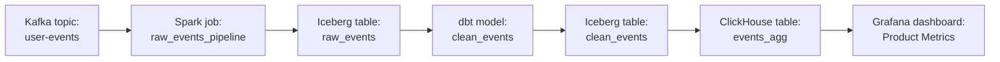

# Metadata & Data Catalogues

## Why Metadata Matters

A data platform with 10,000 tables and no catalogue is a data swamp. Engineers cannot find data, trust it, or understand where it came from.

Metadata answers:
- **What data exists?** (discovery)
- **What does it mean?** (semantic metadata)
- **Where did it come from?** (lineage)
- **Is it reliable?** (quality metadata)
- **Who owns it?** (governance)

---

## Types of Metadata

**Technical metadata**: schema, partitions, row counts, file locations, query statistics.

**Operational metadata**: pipeline run history, freshness timestamps, SLA compliance, job durations.

**Business metadata**: domain ownership, data definitions, sensitivity classification, PII flags.

---

## Data Lineage

Lineage tracks data from origin to consumption:

When a data quality issue is found in `Grafana`, lineage lets you trace backwards: `clean_events` → `raw_events` → Kafka → producer application. You can identify where the bug was introduced.

When a schema changes, lineage tells you which downstream tables, models, and dashboards are affected.

---

## Tools

**DataHub**: LinkedIn's open-source metadata platform. Strong lineage, extensive integrations, programmatic API.

**Apache Atlas**: Hadoop-ecosystem metadata (Hive, HDFS, HBase). Less modern UI but strong governance features.

**Amundsen**: Lyft's open-source data discovery tool. Strong search and documentation features.

**OpenLineage**: open standard for lineage capture. Integrates with Airflow, Spark, Flink, dbt.

---

## Practical Implementation

For a new data platform:

1. Instrument pipelines to emit lineage events (OpenLineage + Airflow/Spark integration)
2. Deploy a metadata catalogue (DataHub for most teams)
3. Define ownership: every dataset has an owner team
4. Classify PII columns in the schema registry
5. Set up automated freshness monitoring
