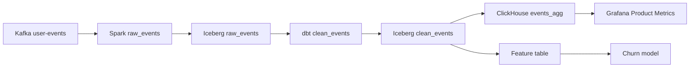

# Metadata & Data Catalogues

A platform with 10,000 tables and no operating model for metadata is a swamp with a search box. Tools (DataHub, OpenLineage, a schema registry) are **how you implement** the model. They are not the model.

Metadata answers operational questions on-call and in design review:

| Question | If you cannot answer |
|----------|----------------------|
| What exists? | Duplicate pipelines |
| What does it mean? | Metrics that disagree |
| Where did it come from? | 4-hour "root cause" |
| How fresh is it? | Dashboards that lie politely |
| Who owns it? | Pager to "data platform" |
| Is it PII? | GDPR as archaeology |

Related: [quality](../quality/index.md), [security](../security/index.md), [analytics platform](../architectures/analytics-platform.md), [selection framework](../reference/selection-framework.md).

---

## Operating model (before you buy a catalogue)

Write these policies in a short doc. If engineering will not sign them, DataHub will become a graveyard of auto-ingested tables.

1. **Every dataset has an owner** (a team, not a person who left). Unowned datasets are deprecated on a timer.
2. **Every dashboard metric has a definition** and a source table. Two "revenue" metrics must name their difference or merge.
3. **Freshness SLO** per tier: gold (product UI) vs bronze (experimental).
4. **PII tags** on columns; no tag = cannot leave the raw zone.
5. **Lineage is produced by pipelines**, not drawn in slides. OpenLineage or equivalent is a **release requirement** for gold jobs.
6. **Breaking schema changes** go through a registry with compatibility.

V1 of this model is a spreadsheet plus OpenLineage on five gold jobs. V2 is a catalogue. Do not reverse them.

---

## Types of metadata (and who writes them)

| Kind | Examples | Produced by | Consumed by |
|------|----------|-------------|-------------|
| **Technical** | Schema, partition spec, file counts, `ORDER BY`, Iceberg snapshot id | Engines, metastore | Optimisers, humans debugging scans |
| **Operational** | Last success, duration, rows out, lag, quality pass/fail | Airflow, Flink, Kafka, GE/dbt | On-call, SLO boards |
| **Business** | Owner, domain, metric definition, tenant visibility | Humans + PR review | Everyone |
| **Governance** | PII class, retention, residency, ACL | Security + owners | Masking, catalogues, legal |

Auto-harvest technical metadata. **Never** auto-harvest owners and metric definitions — you will get `owner=spark@internal`.

---

## Lineage as a pager tool

Lineage is not a pretty DAG for executives. It is:

- **Backward:** Grafana is wrong → which model → which table → which Kafka topic → which producer.
- **Forward:** schema change on `orders` → which CH tables, dbt models, ML features, and contracts break.



When `Grafana` shows a 20% drop, you do not grep six repos. You walk lineage and check **freshness and quality** at each hop.

OpenLineage is the **event standard** (job started/completed, inputs/outputs, run facets). Airflow, Spark, Flink, and dbt can emit it. The catalogue is the **database of those events**.

!!! tip "Lineage that lies"
    If a Spark job writes with a handwritten path and a JDBC job writes the same table, OpenLineage will show two parents or none. **Jobs must be the only writers.** Table formats help; discipline helps more.

---

## Ownership

| Rule | Practice |
|------|----------|
| Owner is a team Slack/on-call | Page them when gold freshness misses |
| Platform team owns **platform**, not `fct_orders` | Otherwise everything pages the same four people |
| Producer owns schema | Consumers do not "fix" JSON in twelve jobs |
| Deprecated means a date | Catalogue flag without a date is noise |

For [SaaS analytics](../architectures/analytics-platform.md), also tag **tenant visibility**: internal-only vs customer-exportable.

---

## PII and retention as metadata

Classification belongs **next to the column**, not in a wiki:

- `user_id` (identifier), `email` (direct), `ip` (quasi), `latency_ms` (not PII).
- Retention: raw 30 d, agg 2 y — must match [security](../security/index.md) TTL and Iceberg expire.
- Residency: `eu-west-1` only for `customer_id` in EU.

The catalogue should **block** a Trino join that projects `email` into a world-readable schema if policy says so. If the catalogue cannot enforce, it is documentation — still useful, not a control.

---

## Freshness

Freshness is an SLO, not a vibe.

```
gold.events_agg: max(timestamp) >= now() - 15 minutes
gold.fct_orders_daily: completed Airflow run for yesterday before 07:00
```

Emit this as operational metadata. Alert **per dataset**, not "Airflow is green" (a green DAG can write zeros). Tie to [quality](../quality/index.md).

Kafka lag, Flink checkpoint age, CH `max(ts)`, Iceberg snapshot time — different layers, one SLO: **the thing the user sees**.

---

## Tooling (implements the model)

| Tool | Role | Not a role |
|------|------|------------|
| **OpenLineage** | Standard run events | UI, ownership |
| **DataHub** | Catalogue, search, lineage UI, some governance | Magical quality |
| **Amundsen** | Discovery | Full lineage platform |
| **Atlas** | Hadoop-era governance | Greenfield default |
| **Schema registry** | Avro/Protobuf compatibility | Table docs |
| **Hive/Glue/Nessie** | Metastore for files | Business glossary |
| **Great Expectations / dbt** | Quality facets that should **attach** to catalogue | Replacement for owners |

Pick **one** catalogue. Instrument **OpenLineage** first on gold paths. A schema registry is mandatory if Kafka is in the path — it is metadata for **events**, not optional.

---

## V1 → V2 for metadata

**V1 (fewest parts)**

- Registry for Kafka schemas.
- `OWNERS.md` or CODEOWNERS for gold tables.
- OpenLineage → Marquez or DataHub from Airflow + one Spark job.
- Freshness check on the **one** dashboard that executives watch.

**Do not add yet:** custom scrapers for every database, ML on column descriptions, a second catalogue, a "data mesh portal" with no owners.

**Bottleneck:** people stop updating owners; lineage misses JDBC jobs.

**V2:** auto-ingest Iceberg/CH/Kafka, PII classifiers **with human confirm**, quality results as facets, access audit linked to dataset pages.

---

## Worked example: empty funnel, customer 42

[Analytics](../architectures/analytics-platform.md) UI: tenant `cust_0042` funnel is empty.

1. Catalogue: `events_agg` owner = growth-data, SLO 15 min, lineage from `clean_events` ← Kafka `user-events`.
2. Operational: last OpenLineage run **succeeded**, rows out **0** for that tenant — quality should have fired ([quality](../quality/index.md)).
3. Technical: schema registry shows producer added `endpoint_v2` and the Flink job dropped unknown events.
4. Forward lineage: model features also empty — warn ML.

Without metadata you SSH into Flink. With metadata you have a **hypothesis in five minutes**. Then you still verify with metrics.

---

## Failure modes of the catalogue itself

| Failure | Effect | Absorb |
|---------|--------|--------|
| Lineage incomplete | False confidence | Gold-path coverage SLO |
| Stale owners | Pages to `/dev/null` | Quarterly expire |
| PII untagged | Trino exfil | Default-deny on raw zone |
| 10k auto tables | Nobody searches | Hide non-gold |
| Catalogue down | Do not block ingest | Catalogue is not on the write path |

The catalogue **must not** be in the ingest critical path. It consumes events about jobs; it does not approve every insert.

---

## Contracts vs catalogues

A **data contract** (schema + SLO + owner + semantics) is the object you version in git. The catalogue **displays** current contracts and runtime facts. If the contract lives only in DataHub UI, it will drift.

Put contracts next to the producer (schema + tests). OpenLineage run events prove the contract at runtime.

---

## Apply this at work

1. List gold datasets (the ones that page someone). If the list has 400 entries, it is not gold.
2. Require owner + freshness + PII on gold before the next quarter.
3. Emit OpenLineage from the orchestrator you already have.
4. Put schema registry in front of Kafka producers.
5. Use lineage in the next incident write-up — if you could not, the model is incomplete.

Lab pairing: after [Kafka](../labs/index.md) and [ClickHouse](../labs/index.md), draw lineage for the lab tables by hand. That drawing is the contract; the tool comes later.

---

## Gold / silver / bronze (operating tiers)

| Tier | Meaning | Metadata required | Break-glass |
|------|---------|-------------------|-------------|
| **Gold** | Pages someone; exec or customer | Owner, SLO, lineage, PII, tests | Dual publish blocked on fail |
| **Silver** | Internal, used by gold | Owner, freshness, schema | Alert |
| **Bronze** | Experiments | Owner or auto-delete in 30 d | None |

If everything is gold, nothing is. Catalogue UX should **default to gold only**.

---

## Schema registry vs table catalogue

Kafka subjects are **event** contracts. Iceberg/Glue is **table** contracts. CH DDL is **serving** contracts. They must not drift independently:

- Producer adds field → registry.
- Spark writes new Iceberg column → table schema + OpenLineage.
- Flink MV into CH → CH column + docs.

A weekly job that diffs the three is more valuable than a second catalogue vendor. Name it in V2.

---

## Metric definitions

"Active users" will exist five times. The catalogue page for `gold.events_agg` should state:

- Grain (`user_id` per day per tenant)
- Filters (`status_code` not 4xx)
- Timezone
- Late-event policy

Until that paragraph exists, two Grafana panels will fight. This is business metadata. Engineers cannot scrape it from Spark.

---

## OpenLineage minimum viable emit

From Airflow: `inlets`/`outlets` or OpenLineage provider. From Spark: listener. From dbt: native. From Flink: improving — if missing, **document** the edge in the contract YAML so the catalogue is not silently wrong.

A gold job without lineage is **not gold**.

---

## Search quality

Engineers search `revenue`, `events`, `cust`. If bronze `tmp_events_joe_2021` ranks first, they will use it. Demote non-gold. Deprecate by **date**. Redirects: `fct_revenue` → `gold.fct_orders` page.

---

## Apply in the next incident

After you close an incident, add one catalogue field that would have shortened it (owner, SLO, parse-fail facet). If you only add a Grafana panel, the swamp grows.

---

## Runbook: "is this table safe to use?"

An engineer finds `events_v3`. Checklist:

1. Gold? If bronze, do not put in a customer tile.
2. Owner reachable?
3. Freshness last success < SLO?
4. Quality last run pass?
5. PII — can I SELECT this in a notebook?
6. Lineage — is the producer the one I think?
7. Timezone and grain documented?

If three answers are missing, do not use it. Create a ticket to the platform **only** if it was advertised as gold.

---

## OpenLineage facets worth having

- `schema` (fields actually written)
- `datasource` (Kafka topic, Iceberg table)
- `documentation` (link to contract)
- Quality assertion results
- Job `run.duration` and `rowCount`

Without row counts, lineage is a cartoon. With row counts, you debug "empty funnel" in the catalogue.

---

## Anti-patterns

- Scraping 10k Snowflake tables into DataHub with no owners (search pollution).
- Lineage from SQL parse only (misses Spark `write.parquet` paths).
- PII classifier auto-tagging `id` as non-PII and `country` as PII without review.
- Catalogue in the write path (ingest waits on DataHub).
- Two catalogues (DataHub + wiki + dbt docs) with three truths.

Pick one UI. dbt docs can **feed** it, not compete.

---

## V1 contract YAML (sketch)

```yaml
name: gold.events_agg
owner: growth-data
slo_freshness: 15m
pii: [user_id]
grain: customer_id, endpoint, minute
source: kafka:user-events
consumers: [grafana:product, ch:tiles_1m]
```

Five gold files like this beat an empty DataHub. Tooling comes after the files exist in git.
