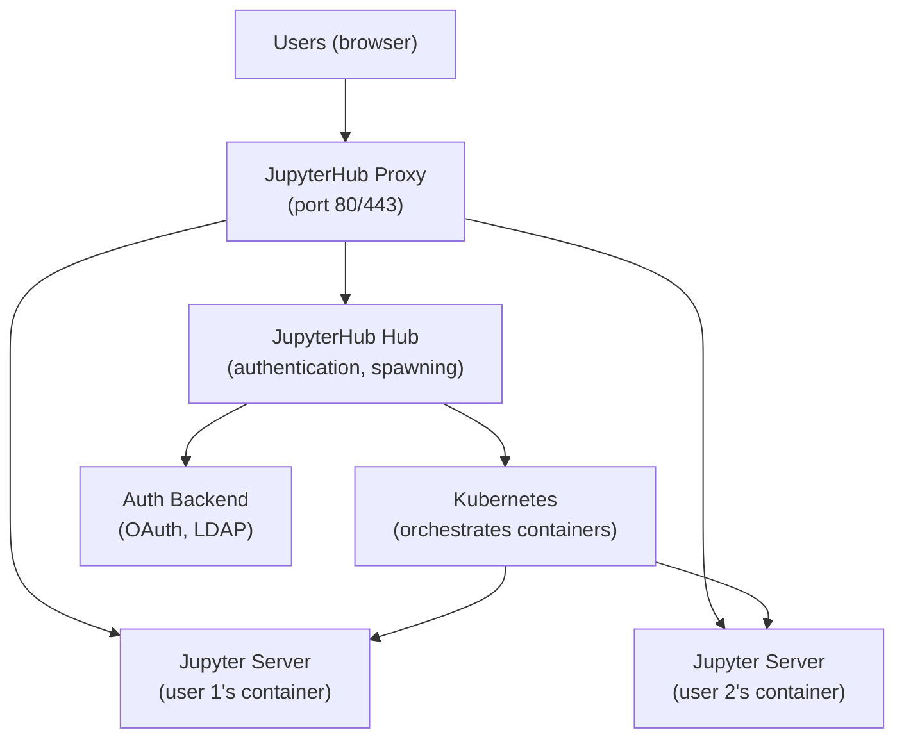

# JupyterHub & Shared Compute

## The Problem

Analysts and data scientists need an environment to explore data interactively. They need access to data, compute, Python packages, and collaboration capabilities — without setting up their own clusters.

JupyterHub is the standard solution for providing shared notebook environments to teams.

---

## Architecture



---

## Kubernetes-Based Deployment (JupyterHub on K8s / z2jh)

The Zero to JupyterHub project provides a Helm chart for deploying JupyterHub on Kubernetes:

```yaml
# config.yaml
hub:
  config:
    GitHubOAuthenticator:
      client_id: your-client-id
      client_secret: your-secret
      oauth_callback_url: https://hub.example.com/hub/oauth_callback
      allowed_organizations:
        - your-github-org

singleuser:
  image:
    name: jupyter/datascience-notebook
    tag: latest
  cpu:
    limit: 4
    guarantee: 0.5
  memory:
    limit: 8G
    guarantee: 1G
  storage:
    capacity: 10Gi
```

---

## Resource Isolation

Each user gets their own container with:
- CPU and memory limits
- Persistent storage (their notebooks survive restarts)
- Environment isolation (user A's packages don't conflict with user B's)

Profile lists allow users to choose resource profiles:

```yaml
singleuser:
  profileList:
    - display_name: "Small (2 CPU, 4 GB)"
      kubespawner_override:
        cpu_limit: 2
        mem_limit: 4G
    - display_name: "Large (8 CPU, 32 GB)"
      kubespawner_override:
        cpu_limit: 8
        mem_limit: 32G
    - display_name: "GPU (4 CPU, 16 GB + 1 GPU)"
      kubespawner_override:
        extra_resource_limits:
          nvidia.com/gpu: "1"
```

---

## Where Notebooks Belong in Production Data Platforms

**Do use notebooks for**:
- Exploratory data analysis
- Model development
- Ad-hoc investigation
- Documentation with embedded code and visualisations

**Do not use notebooks for**:
- Production data pipelines (use Spark jobs, dbt models, Airflow DAGs)
- Version-controlled, tested, reusable code (extract to Python modules)

Notebooks that "run as production pipelines" — papermill-executed notebooks in Airflow — are acceptable but come with limitations (testing, debugging, modularisation are all harder than proper Python modules).
