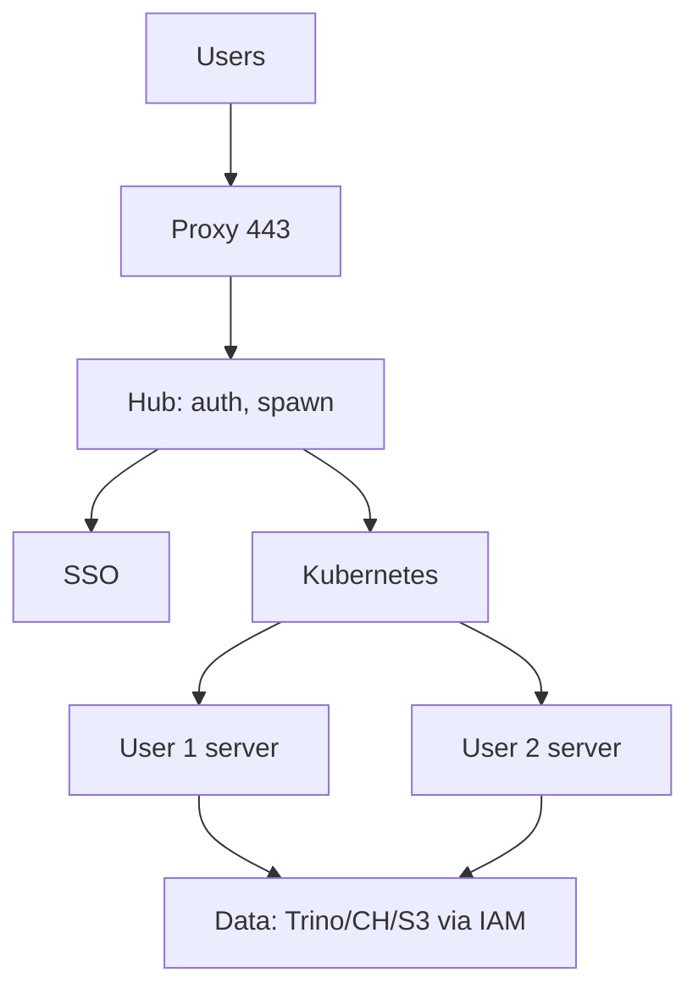

# JupyterHub & Shared Compute

Friday, 4:50 PM. A security ticket lands: 200,000 rows of customer emails found in a personal Google Drive folder. The trail leads to a JupyterHub notebook: `spark.read.parquet("s3://lake/raw/...")`, then `.toPandas().to_csv("~/export.csv")`, then a browser download.

Which single control would have stopped this fastest?

A. Disable browser download from user pods.
B. Give the notebook masked, curated data instead of raw IAM.
C. Deny network egress so the file can't leave the pod.
D. Audit logging on the query, so it's caught after the fact.

Analysts need a REPL with data, CPUs, and packages, and JupyterHub (often Zero to JupyterHub on Kubernetes) is the usual shared answer to that — but as the scenario above shows (B beats the others: A and C are compensating controls, D is forensics, not prevention), it is also a **cost, isolation, and exfiltration** problem wearing a friendly UI, and should be treated as a production-adjacent service, not "just notebooks."

Related: [security](../security/index.md), [Spark vs Ray](../comparisons/spark-vs-ray.md), [quality](../quality/index.md).

---

## The problem

If every data scientist builds a personal Spark cluster, you get credential sprawl and no audit. If everyone shares one giant notebook host, you get noisy neighbours and a single `pip install` that breaks the world. JupyterHub spawns **per-user** environments with limits. That is necessary. It is not sufficient for production data movement.

---

## Architecture



Hub authenticates, starts a user pod, proxy routes. The **pod identity** is the security boundary. If that identity can `s3:GetObject` on `raw/`, the notebook **is** a data plane.

---

## z2jh sketch

```yaml
hub:
  config:
    GitHubOAuthenticator:
      allowed_organizations: [your-org]
singleuser:
  image:
    name: jupyter/datascience-notebook
    tag: pinned-digest-not-latest
  cpu:
    limit: 4
    guarantee: 0.5
  memory:
    limit: 8G
    guarantee: 1G
  storage:
    capacity: 10Gi
```

Pin images. `latest` is how you get surprise CUDA and broken kernels. Profiles for small/large/GPU — **GPU is a budget line**, not a default.

---

## Isolation

| Layer | What you want | Failure if missing |
|-------|---------------|-------------------|
| Linux/k8s | One uid per user, NetworkPolicy | Lateral movement |
| CPU/RAM | Limits + profiles | One `merge` of 200 GB pandas takes the node |
| Packages | User conda **or** controlled image | Dependency hell vs malware pip |
| Data | Masked views, not raw IAM | Exfil |
| Network | Deny egress except approved | `requests.post` to a laptop on 4G |
| Download | Disable or scan | CSV of emails |

Kernel isolation is not tenant isolation. Two analysts in the same company can still leak **customer** data to each other via an unsecured S3 prefix.

---

## Cost

Notebooks waste money in predictable ways:

- **Idle pods** at 8–32 Gi guarantee. Scale-to-zero / cull after idle minutes.
- **Spark on YARN/k8s from a notebook** that never stops the session — clusters live overnight.
- **GPU profiles** left selected.
- **Driver-side** `collect()` — see Spark gotchas; this is both OOM and cost.
- **Personal copies** of 2 TB datasets "for speed."

Chargeback per namespace/profile. A Hub without idle cull is a furnace.

Capacity sketch: 50 users × 20% concurrent × 8 Gi × on-demand nodes is a small Kubernetes bill. 50 users × always-on 32 Gi + 50 tiny Spark clusters is not.

---

## Data exfiltration (threat model)

Assume a motivated intern and a compromised token.

| Path | Mitigation |
|------|------------|
| Browser download | Disable, or DLP; large file alert |
| `print` PII | Masked columns; sample rows in views |
| Write to personal bucket / webhook | IAM + egress deny |
| Screenshots | Process / DLP; cannot fully stop |
| Spark UI / logs | Redact; no secrets in SQL |
| Git push of notebook outputs | `nbstripout`; secret scanning |

Default notebook data access: **Trino on masked curated tables**, row-limited. Raw Iceberg is a job in CI with a service account, not a Hub spawn.

!!! danger "Notebooks are an exfil UI"
    If Hub IAM equals the ETL role, you built a web app that dumps the lake. Fix IAM before you add "just one more library."

---

## Why notebooks are not production jobs

| Production job | Notebook |
|----------------|----------|
| Git PR, tests, pinned deps | Cells out of order, hidden state |
| Idempotent, scheduled, observed | "Run all" on Tuesday |
| Retries, SLAs, lineage | Hope |
| Code review of a module | JSON diff of outputs |
| Secrets from a manager | `TOKEN = "…"` in a cell |

Papermill-in-Airflow is a **bridge** for analysts, not a target architecture. It is acceptable for a weekly HTML report if you:

- Parameterise,
- Strip outputs from git,
- Treat failures as DAG failures,
- Do not hide Spark jobs inside 40 cells.

The moment two teams depend on it, extract a Python module / dbt model / Spark job. [Quality](../quality/index.md) checks belong in that job, not in cell 17.

---

## Where notebooks *do* belong

- Exploratory analysis on **sampled, masked** data.
- Model prototyping (then Ray/Spark jobs for real training — [Spark vs Ray](../comparisons/spark-vs-ray.md)).
- Incident investigation with **read-only** roles and audit.
- Teaching (this academy's labs are scripts; notebooks are fine as a skin).

They do not belong on the [fraud 200 ms path](../architectures/fraud.md), as the [SaaS customer UI](../architectures/analytics-platform.md), or as the only copy of a metric definition ([metadata](../metadata/index.md)).

---

## V1 Hub (fewest parts)

- SSO, pinned image, 8 Gi cap, idle cull.
- Trino/CH **masked** credentials via IRSA/Workload Identity, not long-lived keys in the user home.
- No internet egress from user pods (or allow PyPI proxy only).
- Audit: who spawned, who queried.

**Do not add yet:** user-level Kubernetes admin, unrestricted Spark, GPUs for all, NFS full of raw dumps.

**Bottleneck:** "I need a library." Provide a **request path** to add it to the image, not `pip install` from random GitHub on prod data.

**V2:** profile list, Spark/Ray **ephemeral** clusters with max runtime, DLP, chargeback.

---

## Failure modes

| Failure | Symptom | Absorb |
|---------|---------|--------|
| One user OOMs the node | Other kernels die | Limits, dedicated nodes for large profile |
| Idle 100 pods | Bill | Cull |
| `collect()` | Driver OOM | Educate; cap Spark driver; [Spark incident](../incidents/index.md) |
| Notebook as pipeline | Silent wrong weekly | Extract job |
| Egress open | Exfil | NetworkPolicy |

---

## Apply this at work

1. List what a Hub user can read **today**. Compare to [security](../security/index.md) threat table.
2. Turn on idle cull.
3. Move one papermill DAG to a module.
4. Pin the image digest.
5. Give analysts a **sample** of production, not production.

Labs in this academy run as scripts and Compose on a laptop — that is the right shape for **learning**. Production is not your laptop; do not copy Hub-shaped habits into Airflow.

---

## Profiles that do not bankrupt you

| Profile | CPU | RAM | Idle cull | Who |
|---------|-----|-----|-----------|-----|
| Default | 1 | 2–4 Gi | 30 min | Everyone |
| Medium | 2 | 8 Gi | 30 min | Request |
| Large | 4 | 16 Gi | 15 min | Ticket; chargeback |
| GPU | 4 | 16 Gi + 1 GPU | 15 min | ML; hard cap N pods |

Guarantees should be **below** limits so the node packs. A 32 Gi **guarantee** per idle user is the furnace.

---

## Spark from a notebook

Allowed pattern: ephemeral cluster, **max runtime 2 h**, driver memory cap, read **curated** only, write only to `s3://lake/tmp/user=`. Forbidden: long-lived yarn session, `collect()` of gold tables, writing to `curated`.

Document how to **promote** a notebook: extract module → PR → Airflow. If promotion never happens, you have shadow pipelines.

---

## Output cells and git

Notebooks with data in JSON diffs are PII leaks and review hell. `nbstripout`, `jupyter nbconvert --clear-output`, or treat notebooks as uncommitted. Metric definitions belong in dbt/docs, not cell 0 markdown that drifted.

---

## Alternatives

- SQL IDE on Trino with row limits (often enough).
- Hex/Mode/Looker for **published** analysis with governance.
- Laptop Docker labs (this academy) for learning — not prod credentials.

Hub is for when those fail, not the default for every SELECT.

---

## Review script

1. What IAM does a spawn get?
2. Egress?
3. Idle cull?
4. Can they download 1e6 emails?
5. Any papermill DAG older than 90 days? Extract or delete.

---

## Why hidden state is a data bug

Cells run out of order: you filter `customer_id`, then re-run an upper cell that reads unfiltered `events`, then export. The notebook "looks" like the filter exists. Production jobs do not have this. If a number from a notebook becomes a gold metric, you inherited hidden state. Re-implement in dbt/Spark with tests.

---

## Isolation vs convenience

Shared conda on a VM is how user A's `numpy` breaks user B. Per-user images or per-user conda on a **read-only** base is the point of Hub. Allowing `sudo pip` on a shared image returns you to 2015.

---

## GPU economics

A 1-GPU profile idle 20 h/day is a four-figure monthly burn per user. Require a job queue (Ray/Slurm) for training; Hub GPU is for **debugging a batch**, 15 min cull, max 1 GPU per human.

---

## Logging

Audit: user, spawn time, profile, SQL text to Trino/CH (engine-side). Hub logs are not enough if they only say "spawned."

---

## Papermill pattern (if you must)

```
Airflow → papermill input.ipynb → s3://reports/date=.../out.ipynb
```

Pin the image digest in the DAG. No `pip install` in the notebook. Parameters: `date`, `tenant`. Fail the DAG on exception. Do not commit outputs. Schedule as **report**, not as `fct_orders`.

---

## Academy vs work

Labs in `labs/` are scripts so diffs are reviewable. You may wrap them in notebooks **locally**. Do not confuse that with JupyterHub-on-the-lake.

---

## Data-access patterns that are allowed

| Pattern | OK? |
|---------|-----|
| Trino `SELECT ... LIMIT 10000` on masked curated | Yes |
| CH `tiles_1m` for one tenant via app-issued token | Yes |
| Spark job in CI writing gold | Yes (not Hub) |
| `spark.read.parquet("s3://lake/raw/")` from Hub | No |
| Download full query CSV | No / DLP |
| Personal database dump in NFS | No |

Publish this table in the Hub spawner page. Social policy without IAM fails; IAM without social policy gets tickets forever.

---

## Kernel vs cluster

The user pod is **not** the Spark cluster. Connecting to a shared Spark from 30 notebooks without queues is a noisy-neighbour incident (executors vanish, shuffle service dies). Give **ephemeral** clusters per user with quotas, or force SQL-only.

Ray from Hub: same story. One `ray.init(address=shared)` from a student experiment kills training.

---

## Cost worked example

50 users, 20% concurrent, default 4 Gi limit 2 Gi guarantee, 3 nodes × 16 Gi:

- Fits if cull works.
- If 50 × 8 Gi guarantee always-on = 400 Gi = a large node group idle all night.

Add 10 Spark sessions × 8 executors × 8 Gi = another furnace. Chargeback is the only language finance hears.

---

## Incident: notebook as source of truth

A VP number lived in a notebook on a user PVC. The user left. The PVC expired. The number could not be reproduced. Prevention: gold metrics in git + warehouse. Hub is not a records system.

---

## FAQ

**Can we use VS Code / JupyterLab?** Same IAM and cull rules; the IDE is not the issue.

**Can we pip install?** Into user env, from **internal** index, not as root on the base image.

**Can we SSH?** No. That bypasses proxy audit.

**Can we mount the lake?** No. Connectors with grants.
