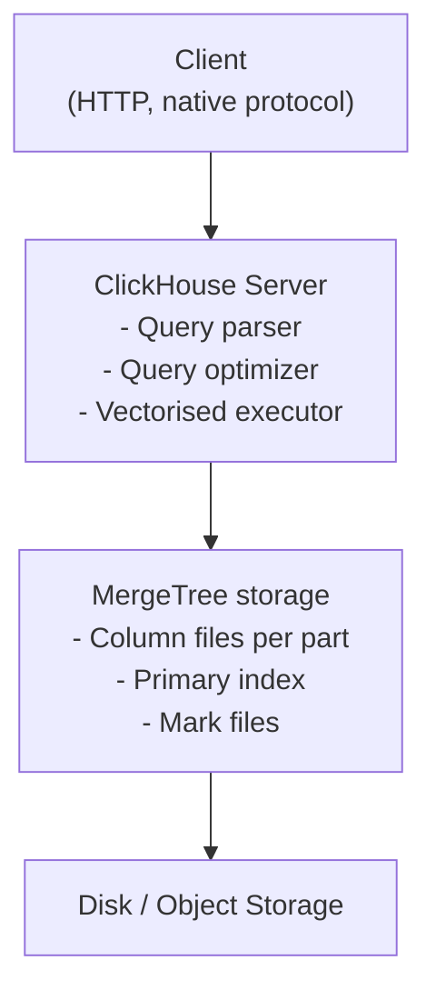
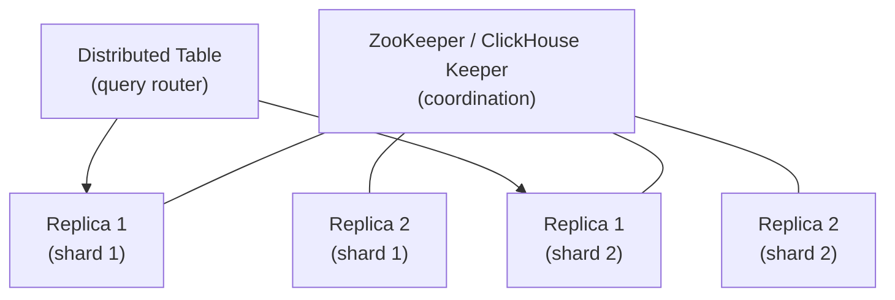
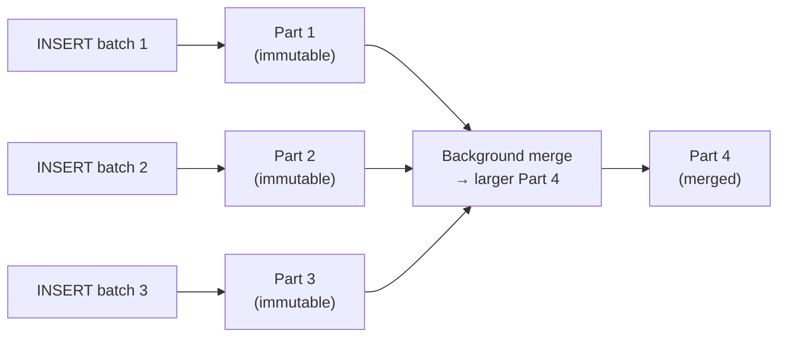

# ClickHouse

## The Problem

You receive hundreds of millions of events per day. You need dashboard queries to complete in hundreds of milliseconds.

A PostgreSQL table with 10 billion rows needs minutes for `SELECT country, avg(latency) FROM requests GROUP BY country`. It reads the entire table to get two columns.

Why?

---

## Row-Oriented vs Column-Oriented Storage

A PostgreSQL row is stored together on disk:

```
Row 1: [2024-01-15 | user_abc | india | /api/orders | 234ms | 200 | 1024]
Row 2: [2024-01-15 | user_def | usa   | /api/search | 45ms  | 200 | 512]
Row 3: [2024-01-15 | user_ghi | india | /api/login  | 890ms | 500 | 256]
```

For the query `SELECT country, avg(latency) FROM requests GROUP BY country`, PostgreSQL reads ALL bytes of ALL rows to extract the two columns it needs.

ClickHouse stores each column separately:

```
timestamps: [2024-01-15, 2024-01-15, 2024-01-15, ...]
user_ids:   [user_abc, user_def, user_ghi, ...]
countries:  [india, usa, india, ...]
endpoints:  [/api/orders, /api/search, /api/login, ...]
latencies:  [234, 45, 890, ...]
statuses:   [200, 200, 500, ...]
```

The same query reads only the `countries` and `latencies` columns — skipping all others entirely.

For a table with 20 columns where you typically query 2–4, this is a 5–10× reduction in data read.

---

## Why Columnar Is Faster for Analytics

Three effects compound:

1. **Less data read**: only the queried columns are read from disk
2. **Better compression**: a column of similar values (e.g., `country` with 50 distinct values, or `latency_ms` which is small integers) compresses much better than mixed-type rows
3. **SIMD vectorisation**: modern CPUs can process arrays of the same type very efficiently (vector instructions)

ClickHouse combines all three. It is not just "columnar storage" — it is columnar + vectorised execution + extremely aggressive compression.

---

## Architecture



For distributed deployments:



---

## MergeTree: The Core Storage Engine

Every ClickHouse table uses a MergeTree variant. Understanding MergeTree is essential.

### How Writes Work



Each INSERT creates a new immutable **part** — a directory of column files. ClickHouse merges small parts into larger ones in the background.

This is fundamentally different from PostgreSQL's in-place UPDATE model. ClickHouse does not update rows in place. It replaces parts.

**Consequence**: ClickHouse is not suitable for OLTP-style workloads with many small updates.

### What a Part Contains

```
part-20240115_1_100_3/
    timestamp.bin      (compressed column data)
    timestamp.mrk2     (mark file: positions of granules)
    user_id.bin
    user_id.mrk2
    country.bin
    country.mrk2
    latency_ms.bin
    latency_ms.mrk2
    primary.idx        (sparse primary index)
    columns.txt        (column metadata)
    checksums.txt
```

---

## The Primary Index and Granules

ClickHouse uses a **sparse primary index** — not an index on every row (like a B-tree), but an index on every N rows (default N=8192, called a **granule**).

For a part with 8 million rows and granule size 8192, the primary index has ~1000 entries.

A query like:
```sql
SELECT avg(latency_ms) FROM requests
WHERE customer_id = 'bigcorp' AND timestamp > '2024-01-15'
```

Uses the primary index to skip to the relevant granules. Then reads only those granules' column data.

**The primary index is defined by `ORDER BY`.**

---

## ORDER BY Is a Physical Design Decision

```sql
-- Option A
CREATE TABLE requests (
    timestamp DateTime,
    customer_id String,
    latency_ms UInt32,
    ...
) ENGINE = MergeTree()
ORDER BY (customer_id, timestamp);

-- Option B
CREATE TABLE requests (...)
ENGINE = MergeTree()
ORDER BY (timestamp, customer_id);
```

For the query `WHERE customer_id = 'bigcorp' AND timestamp > '2024-01-15'`:

- **Option A** (`ORDER BY customer_id, timestamp`): primary index locates all BigCorp rows efficiently, then filters by timestamp
- **Option B** (`ORDER BY timestamp, customer_id`): cannot skip by customer_id — must scan the timestamp range and filter BigCorp rows within it

Choose `ORDER BY` based on your dominant query predicates. **This is the most important ClickHouse design decision.**

---

## Ingestion Patterns

### Kafka Engine (for streaming ingestion)

```sql
-- Materialized view buffers Kafka → MergeTree
CREATE TABLE kafka_events_queue (
    timestamp DateTime,
    customer_id String,
    latency_ms UInt32
) ENGINE = Kafka SETTINGS
    kafka_broker_list = 'kafka:9092',
    kafka_topic_list = 'user-events',
    kafka_group_name = 'clickhouse-consumer',
    kafka_format = 'JSONEachRow';

CREATE TABLE events (...) ENGINE = MergeTree() ORDER BY (customer_id, timestamp);

CREATE MATERIALIZED VIEW events_mv TO events AS
SELECT * FROM kafka_events_queue;
```

---

## Production Gotchas

!!! warning "Too Many Small Inserts"
    Inserting one row at a time creates one part per insert. Parts accumulate faster than merges can clean them up. ClickHouse health degrades: "too many parts" error.
    **Fix**: batch inserts (thousands to hundreds of thousands of rows per INSERT).

!!! warning "Poor ORDER BY Choice"
    An ORDER BY that doesn't match your query predicates means full scans. Impossible to fix without recreating the table.
    **Fix**: understand your top 3 query patterns before creating the table.

!!! warning "Using UPDATE/DELETE"
    ClickHouse mutations (ALTER TABLE UPDATE/DELETE) are heavy background operations that rewrite parts. They are not like SQL UPDATE/DELETE.
    **Fix**: accept immutable data, use ReplacingMergeTree for versioned records, or batch mutations rarely.

---

## How to Apply This at Work

Before creating a ClickHouse table:

1. What are the top 3 query patterns by frequency?
2. What columns appear in WHERE clauses?
3. What is the query cardinality? (distinct values per column)
4. What is the ingestion rate? Are inserts batched?
5. Do records need to be updated? If so, use ReplacingMergeTree or SummingMergeTree.
6. What is the expected data volume in 1 year?
