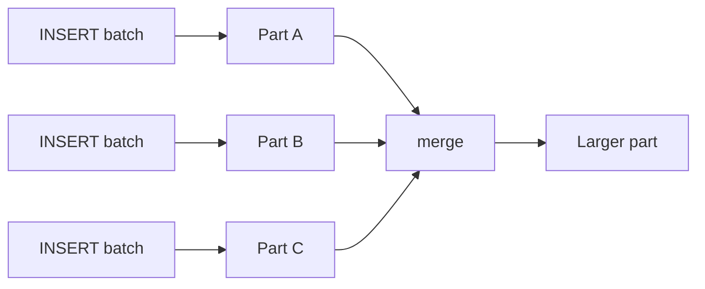

# ClickHouse

Hundreds of millions of events per day. Grafana wants p95 latency by endpoint in a few hundred milliseconds. Postgres can store the rows. It cannot answer that chart as a lifestyle.

ClickHouse is a columnar store that **owns** the data: sorted parts, sparse indexes, vectorised execution. It is not Trino (no federation as a purpose) and not Postgres (no OLTP mutations). The design decision you cannot postpone is `ORDER BY`.

---

## Use case

Observability / SaaS analytics:

```
{timestamp, customer_id, service, endpoint, status_code, latency_ms, bytes, trace_id}
```

~400 million events/day. Queries that must be fast:

```sql
-- Q1 fleet: one service, recent time
SELECT endpoint, count(), quantile(0.95)(latency_ms)
FROM requests
WHERE service = 'checkout'
  AND timestamp >= now() - INTERVAL 1 HOUR
GROUP BY endpoint;

-- Q2 tenant: one customer, recent time
SELECT status_code, count()
FROM requests
WHERE customer_id = 'bigcorp'
  AND timestamp >= now() - INTERVAL 6 HOUR
GROUP BY status_code;

-- Q3 wide scan: whole fleet, one hour (on-call wall)
SELECT service, count(), avg(latency_ms)
FROM requests
WHERE timestamp >= now() - INTERVAL 1 HOUR
GROUP BY service;
```

If the product is **customer-facing 5k QPS** of Q2, read [Pinot](pinot.md) too. If the product is internal dashboards plus ad-hoc SQL, stay here.

---

## Why this is hard

The engine must:

- ingest hundreds of thousands of rows/s **in batches** without creating a million tiny files;
- skip almost all bytes for Q1/Q2;
- still answer Q3 (which matches **time**, not tenant);
- survive a restart without a 14-hour `REPAIR`.

Row stores give you B-trees per query. ClickHouse gives you **one physical order per table** (plus optional projections). That order cannot be equally perfect for Q1, Q2, and Q3. You pick the revenue query and you copy or project the others.

---

## Intuition

Writes do not update pages. They create **immutable parts**. Background merges compact parts into larger parts. Reads walk a **sparse primary index** built on the sort key, jump to **granules** (~8,192 rows), and decode **only the columns the query named**.



`ORDER BY` is not an SQL nicety. It **is** the primary index. Rows in a part are stored in that order. The index stores one key every `index_granularity` rows (a mark). Query planning is: binary-search marks, skip granules that cannot match, read the rest.

Simulate this: [ORDER BY explorer](../simulations/clickhouse-order-by.html).

---

## Internals

### MergeTree parts

Each part is a directory:

```text
20240612_0_120_3/
    timestamp.bin     latency_ms.bin     service.bin     ...
    timestamp.mrk2    latency_ms.mrk2    service.mrk2
    primary.idx
    columns.txt       checksums.txt      count.txt
```

| File | Role |
|------|------|
| `*.bin` | Compressed column data |
| `*.mrk2` | **Marks**: byte offsets of granules in the `.bin` |
| `primary.idx` | Sparse index: sort-key value at each granule start |
| part name `partition_minBlock_maxBlock_level` | Identity for merges / replication |

Parts are **immutable**. A merge writes a new part and deletes the inputs after readers drain.

### Granules, marks, sparse primary index

Default granule = 8,192 rows. 8 million rows → ~1,000 marks. The primary index for that part fits in memory easily. It is **not** a B-tree of every row. If 8,000 consecutive rows share the same `service` and your query filters a different `service`, one mark comparison skips all 8,000.

If those 8,000 rows are a mix of every service (because you ordered only by time), the mark’s min/max for `service` is “almost everything” and you skip nothing.

`EXPLAIN indexes = 1` shows granules selected vs total. That is the first debug tool, not `EXPLAIN` in the Postgres sense.

### `ORDER BY` vs `PARTITION BY`

| Clause | What it does | What it is not |
|--------|----------------|----------------|
| **`ORDER BY`** | Physical sort **inside** each part; sparse index | A SQL `ORDER BY` on SELECT (though SELECT can use it) |
| **`PARTITION BY`** | Separate directories (drop/TTL/skip whole partitions) | A substitute sort key |

Typical observability:

```sql
PARTITION BY toYYYYMMDD(timestamp)   -- drop a day, prune by day
ORDER BY (service, endpoint, timestamp)  -- skip inside the day
```

Anti-pattern: `PARTITION BY timestamp` (DateTime) → one partition per second. Anti-pattern: 10,000 partitions “for prune.” Merge and Keeper metadata will explode. Hundreds of partitions is a lot; thousands is an incident.

### Worked `ORDER BY` for observability

Same table, three keys. Same three queries. This is the lesson.

#### A. `ORDER BY (timestamp)`

Rows are a time stream. Granules are “a few seconds of the fleet.”

| Query | Fast? | Why |
|-------|-------|-----|
| Q1 `service = 'checkout'` last hour | **Slow** | Last hour is many granules; each granule contains **all** services. Filter `service` after read. |
| Q2 `customer_id = 'bigcorp'` | **Slow** | `customer_id` is not in the key. Full hour/day scan + filter. |
| Q3 all services last hour | **Fast** | Time prefix matches. You wanted the whole fleet anyway. |

```sql
CREATE TABLE requests_by_time (...)
ENGINE = MergeTree
PARTITION BY toYYYYMMDD(timestamp)
ORDER BY (timestamp);
```

Use only if almost every query is a **time range over the whole fleet** (on-call wall) and never “one tenant” or “one service.” That is rare in SaaS.

#### B. `ORDER BY (service, endpoint, timestamp)`

Granules are “this endpoint of this service, in time order.”

| Query | Fast? | Why |
|-------|-------|-----|
| Q1 checkout, last hour, by endpoint | **Fast** | Index seeks `service=checkout`, then `endpoint`, then time. Other services never decoded. |
| Q2 `customer_id = 'bigcorp'` | **Slow** | Customer is scattered across services. Scan all services for the time range (or the whole partition). |
| Q3 all services last hour | **OK / mixed** | Time is the **third** column. You cannot binary-search time globally. You walk each `(service, endpoint)` and skip old timestamps **within** that prefix — still much less than a full table if partitions are daily. |

```sql
CREATE TABLE requests_by_svc (...)
ENGINE = MergeTree
PARTITION BY toYYYYMMDD(timestamp)
ORDER BY (service, endpoint, timestamp);
```

This is the default for **SRE / service dashboards**. `PARTITION BY` day still lets Q3 drop old days.

#### C. `ORDER BY (customer_id, timestamp)`

Granules are “this tenant’s stream.”

| Query | Fast? | Why |
|-------|-------|-----|
| Q1 `service = 'checkout'` fleet-wide | **Slow** | Service is not a prefix. Every customer granule mixed services. |
| Q2 `customer_id = 'bigcorp'` last 6 h | **Fast** | Seek tenant, then time. Everyone else skipped. |
| Q3 fleet last hour | **Slow** | Time is second; you iterate customers. |

```sql
CREATE TABLE requests_by_cust (...)
ENGINE = MergeTree
PARTITION BY toYYYYMMDD(timestamp)
ORDER BY (customer_id, timestamp);
```

This is the default for **tenant product analytics** (and a prerequisite if you later expose charts to customers). BigCorp 40% of traffic is then **one** dense key range — good for their dashboard, a **hot range** on one shard if you sharded poorly.

#### Hybrid that teams actually ship

You cannot have B and C in one `ORDER BY`. Options:

- Two tables (or a materialized view) from the same Kafka sink: SRE table `(service, endpoint, timestamp)`, product table `(customer_id, timestamp)` or `(customer_id, service, timestamp)`.
- **Projection** on one table (ClickHouse projections store another sort order).
- If Q2 is rare, keep B and accept tenant scans on a day partition.

```sql
ALTER TABLE requests_by_svc ADD PROJECTION p_cust
(
    SELECT *
    ORDER BY (customer_id, timestamp)
);
ALTER TABLE requests_by_svc MATERIALIZE PROJECTION p_cust;
```

Projections cost disk and merge CPU. They are still cheaper than the wrong primary key.

### Mutations vs collapsing / replacing

`ALTER TABLE ... UPDATE/DELETE` is a **mutation**: rewrite parts in the background. It is not Postgres `UPDATE`. Concurrent reads may see old values until parts finish. Mutations on a hot table are how on-call spends the weekend.

For “latest row wins” facts:

```sql
CREATE TABLE customer_dims
(
    customer_id String,
    plan        LowCardinality(String),
    updated_at  DateTime,
    version     UInt64
)
ENGINE = ReplacingMergeTree(version)
ORDER BY (customer_id);
```

**ReplacingMergeTree does not make rows unique at query time.** Dedup happens during **merges**. Until then you have duplicates.

```sql
SELECT customer_id, plan FROM customer_dims FINAL;  -- correct, expensive
SELECT customer_id, argMax(plan, version)           -- usually better
FROM customer_dims
GROUP BY customer_id;
```

`CollapsingMergeTree` / `AggregatingMergeTree` are for signed rows and incremental states. Same caveat: correctness after merge, or via `FINAL` / explicit `-State` / `-Merge` aggregates.

### Distributed tables and the sharding key

```sql
-- on each shard: local MergeTree
CREATE TABLE requests ON CLUSTER '{cluster}' (...)
ENGINE = ReplicatedMergeTree
PARTITION BY toYYYYMMDD(timestamp)
ORDER BY (service, endpoint, timestamp);

-- router
CREATE TABLE requests_d ON CLUSTER '{cluster}' AS requests
ENGINE = Distributed('{cluster}', currentDatabase(), requests, cityHash64(customer_id));
```

The last argument is the **sharding key**. `rand()` spreads load and **destroys** locality for tenant queries (every shard scanned). `cityHash64(customer_id)` colocates a tenant; BigCorp becomes a **hot shard**.

Replication ≠ sharding. Replicas are copies of a shard (Keeper coordinates). Distributed is a **fan-out query**. `SELECT` on the Distributed table hits every shard unless the optimizer can infer a shard from the key (often it cannot for `WHERE service = ...`).

### Inserts are batches

One `INSERT` = at least one part (more with partitions). Target **tens of thousands of rows per insert**, not one. Kafka Engine + materialized view batches for you; HTTP insert from a naive app does not.

```sql
CREATE TABLE kafka_requests (...) ENGINE = Kafka
SETTINGS kafka_broker_list = 'kafka:9092',
         kafka_topic_list = 'requests',
         kafka_group_name = 'ch-requests',
         kafka_format = 'JSONEachRow',
         kafka_num_consumers = 4;

CREATE MATERIALIZED VIEW requests_mv TO requests AS
SELECT * FROM kafka_requests;
```

Production alternatives: Vector/Redpanda Connect/NiFi inserting batches; Flink sink with `clickhouse-jdbc` batching; object storage → `INSERT SELECT` from S3. All of them **batch**. The Kafka engine is not mandatory.

---

## How

Full serving table for SRE dashboards:

```sql
CREATE TABLE requests
(
    timestamp    DateTime64(3),
    customer_id  LowCardinality(String),
    service      LowCardinality(String),
    endpoint     LowCardinality(String),
    status_code  UInt16,
    latency_ms   UInt32,
    bytes        UInt64,
    trace_id     String CODEC(ZSTD(1))
)
ENGINE = MergeTree
PARTITION BY toYYYYMM(timestamp)          -- monthly if you TTL by month; daily if you drop days
ORDER BY (service, endpoint, timestamp)
TTL timestamp + INTERVAL 90 DAY
SETTINGS index_granularity = 8192;

-- skip index if you still filter customer on this table
ALTER TABLE requests
    ADD INDEX idx_cust customer_id TYPE bloom_filter GRANULARITY 4;
```

TTL:

```sql
-- drop raw after 90d; keep a rollup forever
ALTER TABLE requests
    MODIFY TTL timestamp + INTERVAL 90 DAY;

CREATE TABLE requests_1h
(
    hour DateTime,
    service LowCardinality(String),
    endpoint LowCardinality(String),
    c UInt64,
    lat_sum UInt64
)
ENGINE = SummingMergeTree
PARTITION BY toYYYYMM(hour)
ORDER BY (service, endpoint, hour);

CREATE MATERIALIZED VIEW requests_1h_mv TO requests_1h AS
SELECT
    toStartOfHour(timestamp) AS hour,
    service,
    endpoint,
    count() AS c,
    sum(latency_ms) AS lat_sum
FROM requests
GROUP BY hour, service, endpoint;
```

Query the rollup for “last 30 days” charts; raw for last few hours.

---

## Gotchas

!!! production-gotcha "Too many parts"
    `Code: 252. Too many parts`. Causes: row-by-row insert, too many partitions, stalled merges (CPU/disk), `max_partitions_per_insert_block` exploding. Watch `system.parts` (`active = 1`). Batch. Reduce partition cardinality. Check `system.merges`.

!!! production-gotcha "FINAL on the hot path"
    `SELECT ... FINAL` forces merge-on-read. Fine for a 10k-row dim table. Lethal on 2 billion request rows. Use `argMax` / `GROUP BY` or wait for merges.

!!! production-gotcha "ReplacingMergeTree as a uniqueness constraint"
    Duplicates are visible until merge. Dedup in the pipeline or query with `GROUP BY` the sorting key.

!!! production-gotcha "ORDER BY (timestamp, customer_id) because 'everything is time series'"
    You made Q2 a full scan of the time range. Time-series instinct is wrong when the dashboard is per tenant or per service. Put the **selective equality** first.

!!! production-gotcha "Distributed query amplification"
    `SELECT count() FROM requests_d WHERE service = 'a'` hits **all shards**, each doing local work. 3 shards × 3 replicas misconfigured can 9× a query. Query the local table on one replica when you meant to.

!!! production-gotcha "Mutation as CDC"
    Applying every Postgres UPDATE as `ALTER TABLE UPDATE` will rewrite the world. Land CDC as new parts in ReplacingMergeTree or a new version column.

---

## Failure modes

| Failure | Appearance | Cause |
|---------|------------|-------|
| Too many parts | Inserts stall, `Readonly` | Tiny inserts / merge lag |
| Disk full | Merges fail, then inserts fail | Merges need **headroom** (~2× largest part); TTL not dropping |
| Query reads 10× expected bytes | Slow dashboards | Wrong `ORDER BY`; function on key; `SELECT *` |
| Replica diverges | `system.replicas` `absolute_delay` | Keeper / queue / mutation stuck |
| Hot shard | One node CPU 100% | Sharding on `customer_id` + one whale tenant |
| Memory limit | `MEMORY_LIMIT_EXCEEDED` | Huge `GROUP BY` cardinality (`GROUP BY user_id` on a day of events) |

---

## Debugging

Parts and merges:

```sql
SELECT partition, count() AS parts, sum(rows) AS rows,
       formatReadableSize(sum(bytes_on_disk)) AS disk
FROM system.parts
WHERE table = 'requests' AND active
GROUP BY partition
ORDER BY partition DESC
LIMIT 14;

SELECT * FROM system.merges WHERE table = 'requests';
```

Marks / index usage:

```sql
EXPLAIN indexes = 1
SELECT endpoint, count()
FROM requests
WHERE service = 'checkout'
  AND timestamp >= now() - 3600
GROUP BY endpoint;
```

You want **primary key** granules far below total granules. If selected ≈ total, the predicate is not a prefix of `ORDER BY` (or you wrapped the column in a function).

Query log:

```sql
SELECT
    type, query_duration_ms,
    read_rows, formatReadableSize(read_bytes) AS read,
    result_rows, memory_usage, query
FROM system.query_log
WHERE event_time > now() - 600 AND type = 'QueryFinish'
ORDER BY query_duration_ms DESC
LIMIT 20;
```

`read_rows` ≈ all rows in the time partition → sort key miss. `memory_usage` huge → aggregation cardinality.

Replication:

```sql
SELECT database, table, is_leader, absolute_delay, queue_size, log_max_index, log_pointer
FROM system.replicas;
```

---

## Scale 10× / 100× / 1000×

Start: 40 million events/day, one node, `ORDER BY (service, endpoint, timestamp)`, daily partitions, batched Kafka.

| Scale | What breaks | Move |
|-------|-------------|------|
| **10×** (~400 M/day) | Parts if batching slipped; daily partitions still fine; memory on `GROUP BY user_id` | Fix inserts; skip indexes; kill unbounded GROUP BY; maybe monthly partitions + TTL |
| **100×** (~4 B/day) | Single-node disk/CPU; merges; one whale tenant | Replicated shards; shard key chosen **on purpose**; rollup MVs; projections; object storage for cold |
| **1000×** | Distributed amplification; `FINAL`; raw retention; Kafka MV as the only pipe | Tiered storage; drop raw to 7–14d; pre-aggregate; separate tenant vs SRE tables; do not use ClickHouse as the lake |

Hardware scale without the right `ORDER BY` is paying 1000× IO forever.

---

## Trade-offs

| Get | Give up |
|-----|---------|
| 100–1000× vs row store on dashboard SQL | Point lookups, chatty UPDATEs |
| SQL richer than Pinot | High-QPS multi-tenant isolation is extra work |
| Simple ops vs Pinot’s four components | You still run Keeper, backups, parts |
| Own the bytes (fast) | You copy them from the lake; ClickHouse is not Iceberg |

---

## Alternatives

| Instead | When |
|---------|------|
| **Postgres** | Data fits, queries are OLTP or tiny analytics |
| **Trino on Iceberg** | Ad-hoc across the lake, no serving SLA — [ClickHouse vs Trino](../comparisons/clickhouse-vs-trino.md) |
| **Pinot** | User-facing, high QPS, star-tree dimensions — [ClickHouse vs Pinot](../comparisons/clickhouse-vs-pinot.md) |
| **Druid** | Similar to Pinot; ops/culture fit |
| **BigQuery / Snowflake** | Elastic warehouse, weaker on 200 ms Grafana |
| **Timescale** | SQL time-series, moderate scale, Postgres ecosystem — [TSDBs](../time-series/tsdbs.md) |

---

## Apply

Before `CREATE TABLE`:

1. Write the three queries with real predicates.
2. Put **equality columns** first in `ORDER BY`, time usually last.
3. `PARTITION BY` a coarse time bucket you will drop.
4. Batch inserts; never one row from the app.
5. Decide uniqueness: none (facts), `argMax` (dims), not `FINAL`.
6. TTL raw; MV rollups for long charts.
7. If tenants and SREs both need speed, **two sort orders**, not one compromise key.

At work you will recognise this problem when Grafana is slow **and** `read_bytes` ≈ table size. That is not “need more CPU.” That is the wrong primary key.

---

## Exercise

Observability cluster, 500 million events/day, queries:

1. Service owners: `WHERE service = ? AND timestamp > now()-1h GROUP BY endpoint` (90% of QPS).
2. Support: `WHERE customer_id = ? AND timestamp > now()-1d` (9%).
3. Exec wall: `WHERE timestamp > now()-1h GROUP BY service` (1%).

Shard count will be 4 in six months. Pick `PARTITION BY`, `ORDER BY`, sharding key, and what you do for (2). Say what happens to BigCorp (8% of events) and what `EXPLAIN indexes = 1` should show for (1).

??? success "Answer"
    **`PARTITION BY toYYYYMMDD(timestamp)`** (or weekly/monthly if 500 M/day still makes daily partitions huge but countable). Not `toYYYYMMDDhh` — too many parts.

    **`ORDER BY (service, endpoint, timestamp)`** — matches (1), the 90% path. Granules for other services skipped.

    **(3)** is a time filter without service: daily partition prune + scan of **all** services for that hour. Acceptable at 1% QPS. Do not switch the primary key to `(timestamp)` and destroy (1).

    **(2)** is the mismatch. Options: projection `ORDER BY (customer_id, timestamp)`; second table populated by the same MV; skip index on `customer_id` as a band-aid (helps some, not like a prefix). Do not use `FINAL`.

    **Sharding:** `cityHash64(service)` keeps (1) often on fewer shards **if** you filter by service **and** the Distributed engine can prune (do not assume it always does). `cityHash64(customer_id)` makes (2) local and (1) fan-out. Given 90% QPS is (1), shard by `service` (or `sipHash64(service, endpoint)`), and accept (2) hitting all shards until a tenant table exists. **Do not** shard by `rand()`.

    **BigCorp 8%:** if you sharded by `customer_id`, one shard is permanently hot. If you sharded by `service`, BigCorp is spread; their support query scans every shard’s day.

    **`EXPLAIN indexes = 1` for (1):** primary index used, granules selected ≪ granules total (roughly checkout’s share of the hour, not 100%). If selected ≈ total, you used a function on `service` or queried the Distributed table in a way that scanned extra, or the table was actually ordered by time.
