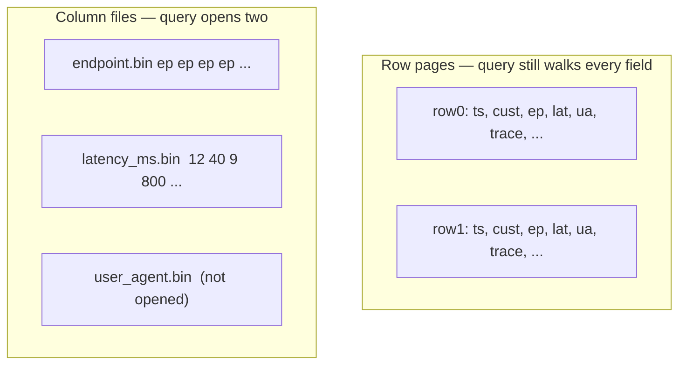

# Why Columnar Storage

**Code review, 11:14 AM.** A teammate submits a query — two columns, one time filter, one `GROUP BY` — and argues it should be near-instant: "it only touches two columns out of eighty." In prod it takes 8 seconds and reads 17 GB.

Predict before you read on: is the two-column claim wrong, or is the disk layout the actual problem — even though the query itself is fine?

The claim about which columns matter is right and the assumption about what the engine reads off disk is wrong: a dashboard over hundreds of millions of events a day almost never wants a row, it wants two or three columns, aggregated, and the storage layout that matches that question is columns on disk, not tuples — the physics [ClickHouse](clickhouse.md) and [Pinot](pinot.md) operationalize, and the reason [Trino](../query-engines/trino.md) is only fast when the files underneath it are columnar too.

---

## Use case

Observability / SaaS analytics table:

```
timestamp | customer_id | service | endpoint | status | latency_ms | bytes | trace_id | user_agent | ...
```

Twenty to eighty columns. The tile that pays the bills:

```sql
SELECT endpoint, count(*), avg(latency_ms)
FROM requests
WHERE timestamp >= now() - INTERVAL 1 HOUR
GROUP BY endpoint;
```

Two grouping/measure columns, a time filter. `trace_id` and `user_agent` are dead weight for this query.

---

## Why this is hard

Disk and memory buses move **bytes**, not “logical rows.” If a row is 800 bytes and you need 16, you still move 800 unless the engine can avoid touching the other 784.

At 5×10⁸ events/day × 800 B ≈ 400 GB/day raw. A 7-day scan of a row store is terabytes of IO for a chart with 40 endpoints on it. SSDs do not save you; they just fail later than spinning rust.

Compression does not rescue a row layout. Adjacent bytes in a row are a timestamp, a UUID, a URL, an integer, a string — high entropy. Adjacent bytes in the `status` column are the same three values for meters of disk.

---

## Intuition

Imagine a spreadsheet. A row-store page is **several full rows** stacked. A column-store file is **one column**, many rows deep.

To `GROUP BY endpoint` and average `latency_ms` you walk two columns. You never load `trace_id`.



Vectorised engines then feed those columns to the CPU as arrays. One SIMD instruction adds 8–16 latencies. A row interpreter cannot do that without gathering from tuples first.

---

## Internals

### Row vs column IO for `GROUP BY` two columns

Take 1 billion rows, 20 columns, ~50 bytes average per column → ~1 KB/row.

**Row store (Postgres heap / InnoDB):**

| | |
|--|--|
| Bytes per row touched | ~1000 (tuple + headers, even with an index-only scan you often still miss here) |
| Rows | 1×10⁹ |
| IO (uncompressed mental model) | **~1 TB** |
| Useful payload (`endpoint` + `latency_ms`) | ~100 GB |
| Waste | ~90% |

A B-tree on `timestamp` can limit the **row range** for “last hour,” which is why OLTP is not uniformly terrible. Once the range is “last 7 days” and you still want two columns, you are back to reading fat tuples.

**Column store (Parquet / MergeTree / Pinot segment):**

| | |
|--|--|
| Columns opened | 2 of 20 |
| Raw column bytes | ~100 GB |
| After dictionary + delta + zstd | often **5–20 GB** |
| Extra skip | min/max per row group / granule if `endpoint` is sparse in a granule |

If `ORDER BY (endpoint, timestamp)` (ClickHouse) or a sorted index (Pinot), equal endpoints sit together: run-length encoding turns 50 million `/health` rows into a handful of runs. The same `GROUP BY` becomes closer to a merge of already-sorted keys.

**Worked ratio for one hour** at 400 million events/day ≈ 16.7 million rows/hour:

| Layout | Read (order of magnitude) |
|--------|---------------------------|
| Row, 1 KB/row, last hour | ~17 GB |
| Column, 2 × 8 B averages, uncompressed | ~270 MB |
| Column, compressed status-like + ints | ~30–100 MB |
| Column + granule skip if time is the sort prefix | even less |

The dashboard latency gap (50 ms vs 8 s) is this table, not a magic join algorithm.

### Compression is a columnar feature

Codecs that matter in production:

| Codec | Loves | Hates |
|-------|-------|--------|
| Dictionary / `LowCardinality` | `service`, `country`, `status` | `trace_id`, `user_id` |
| RLE | Sorted low-cardinality | Random high-cardinality |
| Delta / double-delta | `timestamp`, counters | White noise floats |
| Gorilla / FPC | Slowly changing floats | Random payloads |
| LZ4 | CPU cheap, everywhere | You needed 3× more compression |
| ZSTD | Cold storage, fatter columns | Tiny hot granules where CPU > disk |

ClickHouse lets you set codecs per column. Parquet uses dictionary + run-length + general purpose per page. Pinot similar inside segments.

Rule: **sort first, compress second.** `ORDER BY (service, endpoint, timestamp)` makes `service` and `endpoint` locally constant. `ORDER BY (timestamp)` makes time compressible and `service` a random walk — still columnar, much worse compression on dimensions.

### SIMD and vectorised execution

CPUs offer SIMD (AVX2 / AVX-512 / NEON): one instruction, many lanes.

Row-at-a-time:

```text
for row in table:
    if row.endpoint == "/checkout":
        acc.sum += row.latency_ms
        acc.n += 1
```

Branchy, tuple-oriented, wrecks prefetch.

Vectorised (granule / batch of 8,192 rows in ClickHouse):

```text
load 256-bit register of endpoint dictionary ids
compare-eq → bitmask
load latencies
masked add into accumulator
```

This is why granule size 8,192 is not an arbitrary constant: it is large enough to amortize decoding and fill SIMD loops, small enough that skipping a granule is worth a mark lookup.

Trino pages and Spark whole-stage codegen are the same idea on data they **read** from Parquet. They do not get ClickHouse’s sparse primary index unless the file format + layout provides skip info.

### File layout pieces you will see in EXPLAIN / parts

| Name | System | Role |
|------|--------|------|
| Row group / stripe | Parquet / ORC | Horizontal slice with per-column min/max |
| Granule + mark | ClickHouse | 8,192 rows; mark file stores offsets into `.bin` |
| Segment | Pinot | Immutable columnar unit with optional inverted indexes |
| Zone map / skip index | all of the above | “this block has no `customer_id = X`” |

Columnar **without** skip metadata is still better than rows (you read fewer columns) but you cannot jump. Columnar **with** a sort key is the OLAP jackpot.

For the specific byte-level anatomy of a Parquet file — row groups, column chunks, pages, the footer, and how predicate pushdown and small-file pathology follow directly from that structure — see [Parquet Internals](../foundations/parquet-internals.md).

---

## How

You choose layout when you **write**, not when you query.

Parquet (lake, Trino/Spark):

```sql
-- Spark: write partitioned, reasonably large files, snappy/zstd
df.repartition("ds")
  .write.mode("append")
  .partitionBy("ds")
  .option("compression", "zstd")
  .parquet("s3://lake/events")
```

ClickHouse (serving):

```sql
CREATE TABLE requests
(
    timestamp   DateTime,
    customer_id LowCardinality(String),
    service     LowCardinality(String),
    endpoint    LowCardinality(String),
    status      UInt16,
    latency_ms  UInt32,
    bytes       UInt32,
    trace_id    String CODEC(ZSTD(3))
)
ENGINE = MergeTree
PARTITION BY toYYYYMMDD(timestamp)
ORDER BY (service, endpoint, timestamp)
SETTINGS index_granularity = 8192;
```

Pinot (high QPS): schema + table config declaring sorted column, inverted indexes, star-tree — see [Pinot](pinot.md).

Sanity check after load:

```sql
-- ClickHouse: compressed vs uncompressed
SELECT
    table,
    formatReadableSize(sum(data_compressed_bytes))   AS compressed,
    formatReadableSize(sum(data_uncompressed_bytes)) AS uncompressed,
    round(sum(data_uncompressed_bytes) / sum(data_compressed_bytes), 2) AS ratio
FROM system.columns
WHERE table = 'requests'
GROUP BY table;
```

A ratio of ~2 on an analytics table usually means **bad sort key or high-entropy columns dominating**. A ratio of 15–30 on dimensions + timestamps is normal.

---

## When columnar is worse

Columnar is not a personality. It loses when the access pattern is **row-shaped**.

### Point lookups

`SELECT * FROM requests WHERE trace_id = '…'` needs every column of one row. Row store: one heap fetch (if indexed). Column store: open 20 files, seek to the granule that *might* contain the id, reconstruct the row.

If `trace_id` is not in the sort key, you scan (or hit a bloom skip index and still read a granule per hit). Observability “get this trace” belongs in a document/search store or a row-oriented side table, not in the dashboard OLAP table.

### Wide updates

`UPDATE customers SET plan = 'enterprise' WHERE id = 55` is a tuple rewrite (plus WAL) in Postgres. In a column store it is **rewrite the part / segment** (or a mutation queue that rewrites later). One column change dirties the layout because parts are immutable.

Streaming **appends** are fine. CDC that mutates 2% of a 10 TB table every hour is how you recreate Hadoop.

### Tiny rows, transactional writes

Inserting one event per HTTP request: row store appends to a page. ClickHouse creates a **part**. Ten thousand parts later you are in `too many parts`. Columnar engines want **batches**.

### Highly selective OLTP

`WHERE customer_id = ? AND order_id = ?` returning 1 row, 200 QPS, 5 ms: indexes on a row store. A sparse 8,192-row granule index will read thousands of rows of **each column you project** to reconstruct one tuple.

### Wide `SELECT *` over a few rows is still OK-ish

The disaster is `SELECT *` over **billions** of rows. Reconstructing 10 rows from columns is fine. Reconstructing 10⁹ rows from 80 columns is how a “data export” melts the cluster.

---

## Gotchas

!!! production-gotcha "JSON dumped into a String column"
    You kept columnar files and then stored an unstructured blob. Compression on `payload String` is mediocre; every query that mentions it reads the blob. Extract the dashboard dimensions at write time.

!!! production-gotcha "LowCardinality on a high-cardinality column"
    Dictionary explosion: `user_id` as `LowCardinality(String)` can use **more** memory than `String`. LowCardinality is for `service`, `region`, `http_method` — dozens to low tens of thousands of values, not millions.

!!! production-gotcha "Row groups that are tiny"
    100k Parquet files × 2 MB: columnar math dies in footer reads and S3 GET. Same as ClickHouse too-many-parts. Compact to ~100–500 MB files.

!!! production-gotcha "Predicate on uncompressed virtual columns"
    `WHERE toString(timestamp) LIKE '2024-06-%'` cannot use min/max. Filter on native types.

---

## Failure modes

| Symptom | Likely layout cause |
|---------|---------------------|
| Dashboard IO is terabytes for a 2-column chart | Reading a row store, or `SELECT *`, or JSON blobs |
| CPU pegged, disk idle | Uncompressing zstd on already-hot tiny granules; or huge dictionaries |
| Disk full despite “not that many rows” | High-entropy columns, failed merges, or you stored arrays of traces |
| Point lookup API 200 ms → 2 s after migration to CH | You migrated a KV workload onto granules |
| Mutation queue growing | Updates against MergeTree parts |

---

## Debugging

**Postgres** (prove the row-store tax):

```sql
EXPLAIN (ANALYZE, BUFFERS)
SELECT endpoint, avg(latency_ms)
FROM requests
WHERE timestamp > now() - interval '1 hour'
GROUP BY endpoint;
```

Look at `shared read` / `read` bytes. If buffers dwarf the two columns, you found it.

**ClickHouse:**

```sql
EXPLAIN PIPELINE
SELECT endpoint, avg(latency_ms)
FROM requests
WHERE timestamp > now() - 3600
GROUP BY endpoint;

SELECT
    query,
    read_rows,
    formatReadableSize(read_bytes) AS read,
    formatReadableSize(memory_usage) AS mem
FROM system.query_log
WHERE type = 'QueryFinish'
ORDER BY event_time DESC
LIMIT 20;
```

`read_bytes` should be in the same neighborhood as compressed size of the columns you named, times granules you did **not** skip. If you read 80% of the table for a 1-hour filter, `timestamp` is not helping the primary index — see [ClickHouse ORDER BY](clickhouse.md).

**Parquet / Trino:** `EXPLAIN` should list **projected columns** and **partition filter**. Footer-heavy plans: too many files.

Marks/granules: `system.parts` (`rows`, `bytes_on_disk`), `system.parts_columns`. A part with 200 rows is a write-pattern bug, not a columnar-theory bug.

---

## Scale 10× / 100× / 1000×

| Scale | Row store | Column store that matches the query |
|-------|-----------|-------------------------------------|
| **10×** (10⁸ → 10⁹ events/day) | Autovacuum, bloat, seq scans | Batch inserts, merges, file compaction |
| **100×** | You buy a warehouse or you lose dashboards | Sort key, TTL, projections/MVs, maybe shards |
| **1000×** | Not a serious option for this workload | Pre-aggregate; drop raw; object storage cold tier |

Columnar **does not** scale a point-lookup API 1000×. It scales **scans and aggregations** whose working set is a few columns.

---

## Trade-offs

| Gain | Cost |
|------|------|
| 10–1000× less IO on dashboard SQL | Reconstructing a full row is extra work |
| Compression 10–30× on analytics | CPU to decode; bad codecs hurt |
| SIMD-friendly loops | Writes as immutable parts/segments |
| Skip indexes / marks | Only as good as sort / clustering |

---

## Alternatives

| Technology | Layout | Use it when |
|------------|--------|-------------|
| PostgreSQL | Rows + B-trees | OLTP, point lookups, small analytics |
| ClickHouse MergeTree | Columns + sparse index | Dashboards, ad-hoc SQL, heavy scans |
| Pinot segments | Columns + inverted/star-tree | High QPS dimensional |
| Parquet on Iceberg | Columns, no serving index | Lake, Trino/Spark |
| Cassandra / Dynamo | Rows / items | KV / time-series wide rows, not GROUP BY |
| Elasticsearch | Column-ish doc values + inverted | Text + moderate aggregations |

---

## Apply

Before you pick an engine, write the query and count:

1. How many columns are **named**?
2. How many rows survive the time filter?
3. Is this a **lookup** of one entity or an **aggregate** of a population?
4. Do you **update** those rows?

Aggregates over a few columns, append-only, dashboard latency → columnar. Lookups, updates, tiny writes → row store (or a hybrid: OLAP copy + OLTP source).

Then implement the copy. Do not “turn Postgres into a column store” with a dozen covering indexes; you will still update tuples.

---

## Exercise

Table `events` 80 columns, 2 billion rows. Query A: `SELECT customer_id, sum(bytes) FROM events WHERE ds = '2024-06-12' GROUP BY customer_id`. Query B: `SELECT * FROM events WHERE request_id = 'abc'`. Query C: `UPDATE events SET bytes = 0 WHERE customer_id = 'free-tier'`.

For each, say row store vs column store vs “neither / copy,” and what IO you expect on a cold cache.

??? success "Answer"
    **A.** Column store (ClickHouse/Pinot/Parquet). Two columns + a partition/day prune. IO: compressed `customer_id` + `bytes` for one day — GBs or less, not the full 80-column day. Row store reads fat tuples for every event that day.

    **B.** Row store (or a search/trace store) with an index on `request_id`. Column store reconstructs 80 columns from a granule (8k rows × 80 columns of decode) if you even find the granule; without `request_id` in the sort key you scan. Neither OLAP engine wants to be this API.

    **C.** Neither as a hot path. SQL `UPDATE` on 2 billion columnar rows is a mutation that rewrites parts. In a row store it is still a massive heap rewrite. Maintain `bytes` in a serving table keyed by customer, or write a new fact, or filter `free-tier` at query time from a dimension. Do not mutate the event log in place.
