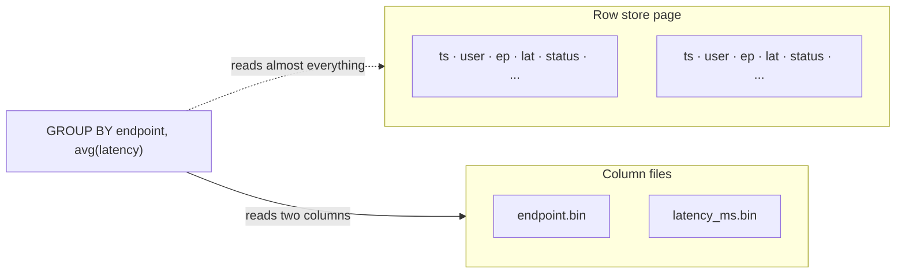
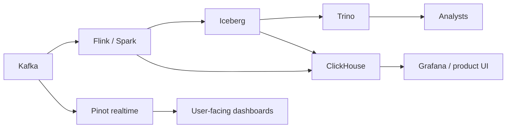

# OLAP

!!! info "Version and source policy"
    Engine syntax and feature support are version-sensitive. Check [Versions & Primary Sources](../reference/version-matrix.md) and reproduce claims on the pinned lab where available.

Hundreds of millions of product and observability events land every day. A dashboard asks: p95 latency by endpoint for the last hour, filtered to one customer. The person staring at Grafana will refresh it. They will not wait for a warehouse slot.

That access pattern — **scan a lot of rows, touch a few columns, aggregate, repeat** — is what OLAP engines are for. Not point lookups. Not `UPDATE` a shopping cart. Not “join five operational databases because we can.”

---

## Workload

Two shapes show up everywhere in this academy.

**SaaS analytics / observability dashboards**

```
{timestamp, customer_id, service, endpoint, status_code, latency_ms, bytes, trace_id}
```

- Ingest: 10⁸–10⁹ events/day.
- Query: `GROUP BY service, endpoint` over minutes to days, sometimes filtered to one `customer_id`.
- Latency: hundreds of milliseconds, not tens of seconds.
- Concurrency: tens (internal) to thousands (customer-facing).

**Not this module:** federated Iceberg ⨝ Postgres for an analyst. That is [Trino](../query-engines/trino.md). You *may* load Iceberg *into* ClickHouse. You do not ask ClickHouse to be a lake catalog.

---

## What this module covers

| Topic | What you will be able to do |
|-------|-----------------------------|
| [Columnar storage](columnar-storage.md) | Account for IO, compression, SIMD; know when rows win |
| [ClickHouse](clickhouse.md) | Design `ORDER BY`, parts, granules, marks; ingest in batches; not pretend mutations are OLTP |
| [Pinot](pinot.md) | Segments, inverted/star-tree indexes, realtime vs offline, when high-QPS dimensional queries need Pinot |

ClickHouse is the flagship: most teams meet OLAP here, and `ORDER BY` is a physical design decision you will live with for years. Pinot is the other attractor: user-facing, concurrent, fresh.

---

## Why a row store falls over

Postgres stores a row as a tuple. To compute `avg(latency_ms) GROUP BY endpoint` it must visit tuples. Each tuple carries `trace_id`, `user_agent`, `payload_hash` — columns the query never named.



At 10⁹ rows × 1 KB/row you are reading ~1 TB to answer a two-column aggregate. Columnar layout plus compression plus vectorised loops is why the same query is 100–1000× cheaper in ClickHouse than in OLTP Postgres. The physics lesson is [columnar storage](columnar-storage.md).

That speed is **bought** with constraints: append-heavy writes, batch inserts, expensive mutations, poor point-lookup behaviour if you use the engine as a KV store.

---

## Two engines, two concurrency stories

| | ClickHouse | Pinot |
|--|------------|-------|
| Mental model | Columnar database you own | Realtime OLAP serving layer |
| Index story | Sparse primary index from `ORDER BY` + skip indexes | Inverted, sorted, range, star-tree, json, text |
| Freshness | Seconds–minutes (batch parts, Kafka MV) | Seconds (consuming segments) |
| SQL | Very wide | Narrower; joins are not the point |
| Concurrency | Good; not “10k QPS dimensional” without care | Built for high QPS on known dimensions |
| Ops | Server + Keeper | Controller, broker, server, minion |

**ClickHouse** wins when the query is a heavy scan or a rich SQL shape: “p99 latency for this service, excluding health checks, with a HAVING on volume, joining a small dimension.” Internal observability platforms usually land here.

**Pinot** wins when thousands of tenants each hit a dashboard of **the same dimensional queries** with **fresh** Kafka data: “my company’s events, last 15 minutes, broken down by the dimensions we indexed.” Star-tree is pre-aggregation as a first-class index.

If you need both (internal ad-hoc **and** customer-facing tiles), that is two serving paths, not one compromise cluster. Details: [ClickHouse vs Pinot](../comparisons/clickhouse-vs-pinot.md), [Pinot](pinot.md).

---

## Physical design is the product

In OLTP you add a B-tree when a query is slow. In ClickHouse the **sort key is the table**. Granules, marks, and the sparse primary index all derive from `ORDER BY`. Changing it means a new table and a copy.

Pinot is the same idea with more knobs: which column is sorted in the segment, which inverted indexes exist, which star-tree dimensions you pre-aggregate. Those are not “tuning.” They are the schema.

A useful test: write the **three** queries that must be fast. If they do not share a prefix of the sort key / star-tree dimensions, you need two tables (or a projection / MV), not a wider `ORDER BY`.

---

## Where OLAP sits



- **Lake** (Iceberg): source of truth, cheap, slow-ish SQL via Trino.
- **OLAP store**: copy or stream shaped for dashboards.
- **Do not** make ClickHouse the only copy of 7 years of events unless you have thought about object storage, TTL, and restore.

---

## Ingest is a batching problem

Dashboard engines want **parts** and **segments**, not one HTTP INSERT per click. The same Kafka topic can feed:

| Path | Mechanism | Freshness |
|------|-----------|-----------|
| ClickHouse | Kafka engine + MV, or Flink/Vector batches of 10k–100k | seconds–minutes |
| Pinot | Realtime consumer → CONSUMING segment | seconds |
| Lake | Flink/Spark → Iceberg commits | minutes–hours |

If the application writes row-by-row to ClickHouse because “we have a JDBC driver,” you will meet `too many parts` before you meet a slow `GROUP BY`. That failure is in [ClickHouse](clickhouse.md); the module-level rule is: **OLAP ingest is bulk**.

CDC (Postgres → Debezium → engine) is the other trap. Event **facts** append. Customer **dimensions** upsert (ReplacingMergeTree / Pinot upsert). Treating every OLTP UPDATE as `ALTER TABLE UPDATE` rewrites columnar parts for a living.

---

## What this module is not

| Problem | Go here instead |
|---------|-----------------|
| Federated Iceberg ⨝ Postgres | [Trino](../query-engines/trino.md) |
| Prom scrape + paging | [TSDBs](../time-series/tsdbs.md) |
| `user_id` as a Prom label | [Cardinality](../time-series/cardinality.md) — then store the **event** in CH/Pinot |
| Point lookup `GET /trace/:id` | Search / OLTP / trace backend |
| 12-hour shuffle ETL | [Spark](../spark/index.md) |

OLAP is the **serving** copy of facts you already have (or the primary store if you accepted that operational bargain). It is not a lake catalog and not a queue.

---

## Debugging preview

When a dashboard is slow, the first three numbers:

1. **Rows read vs rows in the time range** — sort key / partition prune missed.
2. **Bytes read vs columns named** — `SELECT *` or a JSON blob.
3. **QPS × scan** — you are on the wrong engine (ClickHouse scan vs Pinot indexed).

ClickHouse: `EXPLAIN indexes = 1`, `system.parts`, `system.query_log`. Pinot: broker scatter vs merge, star-tree hit, consuming lag. Columnar physics: [columnar storage](columnar-storage.md).

---

## Scale cliffs

| Events / day | Typical pain |
|--------------|--------------|
| 10⁸ | Batch inserts, `ORDER BY` mistakes, too many parts from the application writing row-by-row |
| 10⁹ | Merge pressure, partition explosion (`PARTITION BY timestamp` instead of month/day), hot customer in the shard key |
| 10¹⁰+ | You shard; you TTL raw data; you pre-aggregate; you stop using `FINAL` on the hot path |

10× more events is rarely 10× more hardware if the sort key matches the dashboard. It is easily 100× more hardware if every query is a full scan of `ORDER BY (timestamp)` filtered by `customer_id`.

---

## How to study this module

1. [Columnar storage](columnar-storage.md) — IO for a two-column `GROUP BY`, then when columns **lose**.
2. [ClickHouse](clickhouse.md) — work the observability `ORDER BY` examples with real predicates. Use the [ORDER BY explorer](../simulations/clickhouse-order-by.html).
3. [Pinot](pinot.md) — same events, different concurrency and index story.
4. Only then read [ClickHouse vs Trino](../comparisons/clickhouse-vs-trino.md) and [ClickHouse vs Pinot](../comparisons/clickhouse-vs-pinot.md).

---

## Exercise

Grafana for an observability product: 400 million events/day, 2,000 customers, p95 dashboard 300 ms, peak 80 QPS internal. PM wants the same charts **in the customer app** at 5,000 QPS, each tenant seeing only their rows, data < 15 s old.

Do you scale the ClickHouse cluster 60×, add Pinot, or put Redis in front of ClickHouse? What physical design must exist either way?

??? success "Answer"
    Do not 60× ClickHouse and hope. Internal 80 QPS of moderately rich SQL is a ClickHouse-shaped load. 5,000 QPS of tenant-scoped dimensional tiles with 15 s freshness is a Pinot-shaped load (or a **pre-aggregated** ClickHouse path plus aggressive caching, which you will still have to design as a serving schema).

    Redis in front of raw event queries fails on the key space (every tenant × every time range × every breakdown) and on freshness.

    Either way you **must** physically cluster by tenant: ClickHouse `ORDER BY (customer_id, timestamp)` or `(customer_id, service, timestamp)`; Pinot tenant filter with inverted/sorted indexes and likely a star-tree on the dashboard dimensions. Without that, every query scans everyone else's events.
