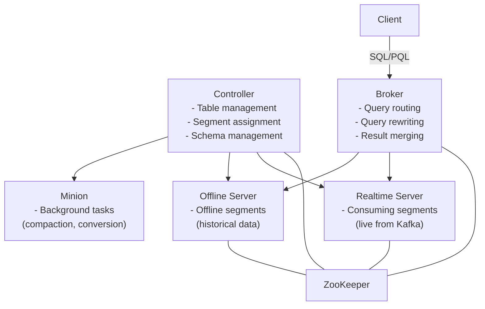

# Apache Pinot

## The Problem

ClickHouse is excellent for internal analytics dashboards. But what about **user-facing analytics** — where your end-users query their own data?

Example: a SaaS platform where each customer has a dashboard showing their own metrics. 10,000 concurrent users querying simultaneously, each expecting <100ms responses, with fresh data from the last few seconds.

ClickHouse can do this, but Pinot was specifically designed for this pattern.

---

## What Makes Pinot Different

Pinot is a **real-time OLAP** system designed for:
- Sub-second queries on fresh data (seconds old)
- High query concurrency (tens of thousands of QPS)
- Multi-tenancy and isolation
- User-facing dashboards at scale

The architectural choices that enable this differ from ClickHouse.

---

## Architecture



---

## Segments

Data in Pinot is stored in **segments** — immutable columnar files similar to ClickHouse parts.

**Realtime segments**: consumed directly from Kafka, held in memory on Realtime Servers, then flushed to offline (object storage) when full.

**Offline segments**: historical data pushed from batch pipelines (Hadoop, Spark), stored on Offline Servers.

A query hitting a Pinot table can combine results from both realtime and offline segments transparently.

---

## Indexes

Pinot's indexing flexibility is a key advantage:

| Index Type | Use Case |
|-----------|---------|
| **Inverted index** | Fast filter on low-cardinality columns (`status`, `region`) |
| **Sorted index** | Fast range scans on one column (implicit, based on sort order) |
| **Range index** | Efficient range predicates (`WHERE latency > 100`) |
| **Text index** | Full-text search on string columns |
| **Star-tree index** | Pre-aggregated index for specific dimension combinations |

The **star-tree index** is Pinot's killer feature for specific workloads: it pre-aggregates data along configured dimensions, enabling sub-millisecond responses for queries that match those dimensions.

---

## Star-Tree Index

For a dashboard showing "total requests per country per status code", you can configure a star-tree index on `(country, status_code)`:

Pinot pre-computes aggregates for all combinations at ingestion time. At query time, the aggregate is simply looked up, not computed from raw data.

**Query that benefits**:
```sql
SELECT country, status_code, count(*) FROM events
GROUP BY country, status_code
```
Response: sub-millisecond (lookup).

**Query that does NOT benefit**:
```sql
SELECT customer_id, count(*) FROM events
GROUP BY customer_id  -- customer_id not in star-tree dimensions
```
Response: full scan.

---

## ClickHouse vs Pinot

| Dimension | ClickHouse | Pinot |
|-----------|-----------|-------|
| **Strength** | Ad-hoc analytics, complex SQL | User-facing, high QPS, fresh data |
| **Query freshness** | Seconds (depends on ingestion) | Sub-second (realtime segments) |
| **Concurrent queries** | Moderate | Very high |
| **SQL complexity** | Excellent | Good (subset of SQL) |
| **Indexing** | Primary index + data skipping | Multiple index types + star-tree |
| **Multi-tenancy** | Manual isolation | Better built-in isolation |
| **Operational complexity** | Moderate | Higher (4 components) |

**Choose ClickHouse** for internal analytics, ad-hoc queries, complex aggregations.

**Choose Pinot** when users are querying their own data at high concurrency with freshness requirements.

---

## Use Cases in the Running Examples

**Security / Observability Platform**: ClickHouse is usually better (analysts run ad-hoc queries, not concurrent user-facing queries)

**SaaS Analytics Platform**: Pinot may be better for the customer-facing dashboard feature (each of 10,000 customers queries their own metrics concurrently)
