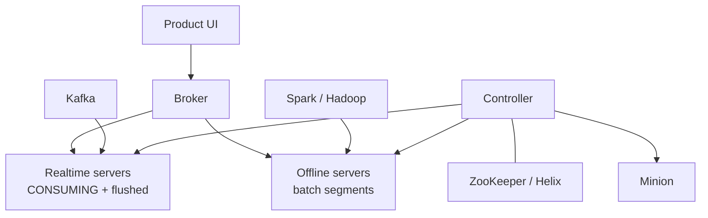

# Apache Pinot

**09:00 AM, every weekday.** The moment the workday starts, ClickHouse's p95 latency jumps from 80 ms to 4 seconds. CPU isn't pegged, disk isn't saturated — the cluster just can't keep up with the sudden burst of concurrent queries, each filtered to a different tenant, each wanting an answer in under 100 ms.

Predict before you read on: (A) shard ClickHouse further, (B) add read replicas, (C) put a cache in front, or (D) the workload has outgrown what a scan-oriented engine was built for and needs a different index strategy?

The same events ClickHouse loves — hundreds of millions a day — now sit behind a **customer** dashboard where ten thousand tenants open the app at 09:00, each asking "my company, last 15 minutes, breakdown by endpoint," and that concurrency-plus-freshness shape is what Apache Pinot was built for: segments, inverted indexes, star-trees, a realtime/offline split, brokers that fan out and merge.

---

## Start with the situation { #use-case }

SaaS product analytics, user-facing:

```
{timestamp, customer_id, user_id, service, endpoint, status_code, latency_ms, country}
```

Queries (almost always filtered to **one tenant**):

```sql
SELECT endpoint, COUNT(*) AS reqs, AVG(latency_ms)
FROM events
WHERE customer_id = 'bigcorp'
  AND timestamp >= ago('15m')
GROUP BY endpoint
LIMIT 50;
```

Concurrent QPS in the thousands. Kafka is the source of truth for “now.” Iceberg / Spark produces yesterday’s segments for cheap history.

Internal “write me a novel SQL with arrays and JOINs” stays on [ClickHouse](clickhouse.md) or [Trino](../query-engines/trino.md).

---

## Why the obvious approach breaks { #why-this-is-hard }

Three constraints at once:

1. **Concurrency.** 5,000 queries/s cannot each scan a day of everyone else’s events. You need tenant clustering **and** indexes that turn filters into bitmap AND, not a column scan.
2. **Freshness.** Batch MergeTree parts flushed every 10 s are visible; Pinot’s consuming segment is the row you ingested 2 s ago, in memory, still queryable.
3. **Known query shapes.** The UI does not invent GROUP BYs. Star-tree pre-aggregates the combinations the UI will ask. That is cheating, in the best way — and useless for ad-hoc.

ClickHouse’s sparse index is perfect for a few heavy scans. It is the wrong data structure for “10k concurrent equality filters on `customer_id`.”

---

## Build the mental picture { #intuition }

A Pinot table is a pile of **segments**. Each segment is a columnar file plus optional inverted / range / sorted / star-tree indexes.

A **broker** takes SQL, rewrites it, sends it to the servers that own relevant segments, and merges. You never talk to a server first.



Realtime servers **consume Kafka**. When a consuming segment hits a row/time threshold it commits, becomes immutable, and eventually an **offline** equivalent may replace it (the hybrid table). A query is `UNION` of both, without the user writing that.

---

## Under the hood { #internals }

### Segments

| Kind | How it appears | Query |
|------|----------------|-------|
| **CONSUMING** | In-memory (plus log), appended from Kafka | Included; slightly different stats |
| **ONLINE realtime** | Flushed immutable segment on realtime server | Same SQL |
| **ONLINE offline** | Pushed from batch (Spark) onto offline servers | Same SQL |

Segment is the unit of assignment, replication, and replacement. Think ClickHouse **part** plus a richer index bundle.

Too many tiny segments: broker planning and scatter-gather explode (cousin of too many parts). Too few huge segments: refresh and restart become lumbering; a tenant’s data may sit in a 50 GB blob you cannot skip well if indexes were skipped at gen time.

### Index types

Pinot is an **index product**. ClickHouse is a **sort-key product**. You can add several of these on one column.

| Index | What it accelerates | Cost |
|-------|---------------------|------|
| **Inverted** | `WHERE status_code = 500`, `country IN (...)` | Disk + heap for dictionaries; high-cardinality inverted is expensive |
| **Sorted** | Range/equality on the column the segment is sorted by — often `timestamp` or `customer_id` | One sorted column per segment (practically) |
| **Range** | `latency_ms > 500` without full scan | Extra structures |
| **Star-tree** | `GROUP BY` on a configured dimension set | Disk, ingest CPU; **wrong** dimensions = no help |
| **JSON / text** | Nested fields, search | Not your metrics hot path if you can extract columns |
| **Bloom** | Negative lookups (`user_id` maybe) | False positives; not a tenant isolator |

For the SaaS dashboard, the usual package:

- Filter `customer_id` → inverted (and/or sort on `customer_id`).
- Time range → sorted `timestamp` or range index.
- `GROUP BY endpoint, status_code` → star-tree with those dimensions + `COUNT`, `AVG(latency)`.

Without inverted on `customer_id`, every tenant query scans the segment. You reinvented a ClickHouse table with `ORDER BY (timestamp)`.

### Star-tree

At ingest, Pinot materializes aggregations for combinations of dimensions, with rollup to `*` (all).

Configured dimensions: `customer_id`, `endpoint`, `status_code`. Metrics: `COUNT(*)`, `SUM(latency_ms)`.

```sql
-- Hits star-tree (subset / exact match of dimensions)
SELECT endpoint, status_code, COUNT(*), AVG(latency_ms)
FROM events
WHERE customer_id = 'bigcorp'
GROUP BY endpoint, status_code;

-- Misses: dimension not in the tree
SELECT user_id, COUNT(*) FROM events
WHERE customer_id = 'bigcorp'
GROUP BY user_id;
```

A miss is not an error. It falls back to raw (or other indexes). The UI must stay inside the tree **or** you pay scan cost at 5k QPS.

Star-tree cardinality is the product of dimension cardinalities **inside a segment** (with skip of unused combos). `user_id` in the tree is how you rebuild the [cardinality](../time-series/cardinality.md) disaster inside Pinot.

### Realtime vs offline tables

| | Realtime | Offline | Hybrid |
|--|----------|---------|--------|
| Source | Kafka (or similar) | Spark / Hadoop batch | Both, time-boundary overlap handled |
| Freshness | seconds | hours / daily | seconds for recent, cheap for year |
| Ops | consumers, offsets, flush | segment build, upload, replace | hardest, correct for “SaaS analytics” |

Upserts (partially upsert / full upsert) exist on realtime tables with a primary key. They are **not** Postgres. You pay a PK index and you constrain how segments compact. Use them for “latest profile per user” serving, not for rewriting a 90-day event log.

### Query path

1. Broker compiles SQL → operators.
2. Routing: which segments (time filter can drop old ones).
3. Scatter to servers; each scans **its** segments with indexes / star-tree.
4. Gather + merge (`GROUP BY`, `ORDER BY`, `LIMIT`).

Broker merge is the ClickHouse-coordinator analogue: a `GROUP BY user_id` over 24 h with no tenant filter will melt the broker even if servers survive.

---

## Put it to work { #how }

Schema sketch (names simplified):

```json
{
  "schemaName": "events",
  "dimensionFieldSpecs": [
    {"name": "customer_id", "dataType": "STRING"},
    {"name": "endpoint", "dataType": "STRING"},
    {"name": "status_code", "dataType": "INT"},
    {"name": "service", "dataType": "STRING"}
  ],
  "metricFieldSpecs": [
    {"name": "latency_ms", "dataType": "INT"},
    {"name": "bytes", "dataType": "LONG"}
  ],
  "dateTimeFieldSpecs": [
    {
      "name": "timestamp",
      "dataType": "LONG",
      "format": "1:MILLISECONDS:EPOCH",
      "granularity": "1:MILLISECONDS"
    }
  ]
}
```

Table config (conceptual — check versioned keys):

```json
{
  "tableName": "events",
  "tableType": "HYBRID",
  "segmentsConfig": {
    "timeColumnName": "timestamp",
    "replication": "3"
  },
  "tableIndexConfig": {
    "sortedColumn": ["customer_id"],
    "invertedIndexColumns": ["customer_id", "endpoint", "status_code", "service"],
    "rangeIndexColumns": ["timestamp", "latency_ms"],
    "starTreeIndexConfigs": [{
      "dimensionsSplitOrder": ["customer_id", "service", "endpoint", "status_code"],
      "functionColumnPairs": ["COUNT__*", "AVG__latency_ms"],
      "maxLeafRecords": 10000
    }]
  },
  "tenants": { "broker": "DefaultTenant", "server": "DefaultTenant" }
}
```

Stream ingest from Kafka is a `streamConfigs` block (`stream.kafka.broker.list`, topic, decoder). Offline: Spark job builds segments from Iceberg, minion or controller uploads.

Query:

```sql
SELECT service, endpoint, COUNT(*) AS reqs, AVG(latency_ms) AS avg_lat
FROM events
WHERE customer_id = 'bigcorp'
  AND timestamp >= ago('15m')
  AND timestamp < ago('0m')
GROUP BY service, endpoint
ORDER BY reqs DESC
LIMIT 100;
```

Always include the tenant predicate. Multi-tenant isolation in Pinot is **query filters + optional tenant isolation at Helix**, not magic RLS unless you built it.

---

## Where teams get caught { #gotchas }

!!! production-gotcha "Star-tree for the query you wished you had"
    The tree is compiled at ingest. Adding a dimension means rebuild (or new table). Product adding “group by browser” next quarter is a data-model change, not a dashboard change.

!!! production-gotcha "Inverted index on user_id / trace_id"
    Cardinality of the dictionary becomes the segment. Memory and build time explode. Keep high-cardinality identifiers out of inverted/star-tree; use them as raw columns for rare drill-down, or put traces elsewhere.

!!! production-gotcha "Realtime only, 14 months retention"
    Consuming + retaining on realtime servers is the expensive path. Hybrid: Kafka for hot, Spark offline for cold, purge realtime after the offline replace.

!!! production-gotcha "Joins as a product feature"
    Pinot joins are limited (lookup / small dimension). Enrich in Flink before Kafka. Do not plan a lakehouse-style JOIN in the serving path.

!!! production-gotcha "Upserts as CDC dump"
    Full-table upsert of event facts: PK index + compaction forever. Events are append-only; dims upsert.

---

## How it fails { #failure-modes }

| Failure | Looks like | Cause |
|---------|------------|-------|
| Broker OOM / GC | Cluster “up,” queries die | Huge GROUP BY merge, no tenant filter, no LIMIT |
| Server GC | One tenant slow | Consuming segment too large; inverted on high-card; heap vs off-heap mismatch |
| CONSUMING stuck | Freshness 10 minutes | Kafka lag, decode errors, offset reset |
| Segment explosion | Planning 5 s | Flush too aggressive; no merge/minion task |
| Inconsistent hybrid | Double count at the seam | Time boundary / watermark misconfig between realtime and offline |
| Noisy neighbour | Small tenants 2 s p95 | Whale tenant + missing `customer_id` index; or one server holds the whale’s segments |

---

## How to investigate { #debugging }

- **Broker query log**: scatter time vs merge time. Merge-dominated → result cardinality. Scatter-dominated → segment count or missing index.
- **EXPLAIN / query options** (version-specific): confirm star-tree used. If the operator is a raw scan, the tree missed.
- **Segment metadata**: rows, size, indexes present. A segment without the inverted index you thought you enabled is a config deploy bug.
- **Consuming offset** vs Kafka high watermark: freshness is this lag, not “Pinot is real-time” as a slogan.
- **Server heap / direct memory**: inverted and star-tree are not free.

ClickHouse analogue: `system.parts` + `EXPLAIN indexes`. Pinot analogue: controller segment list + broker operator stats.

---

## Scale 10× / 100× / 1000×

| Scale | What you do |
|-------|-------------|
| **10×** (400 M → 4 B events/day, still 2k tenants) | More realtime servers, tune flush, keep star-tree dimensions **fixed**, compact segments |
| **100×** (tenants 2k → 50k, QPS 200 → 8k) | Tenant-aware routing / isolation; replica count; **never** let unfiltered SQL from the UI; offline history; maybe multiple tables per product surface |
| **1000×** | Shard tenants across tables/clusters; pre-aggregate even before Pinot; drop raw from serving; Pinot is not the lake |

QPS scale is why Pinot exists. Scan-heavy SQL at 1000× is still a ClickHouse/Trino problem — Pinot will not make a 40-column ad-hoc scan cheap just because it is Pinot.

---

## Trade-offs

| Get | Give up |
|-----|---------|
| High QPS, low latency on **indexed** shapes | Ad-hoc SQL, fat JOINs, window functions as a lifestyle |
| Seconds freshness from Kafka | Ops: controller, broker, server, minion, Helix |
| Star-tree as a serving cache that is consistent with ingest | Flexibility; rebuilds |
| Hybrid history | Two pipelines that must agree at the seam |

---

## Alternatives

| Engine | Prefer it when |
|--------|----------------|
| **ClickHouse** | Internal analytics, heavy scans, rich SQL, fewer concurrent product users — [comparison](../comparisons/clickhouse-vs-pinot.md) |
| **Druid** | Similar realtime OLAP; existing Druid ops muscle |
| **Elasticsearch** | Text-first, secondary aggregations |
| **Redis / pre-agg API** | A handful of tiles, fully precomputed, no dimensional drill-down |
| **Trino** | Humans, not 50 ms |

**Why Pinot vs ClickHouse (one sentence):** Pinot for **concurrent high-QPS dimensional queries** on fresh, tenant-filtered data; ClickHouse for **heavy scans and serious SQL**. Same events, different serving contract.

---

## Apply

You want Pinot when:

1. The query is user-facing or otherwise high-QPS.
2. Filters are equalities/low-cardinality dimensions + time.
3. GROUP BY columns are a **closed list**.
4. Freshness measured in seconds matters.
5. You will invest in segment ops and a Kafka (plus usually a batch) pipeline.

You do **not** want Pinot as a general warehouse or as a log search.

At work: if ClickHouse p95 dies only at 09:00 when customers open the app, you have a concurrency problem, not a “need more ORDER BY” problem. If ClickHouse is slow at 03:00 on one ad-hoc JOIN, Pinot will not help.

Capacity sketch: QPS × (segments hit / inverted selectivity) × merge cardinality. Star-tree turns the middle term into a lookup. Missing `customer_id` in the filter turns it into “scan the company.”

---

## Check your understanding { #exercise }

You run ClickHouse for internal Grafana (`ORDER BY (service, endpoint, timestamp)`), 300 M events/day, 40 QPS, happy. Product wants in-app analytics: 8,000 QPS peak, `WHERE customer_id = $current_tenant`, 10 s freshness, breakdowns by `endpoint` and `status_code` only. A colleague says “add a projection on `customer_id` and 20 more replicas.”

Do you: (a) projection + replicas, (b) new ClickHouse table `ORDER BY (customer_id, timestamp)` behind a cache, (c) Pinot hybrid with star-tree, (d) Trino on Iceberg? Pick one primary and name the failure mode of each reject.

??? success "Answer"
    **Primary: (c)** for the in-app path. Closed dimensions, tenant filter, 8k QPS, 10 s freshness is Pinot’s job. Star-tree on `(customer_id, endpoint, status_code)` plus inverted/sorted `customer_id`. Keep ClickHouse for internal Grafana.

    **(a)** Projection helps **scan bytes** for tenant queries; it does not create inverted bitmaps or a broker designed for 8k QPS. 20 replicas of a scan-oriented engine is a very expensive maybe.

    **(b)** Right ClickHouse physical design for tenant scans, plus cache, can work at **hundreds** of QPS if you pre-aggregate. At 8k QPS and 10 s freshness you are building a serving layer anyway (MV rollups, cache invalidation). Possible for a disciplined team; it is Pinot-without-Pinot.

    **(d)** Trino on Iceberg: planning + S3 per request, no 50 ms, no 8k QPS. Wrong SLA.

    Hybrid Pinot failure mode to plan for: double-counting at the realtime/offline seam, and product later grouping by `user_id` (star-tree miss → cluster-shaped incident).
