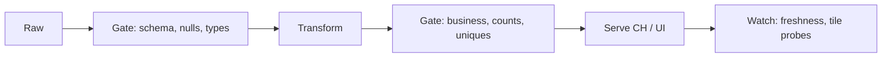

# Data Quality

A pipeline can be **operationally green** and still be wrong. Jobs succeed, Kafka lag is fine, ClickHouse inserts, Grafana shows a number. The number is garbage: a schema coerce to NULL, a timezone shift of 5.5 hours, a join that doubled rows.

Quality is how you detect **silent** failure before a human makes a decision. Uptime is necessary and insufficient.

Related: [metadata](../metadata/index.md), [Airflow idempotency](../airflow/idempotency.md), [incidents](../incidents/index.md).

---

## Silent failure modes (memorise these)

| Failure | Why nothing throws | What a check looks like |
|---------|--------------------|-------------------------|
| New column / missing field | JSON `get` defaults | Null rate on required columns |
| Type coerce | Spark "null on bad rows" | Row count in vs out, cast-fail counter |
| Timezone / epoch ms vs s | Still a timestamp | `max(ts)` vs now; distribution of hour-of-day |
| Fan-out join | More rows, job OK | Uniqueness; `count` vs `count distinct` |
| Hot tenant dropped by bug | Other tenants fine | Per-`customer_id` volume vs forecast |
| Duplicate delivery | At-least-once | Unique `event_id` |
| Partial partition overwrite | Success on 23/24 hours | Completeness by partition |
| Filter pushed wrong | SQL still valid | Sum of amount vs source system |

If your only alert is `job failed`, you will learn about these from a VP.

---

## Dimensions

| Dimension | Question | Example |
|-----------|----------|---------|
| **Completeness** | Are expected rows here? | Today's rows vs 7-day median; all Kafka partitions present |
| **Freshness** | Is it new enough? | `max(timestamp) > now() - 30 min` |
| **Validity** | Domain constraints | `status_code IN (...)`; `latency_ms >= 0` |
| **Uniqueness** | Dupes? | `count(*) = count(distinct event_id)` |
| **Consistency** | Cross-field / cross-table | `order_total ≈ sum(items)`; CH agg vs Iceberg within 1% |
| **Distribution** | Shape | p95 latency jump; country mix; null spike |

Start with completeness, freshness, uniqueness on **gold** tables. Distribution checks are how you catch the 5.5 h timezone bug (hour-of-day histogram).

---

## Where checks run (this is the architecture)



| Layer | What belongs | What does not |
|-------|--------------|----------------|
| **In-pipeline** (Flink/Spark/ingest) | Schema, required fields, drop/DLQ poison | Heavy cross-table consistency |
| **Warehouse / lake** (dbt, GE, CH) | Uniques, relationships, volume, recon to source | Blocking every ad-hoc query |
| **Serving** | Freshness of the **tile**, row policies | Recomputing all GE suites every 10 s |
| **Source** | Producer contract tests | Hoping the lake will notice |

!!! warning "Fail fast vs alert"
    **Block** the publish of gold `fct_orders` if uniqueness fails — better an old dashboard than a doubled GMV. **Alert but do not block** a distribution z-score on a volatile metric unless you have a runbook. Blocking on noisy tests teaches people to disable tests.

In-pipeline checks must be **cheap** (counters, sample). Warehouse checks can scan yesterday's partition. Do not run a full GE suite on 5M events/s in Flink.

---

## Great Expectations, used honestly

GE is a way to **version expectations** and emit a report. It is not a personality.

```python
validator.expect_column_to_exist("customer_id")
validator.expect_column_values_to_not_be_null("timestamp")
validator.expect_column_values_to_be_between("latency_ms", 0, 60000)
validator.expect_column_unique_value_count_to_be_between("status_code", 1, 20)
```

Honest use:

- Run on **batches** (yesterday's Iceberg partition, a CH sample), not on every Kafka record.
- A few dozen expectations per gold table, not 400.
- Fail the Airflow task on **critical** expectations; warn on others.
- Attach the result to OpenLineage / catalogue ([metadata](../metadata/index.md)).
- Do not GE the same thing dbt already tests.

Dishonest use: a suite nobody looks at, `mostly` thresholds that accept 40% nulls, or GE as a substitute for a schema registry.

---

## dbt tests, used honestly

```yaml
models:
  - name: clean_events
    columns:
      - name: event_id
        tests: [unique, not_null]
      - name: status_code
        tests:
          - accepted_values:
              values: [200, 201, 400, 404, 500, 502, 503]
      - name: customer_id
        tests:
          - not_null
          - relationships:
              to: ref('customers')
              field: customer_id
```

Honest use:

- Tests on **models that publish**, not on every staging view.
- `relationships` only when the parent table is complete (CDC lag will false-fail).
- `accepted_values` will break on a legitimate new status — that is a **feature** if you want to know; use a warn-severity if product adds codes weekly.
- Store test results; page the **owner**, not `#analytics-random`.

dbt tests are warehouse-time. They will not catch a 10-minute ClickHouse outage on the hot path — that is a serving freshness probe.

---

## Anomaly detection (after rules)

Rules miss unknown unknowns. A z-score on **row count per tenant per hour** catches "we dropped tenant 42."

```python
z = (today - history.mean()) / history.std()
if abs(z) > 3:
    alert(...)
```

Caveats:

- Weekly seasonality: compare **like-for-like weekday**, not a 30-day mean that includes weekends.
- Launches and bot attacks look like quality bugs — include a "known spike" path.
- Alert on **relative** drop per tenant, or whales drown the global z-score.

Do not start here. Start with `not_null` and partition completeness.

---

## Reconciliation

The only consistency check executives believe: **compare to the source of truth**.

- GMV from Iceberg `fct_orders` vs Postgres `sum(orders)` within 0.5%.
- CH `events_agg` vs Iceberg daily within 1% (hot path may be late).
- Fraud scores count vs Kafka `transaction_id` unique count.

When they diverge, lineage tells you **which hop**. Idempotency ([Airflow](../airflow/idempotency.md)) tells you whether a rerun is safe.

---

## Worked example: timezone silent fail

SaaS events: producer switches from epoch **seconds** to **milliseconds**. Spark still divides wrongly. All timestamps sit in 1970 or in the year 56,000. Job is green.

| Check | Result |
|-------|--------|
| `not_null timestamp` | Pass |
| `max(timestamp)` freshness vs `now()` | **Fail** (or insane future) |
| Hour-of-day distribution vs last week | **Fail** |
| Row count | Pass |

Two cheap checks would have blocked publish. This is why freshness is not optional.

---

## Quality on the five systems

| System | Gold check |
|--------|------------|
| Observability | Parse-fail rate; error ratio not zeroed; CH `max(ts)` |
| E-commerce | Unique `order_id` current state; GMV vs Postgres |
| IoT | Gap detection per device; `quality` flag rate |
| Fraud | Every score has `transaction_id`; no dup alerts on replay |
| SaaS analytics | Per-tenant volume z-score; RLS not tested here but **security** |

---

## V1 → V2

**V1:** schema registry + `not_null/unique` on gold + freshness on the exec dashboard + DLQ counts.

**Do not add yet:** ML anomaly platform, 500 GE expectations, blocking the firehose on a flaky test.

**V2:** per-tenant volume, recon to OLTP, quality facets in the catalogue, serving probes on CH tiles.

---

## Apply this at work

1. Pick one gold metric. Write the silent failures that would not crash the job.
2. Add the cheapest check that would catch each.
3. Decide block vs alert.
4. Page the owner.
5. After the next incident, add **one** check that would have caught it — not a new platform.

Labs do not replace this: when you [break ClickHouse ORDER BY](../labs/index.md), notice that **latency** is a quality signal for serving, not only for data values.

---

## Severity matrix

| Severity | Example | Action |
|----------|---------|--------|
| Sev-1 | Unique `order_id` fails on gold GMV | Block publish; keep last good partition |
| Sev-2 | Freshness 2× SLO | Page owner; still serve |
| Sev-3 | Distribution z=3 on a volatile metric | Ticket; do not wake 03:00 |
| Mute | Known launch window | Scheduled silence with owner |

If everything is Sev-1, people ignore pages. [Metadata](../metadata/index.md) owners own severity, not "the platform."

---

## Partition completeness

For date-partitioned Iceberg:

```sql
SELECT date, count(*) FROM fct_events
WHERE date >= current_date - 3
GROUP BY 1
ORDER BY 1;
```

Alert if a date is missing **or** 10× low vs weekday median. A job that "succeeded" on 23 hours is a silent fail. Airflow green is not completeness.

CH: compare `count()` vs Kafka `records_consumed` (OpenLineage facets or consumer metrics). 1% slack for at-least-once dupes if you have not deduped.

---

## Sampling in the hot path

Flink at 100k/s: keep **counters** (parse fail, null `customer_id`, status histogram) in operator state, flush every 10 s to metrics. Do not run GE per event. Sample 0.1% to a "quality topic" for heavier checks.

Warehouse: scan **yesterday** fully for gold. That is cheap compared to a wrong exec metric.

---

## Tests that lie

- `not_null` on a column that is 90% sentinel `""` or `0`.
- `accepted_values` that include every integer "to stop the noise."
- Volume check against a mean that includes the last outage (you learn to accept outages).
- Uniqueness on a column that is not a key (`user_id` on events).

Review tests like production code. Delete lying tests.

---

## Incident retro rule

Every silent fail gets **one** check with an owner. Not a new "quality platform" project. The [incidents](../incidents/index.md) in this academy are availability; add a data-quality incident of your own (timezone, fan-out join) using the same Alert → Symptoms → Hypothesis template.

---

## In-pipeline vs warehouse vs serving (examples)

| Check | Flink | dbt/GE on Iceberg | Grafana/CH |
|-------|-------|-------------------|------------|
| JSON parse fail | counter + DLQ | — | — |
| `event_id` unique | — | unique test on day partition | — |
| GMV vs Postgres | — | recon model | — |
| Tile freshness | — | — | `max(ts)` probe |
| Null `customer_id` | drop/DLQ | not_null | — |

Do not duplicate `not_null` in all three. Pick the **earliest** cheap layer.

---

## Unit of blocking

Block a **partition publish** (yesterday's `date=`), not the whole table history, not the Kafka topic (unless poison rate is 100%). Serving layer keeps last good tile. Product would rather see 10-minute-old GMV than 2× GMV.

---

## dbt `warn` vs `error`

`error` fails the DAG. `warn` is a log nobody reads unless you page on warn count. Treat warn as **debt** with a weekly triage. Infinite warns = no tests.

`relationships` to a CDC table that lags 20 minutes will flap. Use a dedicated recon job with slack, not a per-run FK test.

---

## Great Expectations checkpoints

Run GE as an Airflow task after the Spark write, before `gold` pointer swap. Store HTML/JSON in S3 with the run id. Link from the catalogue. If nobody opened a GE report in 90 days, delete the suite.

---

## Per-tenant quality (SaaS)

Global row count can pass while `cust_0042` is zero. Group volume checks by `customer_id` for **gold tenants** (or all tenants above a size). This is the [analytics](../architectures/analytics-platform.md) empty-funnel case.

---

## Timezone and clocks

Store UTC. Document it. Check: `hour(ts)` distribution weekday vs last week; `max(ts) < now() + 1h` (future) and `max(ts) > now() - slo`. Epoch ms vs s is a **bimodal** timestamp histogram. Cheap. Catch it.
