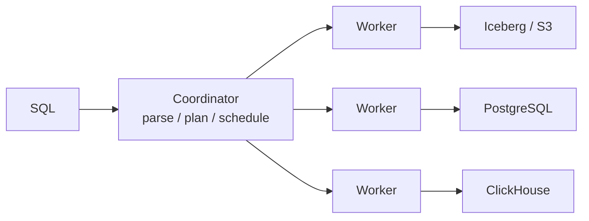
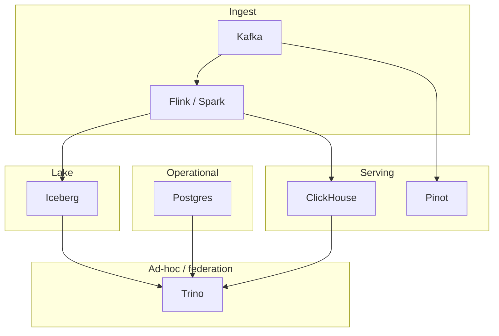

# Query Engines

This module compares engines that query external storage with [managed cloud warehouses](cloud-warehouses.md), where storage, workload isolation, governance, and operations are bundled behind a service contract.

You already have the data. Product events live as Iceberg tables on object storage. Customer records live in Postgres. Billing lives in another team's MySQL. An analyst wants one SQL statement that joins all three and returns this afternoon.

Nobody wants to copy 40 TB into a fourth system first. That copy is stale the moment it lands, expensive to keep, and somebody else's on-call.

A **query engine** is the piece that runs SQL over data it does not own. Compute is a cluster. Storage is whatever the connectors can read. That split is the entire product.

---

## Workload this module is built around

The **SaaS analytics platform** stores:

| Store | What lives there | Typical size |
|-------|------------------|--------------|
| Iceberg on S3 | `events` — `{timestamp, customer_id, user_id, service, endpoint, latency_ms, status_code, bytes}` | hundreds of millions of events/day, years of history |
| PostgreSQL | `customers`, `plans`, `feature_flags` | tens of millions of rows, mutated all day |
| ClickHouse | serving tables for product dashboards | hot 30–90 days |

Questions that actually get asked:

- “p95 latency for `/checkout` last Tuesday, broken down by plan tier” — Iceberg events JOIN Postgres plans.
- “which customers on the enterprise plan still hit the deprecated API?” — same join, different filter.
- “reconcile yesterday’s ClickHouse dashboard with the lake” — federation, not a second ETL.

If the question is a customer-facing dashboard at 200 QPS and 200 ms, this is the wrong module. Go to [ClickHouse](../olap/clickhouse.md) or [Pinot](../olap/pinot.md). If the question is “SQL over whatever we already have,” stay here.

---

## What this module covers

| Topic | What you will be able to do |
|-------|-----------------------------|
| [Trino](trino.md) | Plan a federated query: coordinator, workers, connectors, splits, stages, exchanges; pushdown; join distribution; why the coordinator OOMs |
| [Cloud data warehouses](cloud-warehouses.md) | Explain what BigQuery, Snowflake, and Redshift actually do with a byte and a query; choose between a managed warehouse and a lakehouse/engine stack from workload evidence |

Trino is the engine we go deep on because it is the one you will actually operate against a lakehouse. Presto, Spark SQL, and BigQuery share pieces of the same mental model — stages, shuffles, stats — but they do not federate the same way.

---

## The split: engine vs database

A database **owns** bytes on disk. Postgres, ClickHouse, Cassandra: you INSERT, they store, they query their own files.

A query engine **borrows** bytes. Trino never writes a MergeTree part. It asks a connector for splits, workers read them, they shuffle intermediate rows, they return a result set, and they forget.



That picture has three consequences you cannot negotiate:

1. **You still pay the network.** Joining Iceberg to Postgres means workers pull Iceberg columns *and* Postgres rows. Federation is not free compute over a magic bus.
2. **The source’s access path is your access path.** If Postgres cannot split a 200 GB table, one Trino worker waits on one JDBC scan. The cluster size does not fix that.
3. **There is no storage-side index you control**, except what the source already has (Iceberg manifests, Postgres B-trees, ClickHouse marks). Trino can prune; it cannot invent a primary key on someone else’s table.

---

## How a query actually runs

Forget “Trino is distributed SQL” for a moment. A query is a tree of **stages** connected by **exchanges**.

```
SELECT c.plan, approx_percentile(e.latency_ms, 0.95)
FROM iceberg.analytics.events e
JOIN postgres.public.customers c ON e.customer_id = c.id
WHERE e.ds = DATE '2024-06-12'
  AND e.endpoint = '/checkout'
GROUP BY c.plan
```

Rough physical shape:

| Stage | What happens | Parallelism comes from |
|-------|----------------|------------------------|
| Scan Iceberg | List manifests, prune to `ds=2024-06-12`, read `customer_id`, `latency_ms`, `endpoint` | splits ≈ files / row groups |
| Scan Postgres | JDBC read of `customers` (hopefully `WHERE` pushed, often not for a join build) | usually 1–few splits |
| Join + partial agg | Redistribute or broadcast, hash join, partial `GROUP BY plan` | workers |
| Final agg + output | Gather to coordinator (or a single output stage) | one bottleneck if the result is huge |

Two joins of the same SQL are not the same plan. If `customers` is 50 MB, Trino should **broadcast** it and skip the shuffle of events. If `customers` is 80 GB and stats are missing, it may **partition both sides** — or worse, try to broadcast and kill a worker. Stats are not a nicety; they are the difference between a 12-second query and an incident.

Deep internals, SQL, EXPLAIN, and the coordinator-memory failure mode live in [Trino](trino.md).

---

## What “fast” means here

| Kind of question | Honest latency | Right engine |
|------------------|----------------|--------------|
| Ad-hoc lake SQL, 10–500 GB scanned | seconds to a minute | Trino |
| Federated Iceberg ⨝ Postgres | seconds, dominated by the slowest source + network | Trino |
| Nightly transform Iceberg → Iceberg | minutes, fine | Trino or Spark |
| Product dashboard, 200 ms, 100 QPS | milliseconds | ClickHouse / Pinot on a serving copy |
| Point lookup `WHERE customer_id = 42` | milliseconds | Postgres, not Trino |

Trino’s per-query tax is real: parse, analyze, split enumeration, scheduling. That tax is noise on a 40-second scan. It is the whole bill on a 20 ms lookup.

---

## Federation is a cost model, not a feature checkbox

People sell federation as “query data without ETL.” True, and incomplete.

You still:

- **Pay S3 LIST + GET** for every Iceberg planning cycle (coordinator / Iceberg connector).
- **Pay JDBC** for every Postgres split, holding connections and snapshots you may not have thought about.
- **Move columns you forgot to prune** if the connector cannot push projections.
- **Amplify** a bad predicate: `WHERE lower(email) = '…'` over a 2 TB Iceberg table is a full read, federated or not.

ETL is the act of **paying that cost once**, into a shape the serving engine likes. Federation is paying it **on every query**. Both are legitimate. Mixing them up is how a “simple Trino join” becomes the most expensive query in the company.

The comparison with a serving store is [ClickHouse vs Trino](../comparisons/clickhouse-vs-trino.md). The lake table that makes Iceberg scans viable is [Iceberg](../lakehouse/iceberg.md).

---

## Scale cliffs (preview)

| Scale | What you notice |
|-------|-----------------|
| 10× (1 → 10 TB lake, same cluster) | Split count and S3 GET rate; small files; coordinator planning time |
| 100× | Stats go stale; broadcast joins become time bombs; Postgres side cannot keep up |
| 1000× | You stop federating the hot path. Iceberg for history, ClickHouse/Pinot for dashboards, Trino for humans and batch |

Nothing in Trino removes the need for [partitioning](../foundations/partitions.md) and [columnar files](../olap/columnar-storage.md). The engine can only skip what the table format and file layout make skippable.

---

## How this sits in the platform



Trino is the **SQL front door** to the lake and to systems you do not want to copy. It is not the dashboard store, not the OLTP store, and not a replacement for Spark when the job is a 12-hour shuffle with tight memory control.

---

## How to study this module

1. Read [Trino](trino.md) with one query in your head: Iceberg events ⨝ Postgres customers, filtered to one day and one endpoint.
2. For every operator in EXPLAIN, name whether it runs on a worker or the coordinator, and whether it crosses the network.
3. Predict: broadcast or partitioned join? Then look at what happens when `customers` grows from 50 MB to 50 GB with **no** `ANALYZE`.
4. Only then compare to [ClickHouse](../olap/clickhouse.md). If you cannot say which bytes move, you cannot choose.

---

## Exercise

An on-call dashboard joins 90 days of Iceberg events to Postgres `customers` on every page load (p95 8 s, 40 QPS at 09:00). A PM asks to “just point Grafana at Trino — we already have the data.”

Decide: keep federation, cache, or ETL into a serving store. Name the first bottleneck you expect.

??? success "Answer"
    ETL (or a scheduled incremental job) into ClickHouse or Pinot for the dashboard. 40 QPS × 8 s is not an ad-hoc workload; it is a serving SLA. Federation still pulls Iceberg files and Postgres rows **on every load**, so you pay S3 and JDBC at the traffic pattern of the UI.

    First bottleneck is usually **repeated Iceberg scans** (split planning + S3) and **Postgres connection / scan load** at 09:00, with coordinator queued queries behind them. Caching the Trino result (or a materialized serving table) is the stopgap; the durable fix is a copy shaped for the dashboard’s GROUP BYs. Keep Trino for the analysts who need the join *today* against current Postgres, not for the tile that refreshes every 30 seconds.
