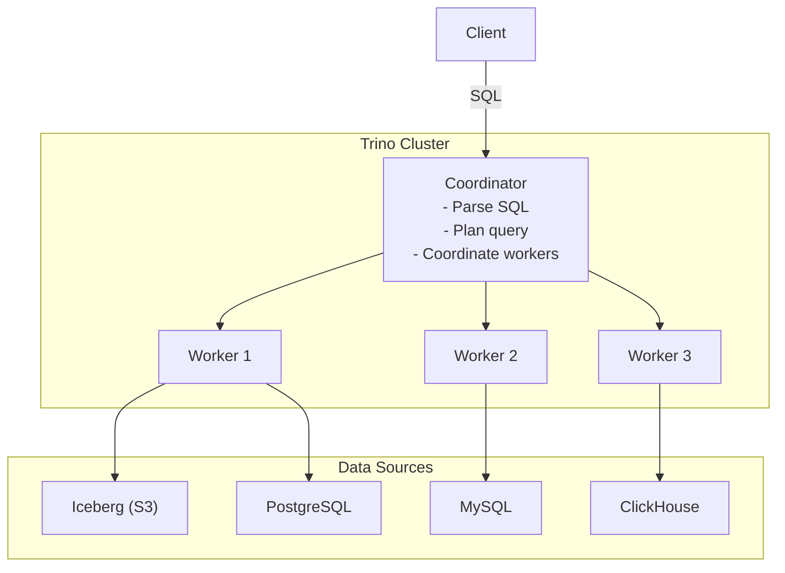

# Trino

## The Problem

Your data exists in:
- Iceberg tables on S3 (historical events)
- PostgreSQL (user profiles)
- MySQL (order data)
- A REST API (real-time pricing)

An analyst wants to JOIN all of these in one SQL query. Without copying all data into one place first.

Trino is the answer.

---

## What Trino Is

Trino (formerly PrestoSQL) is a **distributed SQL query engine** that queries data where it lives. It does not store data. It connects to data sources via **connectors** and executes queries across them.



---

## Architecture

**Coordinator**: receives queries, parses SQL, produces a distributed execution plan, schedules work on workers.

**Workers**: execute tasks, read data from connectors, perform partial computations, exchange data between stages.

**Connectors**: plugins that connect Trino to a specific data source. Trino ships with connectors for Iceberg, Hive, PostgreSQL, MySQL, Kafka, Elasticsearch, ClickHouse, and many others.

---

## Splits

A **split** is the smallest unit of work — reading one chunk of data from a connector.

For an Iceberg table with 1000 Parquet files:
- Each file becomes one or more splits
- Workers pull splits and process them in parallel

For PostgreSQL:
- A split might be a range of rows or a full table scan
- PostgreSQL doesn't naturally support splitting, so large PostgreSQL queries in Trino may be bottlenecked

---

## Stages and Exchanges

A Trino query plan decomposes into stages connected by **exchanges** (data transfers between stages).

```
Stage 1: Read Iceberg data (many splits in parallel)
  ↓ Exchange (redistribute by join key)
Stage 2: Read PostgreSQL data
  ↓ Exchange (redistribute by join key)
Stage 3: JOIN + GROUP BY
  ↓ Exchange (aggregate)
Stage 4: Final aggregation → return to client
```

Each stage runs as many tasks as there are workers (or splits, whichever is smaller). Tasks process splits and produce output for the next stage.

---

## Predicate Pushdown

Trino pushes predicates to connectors when possible. The connector handles filtering close to the data.

For Iceberg:
```sql
SELECT * FROM events WHERE date = '2024-01-15' AND country = 'india'
```

Trino pushes `date = '2024-01-15'` to the Iceberg connector, which uses partition pruning to skip unrelated files. Then `country = 'india'` is pushed as a Parquet filter.

For PostgreSQL:
```sql
SELECT * FROM users WHERE user_id = 12345
```

Trino sends `SELECT * FROM users WHERE user_id = 12345` directly to PostgreSQL. PostgreSQL uses its B-tree index on `user_id`.

Without pushdown, Trino would read all rows from the source and filter locally — potentially reading gigabytes when only kilobytes are needed.

---

## Join Distribution Strategies

**Broadcast join**: the smaller table is sent to all workers. Each worker has a full copy and can JOIN with its local data without shuffling.

Use when one side is small (< a few GB).

**Partitioned (hash) join**: both sides are shuffled by the join key. Records with the same key end up on the same worker.

Use for large-to-large joins.

**Trino chooses automatically** based on table statistics (from connectors that provide them). You can override:

```sql
SELECT /*+ BROADCAST(users) */ *
FROM events e JOIN users u ON e.user_id = u.user_id
```

---

## Cost-Based Optimization

Trino uses connector-provided statistics (row counts, column cardinality, min/max values) to estimate join costs and choose strategies.

For Iceberg, statistics are stored in manifest files. For PostgreSQL, Trino can query `pg_statistics`. When statistics are stale or missing, Trino falls back to heuristics.

Refresh statistics after large writes:

```sql
-- For Iceberg in Trino
ANALYZE TABLE events;
```

---

## ClickHouse vs Trino: A Critical Distinction

**ClickHouse** owns and manages data. It stores data in its own columnar format on its own disks. Queries execute against ClickHouse's storage.

**Trino** does not own data. It connects to external data sources and executes SQL across them. It has no persistent storage.

When they overlap:
- You have Iceberg data and want fast aggregations: **Trino** (query directly) or **ClickHouse** (copy data in)
- You need millisecond dashboard queries on billions of rows: **ClickHouse** (Trino is slower for this)
- You need to JOIN Iceberg data with PostgreSQL: **Trino** (ClickHouse cannot query PostgreSQL directly)
- You need ad-hoc queries across your entire data lake: **Trino**

---

## Production Gotchas

!!! warning "Trino Is Not Optimized for Small Queries"
    Trino's startup cost per query (planning, scheduling) is non-trivial. For thousands of simple point-lookup queries per second, use a database. Trino is optimized for complex analytical queries, not high-QPS simple lookups.

!!! warning "Connector Quality Varies"
    The Iceberg connector is excellent. The PostgreSQL connector has limited pushdown. The MySQL connector may read full tables without indexes. Know your connector's limitations.

---

## How to Apply This at Work

Use Trino when:
1. You need to JOIN data across multiple data stores
2. You need ad-hoc querying over a data lake without managing a separate analytics database
3. You need federated queries across cloud services

Do not use Trino when:
1. You need sub-second dashboard queries (ClickHouse or Pinot are faster)
2. Your workload is thousands of simple queries per second
3. Your data lives entirely in one source that has its own query engine
