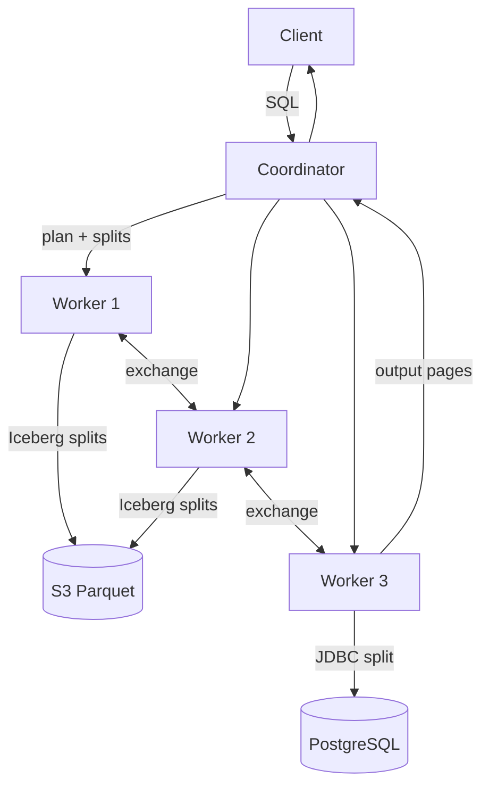

# Trino

10:41 AM. `WHERE ds = DATE '2024-06-12'` should prune to a single day of a 400 TB Iceberg table. `EXPLAIN` shows Trino scanning all 400 days instead. The analyst who wrote the query swears the `WHERE` clause is right there.

What broke the prune?

A. Table statistics are stale, so the optimizer estimated wrong.
B. Something is wrapping the partition column in a function — `date_trunc(ds)` instead of the raw column — and that alone kills prune.
C. The Iceberg connector doesn't support partition pruning for this table.

Pick one before you scroll to the fix.

It's B, almost always. Product events sit in Iceberg on S3. Customer plans sit in Postgres. An analyst writes one JOIN and expects an answer this afternoon — without a new ETL, without a new warehouse, without waiting on the platform team to copy 40 TB. That is the job. Trino is a cluster that runs SQL over connectors. It does not store the events. It does not index Postgres. It **schedules readers** and **shuffles intermediate rows** — and every one of those steps can be quietly defeated by SQL that looks correct.

---

## Use case

SaaS analytics, hundreds of millions of events per day:

```sql
SELECT c.plan,
       count(*) AS requests,
       approx_percentile(e.latency_ms, 0.95) AS p95
FROM iceberg.analytics.events e
JOIN postgres.app.customers c
  ON e.customer_id = c.id
WHERE e.ds BETWEEN DATE '2024-06-01' AND DATE '2024-06-07'
  AND e.endpoint = '/checkout'
GROUP BY 1
ORDER BY requests DESC;
```

`events` is partitioned by `ds`, stored as Parquet, tens of TB. `customers` is a live OLTP table, tens of millions of rows, updated continuously.

If this query is a Grafana tile at 200 QPS, stop. Put a serving copy in [ClickHouse](../olap/clickhouse.md). If this query is a human or a daily report, Trino is the right shape.

---

## Why this is hard

Three independent systems, three latency budgets, one SQL statement.

- **Iceberg** can skip files using manifests. Only if the predicate hits partition columns or min/max stats. `endpoint = '/checkout'` is a data filter, not a partition prune, unless you partitioned on endpoint (you should not).
- **Postgres** is a row store with B-trees. Trino talks JDBC. Large scans hold connections, miss indexes if the predicate is not pushed, and **do not split** the way Parquet files split.
- **The join** has to move at least one side. Broadcast 80 GB of customers and workers die. Partition both sides and you pay a shuffle that looks like Spark, plus you still paid S3 and JDBC to produce the shuffle inputs.

Federation does not cancel physics. You still pay network, you still pay the worst connector, you still pay planning on the coordinator.

---

## Intuition

Treat Trino as a **distributed iterator factory**.

1. Coordinator turns SQL into a tree of **stages**.
2. Each stage is many **tasks** (usually one per worker, each running many **drivers**).
3. A task pulls **splits** — “read this file / this row-group / this JDBC range.”
4. When a stage needs another stage’s output, rows move through an **exchange** (shuffle, broadcast, or gather).



The coordinator is **not** a worker with extra medals. It holds the plan, the split queue, and often the final gather. That is why coordinator OOM is a genre of incident, not a freak accident.

---

## Internals

### Coordinator, workers, connectors

| Piece | Owns | Dies when |
|-------|------|-----------|
| **Coordinator** | SQL parse, analysis, optimizer, split assignment, query state | Metadata storms, huge plans, huge result gather, too many concurrent queries |
| **Worker** | Operators: scan, filter, project, hash join, agg, exchange buffers | Hash table too big, broadcast too big, skewed partition |
| **Connector** | How a source becomes splits + pages | Pushdown lies, slow LIST, JDBC without indexes |

Connectors are plugins. Iceberg, Hive, Delta, Postgres, MySQL, Kafka, ClickHouse, memory, JMX — quality is **not** uniform. The Iceberg connector can prune partitions, push Parquet filters, and read footers. The Postgres connector can push simple predicates and aggregations *sometimes*; a JOIN predicate is not a WHERE on the remote side unless the optimizer rewrites it that way.

### Splits

A **split** is the smallest unit the scheduler hands out.

| Source | Typical split | Parallelism |
|--------|---------------|-------------|
| Iceberg / Parquet | File or row group (plus delete files) | High — thousands of files, workers steal splits |
| Hive on S3 | File / block | High, unless you have 200,000 tiny files |
| PostgreSQL | Often **one split per table** (or a coarse partition) | Low — one JDBC scan |
| MySQL | Same story | Low |
| Kafka | Partition-based | Medium |

If the Postgres side of a federated join is 200 GB with one split, 40 Iceberg workers finish and wait on one JDBC reader. Adding Trino workers does nothing. That is the connector, not “Trino is slow.”

### Stages, tasks, drivers, exchanges

A plan fragment is a **stage**. Stages connect with **exchanges**:

| Exchange | What it does | When you want it |
|----------|----------------|------------------|
| **Gather** | All rows to one place (often coordinator / output) | Final result, `ORDER BY` without limit |
| **Repartition** (hash) | Shuffle by key | Partitioned join, `GROUP BY` with high cardinality |
| **Replicate** (broadcast) | Send the whole build side to every worker | Small dimension table |

```
Stage 0  (output / gather)
   ↑
Stage 1  (join + partial aggregation)
   ↑                    ↑
Stage 2  (Iceberg scan) Stage 3  (Postgres scan)
```

Inside a worker, a task runs **drivers**: pipelines of operators pulling **pages** (columnar batches). That is why Trino likes [columnar storage](../olap/columnar-storage.md) even though it does not own files — pages are vectors.

### Predicate, column, and partition pruning

Three different skips. Mixing them up is how you “push a filter” and still read 8 TB.

**Partition pruning** (Iceberg / Hive): drop entire files using partition values in metadata. `WHERE ds = DATE '2024-06-12'` should never open June 11.

**Column pruning**: read only `customer_id`, `latency_ms`, `endpoint` from Parquet. A `SELECT *` on a 40-column table is a self-inflicted IO tax.

**Predicate pushdown**: evaluate `endpoint = '/checkout'` in the Parquet reader (min/max, dictionaries, zone maps) or as `WHERE` on Postgres. Residual predicates still run in Trino after the page arrives.

```sql
-- Partition prune: ds
-- Column prune: customer_id, latency_ms, endpoint
-- Data filter (Parquet): endpoint
SELECT customer_id, latency_ms
FROM iceberg.analytics.events
WHERE ds = DATE '2024-06-12'
  AND endpoint = '/checkout';
```

A function on the partition column kills prune:

```sql
-- Reads every ds partition. You asked for it.
WHERE date_trunc('week', ds) = DATE '2024-06-10'
```

### Dynamic filtering

For `big ⨝ small` with a selective filter on the small side, Trino can collect join keys from the build side and push them into the probe scan **while the query runs**.

```sql
SELECT e.endpoint, count(*)
FROM iceberg.analytics.events e
JOIN postgres.app.customers c
  ON e.customer_id = c.id
WHERE c.plan = 'enterprise'          -- selective on the small side
  AND e.ds = DATE '2024-06-12';
```

If dynamic filtering fires, Iceberg workers skip row groups whose `customer_id` ranges miss the enterprise id set. If it does not fire (stats say the filter is not selective, or the build is late), you scan the whole day and throw rows away at the join.

Dynamic filtering is **not** partition pruning. It is a runtime bloom/list of keys. It needs the build side to finish early enough to matter.

### Broadcast vs partitioned join

| Strategy | Bytes moved | Memory | Use when |
|----------|-------------|--------|----------|
| **Broadcast** | Build side × worker count | Each worker holds the hash table | Build side small (tens to a few hundred MB, *maybe* low GB if workers are fat) |
| **Partitioned** | Both sides shuffled by join key | Hash table is per-partition | Both sides large |
| **Skewed partitioned** | Same, plus one worker eats a hot key | That worker OOMs | `customer_id` of your biggest tenant |

Hints exist. Prefer fixing stats over sprinkling hints.

```sql
SELECT /*+ BROADCAST(c) */
       e.endpoint, c.plan, count(*)
FROM iceberg.analytics.events e
JOIN postgres.app.customers c ON e.customer_id = c.id
WHERE e.ds = DATE '2024-06-12'
GROUP BY 1, 2;
```

Broadcast of a “small” table that is actually 12 GB uncompressed pages is a classic worker OOM. The SQL looks innocent. The plan is not.

### CBO and statistics

The optimizer estimates row counts to pick join order and distribution.

| Source | Where stats live | Go stale when |
|--------|------------------|---------------|
| Iceberg | Manifest / NDV / size in metadata; `ANALYZE` in Trino | You ingested 10 TB and never analyzed |
| Hive | Metastore | Same |
| Postgres | `pg_statistic` via JDBC, if enabled | Autovacuum lag, or Trino cannot see them |

Without stats, Trino falls back to heuristics: “this looks small, broadcast it.” That guess is how production dies after a silent table growth.

```sql
ANALYZE iceberg.analytics.events;
SHOW STATS FOR iceberg.analytics.events;
```

CBO cannot save a query whose predicate is `WHERE json_extract(...) = ...` over unpartitioned JSON. Estimates need structure.

---

## How

Catalogs are the unit of federation. A cluster with Iceberg + Postgres looks like this operationally (names vary):

```sql
-- iceberg.properties (coordinator + workers)
-- connector.name=iceberg
-- iceberg.catalog.type=glue   -- or hive, rest, jdbc, nessie
-- hive.s3.region=us-east-1

-- postgres.properties
-- connector.name=postgresql
-- connection-url=jdbc:postgresql://orders-db:5432/app
-- connection-user=trino_ro
```

Query as `catalog.schema.table`:

```sql
USE iceberg.analytics;

EXPLAIN
SELECT c.plan, count(*)
FROM events e
JOIN postgres.app.customers c ON e.customer_id = c.id
WHERE e.ds = DATE '2024-06-12'
GROUP BY 1;
```

What you want to see in `EXPLAIN`:

- Iceberg scan with **partition filter** `ds = …` and **projected columns** listed.
- Postgres scan with a **pushed predicate** if you filtered customers; if not, a full table scan warning in your head.
- Join: `Replicated` (broadcast) vs `Partitioned`.
- Partial vs final aggregation.

`EXPLAIN ANALYZE` adds wall time, input positions, and peak memory **per task**. Use it on a sample date first. It is heavier than `EXPLAIN`.

Session knobs you will actually touch:

```sql
SET SESSION join_distribution_type = 'AUTOMATIC';  -- default; don't leave at BROADCAST
SET SESSION join_reordering_strategy = 'AUTOMATIC';
SET SESSION iceberg.query_partition_filter_required = true;  -- belt vs accidental full scan
```

`iceberg.query_partition_filter_required` is a production seatbelt for a table that is 400 TB. Analysts hate it until the first unfiltered `SELECT count(*)`.

Write path (optional): Trino can `CREATE TABLE AS` / `INSERT` into Iceberg. That is batch ETL, not “Trino is a warehouse.” Memory and commit rules still apply.

```sql
CREATE TABLE iceberg.analytics.checkout_daily
WITH (partitioning = ARRAY['ds'])
AS
SELECT ds, c.plan, count(*) AS requests
FROM iceberg.analytics.events e
JOIN postgres.app.customers c ON e.customer_id = c.id
WHERE e.ds BETWEEN DATE '2024-06-01' AND DATE '2024-06-07'
GROUP BY 1, 2;
```

You just **paid federation once** and stored the answer. Dashboards should hit this table, not the original JOIN.

---

## Gotchas

!!! production-gotcha "SELECT * over a wide Iceberg table"
    Column pruning only helps if you do not ask for every column. Wide event tables (nested JSON, maps, debug blobs) turn a “simple count” into a multi-GB-per-split read. Project explicitly.

!!! production-gotcha "Functions on partition columns"
    `WHERE CAST(ds AS varchar) = '2024-06-12'` or `date_trunc` on `ds` disables partition prune. Filter with the typed partition column.

!!! production-gotcha "Federating OLTP as if it were a lake"
    A JOIN that scans Postgres at 09:00 is a denial-of-service against the primary. Use a replica, a snapshot, or a nightly export. `connection-url` pointing at the primary is an incident report waiting for a date.

!!! production-gotcha "Tiny files"
    2 million 8 MB Iceberg files: coordinator spends the query in split enumeration and workers spend it in S3 GET setup. Compact. This is a table-format problem Trino will happily show you as “planning time 4 minutes.”

!!! production-gotcha "Connector quality"
    Iceberg ≠ MySQL ≠ REST. Assume **no** pushdown until `EXPLAIN` shows it. The MySQL connector reading an unindexed 400 M-row table will do it from one split.

---

## Failure modes

| Failure | What it looks like | Root |
|---------|--------------------|------|
| **Coordinator OOM** | Coordinator JVM dies; all queries fail; workers look idle | See next section |
| **Worker OOM** | One node gone, query aborted `Query exceeded per-node memory` | Broadcast too large, agg hash table, skew |
| **Query timeout / queue** | Cluster up, nothing starts | Too many concurrent queries, planning stuck on LIST |
| **Wrong results from stale snapshot** | Iceberg time travel vs “I just inserted” | You queried a snapshot committed before the write |
| **Postgres lock / replica lag** | JDBC waits, or you read yesterday’s customers | Isolation and replica lag are now *your* semantics |
| **S3 throttling** | 503 / slow GET | Split storm after partition explosion |

Federation **cost** is a failure mode of the budget, not the JVM: a “cheap” ad-hoc JOIN that scans 80 TB of Iceberg plus 200 GB of Postgres every hour is a six-figure cloud bill. The engine did what you asked.

---

## Debugging

### Why the coordinator OOMs

The coordinator keeps:

- the query plan and stage graph
- **split objects** for every running query
- exchange buffers for the **output stage** (rows returning to the client)
- metadata (Iceberg manifests listed during planning)

It OOMs when any of those get huge:

1. **Small files / millions of splits.** Planning a table with pathological files materializes a split list the JVM cannot hold.
2. **Gather of a fat result.** `SELECT * FROM events WHERE ds = today` with no aggregation, client is a BI tool that fetches slowly. Output piles up on the coordinator.
3. **Too many concurrent queries.** Each query holds plan + splits. 200 “light” queries are not light on the coordinator.
4. **EXPLAIN ANALYZE + verbose plans** on a monster query, in a pinch.

Workers have `query.max-memory-per-node`. The coordinator’s heap is a **separate** budget. Raising worker memory does not save the coordinator.

What to look at:

- Coordinator heap histogram / GC logs at crash.
- Query UI: **planning time** vs **execution time**. Planning in minutes → metadata / splits.
- `SHOW STATS`, file counts: `SELECT count(*) FROM iceberg.analytics."events$files"`.
- Output row count: if the answer is 400 million rows, the coordinator (or the client) is the product.

Mitigations: compact Iceberg, require partition filters, cap `query.max-output-size` / result size, run a beefy dedicated coordinator, split interactive and ETL clusters, **do not** gather unbounded `SELECT *`.

### EXPLAIN, memory, and the UI

```sql
EXPLAIN (TYPE DISTRIBUTED) SELECT ...;
EXPLAIN ANALYZE SELECT ...;   -- sample first
```

Read, in order:

1. How many **fragments** (stages)? Extra shuffles you did not intend?
2. Scan estimates vs `SHOW STATS`. If estimate is 10,000 and reality is 4 billion, CBO is fiction.
3. Join distribution. Broadcast of a table whose size is `?` is a guess.
4. Peak memory per task in ANALYZE. One task at 80 GB, others at 2 GB → skew.

On workers: `query.max-memory-per-node` vs `query.max-total-memory`. Spilling (if enabled) trades OOM for disk; it does not fix a broadcast of a 50 GB table.

---

## Scale 10× / 100× / 1000×

Assume today’s lake is ~10 TB of events, ~50 M customers, a 20-worker Trino, dashboards **not** on Trino.

| Scale | What breaks | What you change |
|-------|-------------|-----------------|
| **10×** (~100 TB, ~1 B events/day peak weeks) | Split counts, S3 GET, planning time, Postgres replica CPU if you still federate daily | Compact files, partition evolution, `ANALYZE` after large loads, dedicated read replica, session partition-filter required |
| **100×** | Broadcast heuristics fail; one tenant skews joins; coordinator split tracking; JDBC cannot scan the dimension | Stop broadcasting customers; pre-join or denormalize into Iceberg; warehouse the dimension nightly; maybe spill; **remove** OLTP from the hot path |
| **1000×** | Federation as architecture is too expensive for anything repetitive | Trino remains the human SQL layer. Serving copies in ClickHouse/Pinot. ETL (Spark/Flink/Trino CTAS) materializes joins. You do not JOIN 10 PB to Postgres at query time |

Worker count scales scans that **split**. It does not scale a 1-split JDBC source. Horizontal scale without file layout is buying more clients for the same S3 prefix.

---

## Trade-offs

| You get | You give up |
|---------|-------------|
| SQL over Iceberg + Postgres **today** | Predictable p95; you inherit every source’s worst day |
| No extra copy for exploratory questions | You pay IO and network **per query** |
| Elastic compute, cheap object storage | No MergeTree-quality skip index you control |
| One dialect for analysts | Connector semantics (nulls, timestamps, isolation) are a minefield |

Trino is a **good** default for lakehouse SQL. It is a **bad** default for user-facing analytics.

---

## Alternatives

| Option | When it wins |
|--------|----------------|
| **Spark SQL** | Heavy shuffles, iterative jobs, huge writes, you already run Spark |
| **ClickHouse** | Sub-second dashboards on data you are willing to own; see [ClickHouse vs Trino](../comparisons/clickhouse-vs-trino.md) |
| **Pinot / Druid** | High-QPS dimensional queries, freshness in seconds |
| **BigQuery / Snowflake** | You want a managed warehouse and will copy or external-table the lake |
| **Postgres FDW** | Tiny data, one join, no cluster |
| **DuckDB / local Trino** | Laptop-scale Parquet, not 200 concurrent analysts |

Choosing Trino *and* ClickHouse is normal. Choosing Trino *instead of* ClickHouse for the Grafana board is the usual mistake.

---

## Apply

You are looking at a federated query job when:

1. The data already lives in more than one system of record.
2. The consumers are humans, notebooks, or daily jobs — not a 50 ms API.
3. A full copy would be stale, expensive, or politically impossible *for this question*.

Then: pick catalogs, **require** partition predicates on fact tables, `ANALYZE` after loads, put Postgres on a replica, read `EXPLAIN` before the query hits 10 TB, and materialize anything a dashboard will rerun.

If the same JOIN is in a product path, it is no longer a Trino problem. It is an ETL problem.

Related: [Iceberg](../lakehouse/iceberg.md), [columnar storage](../olap/columnar-storage.md), [distributed execution](../foundations/distributed-execution.md), [analytics platform](../architectures/analytics-platform.md).

---

## Exercise

`events` is Iceberg, partitioned by `ds`, 400 TB, 80 columns. `customers` is Postgres, 120 million rows, ~40 GB on disk. Cluster: 1 coordinator (32 GB heap), 30 workers (64 GB heap each). Query:

```sql
SELECT e.*, c.plan, c.region
FROM iceberg.analytics.events e
JOIN postgres.app.customers c ON e.customer_id = c.id
WHERE date_trunc('month', e.ds) = DATE '2024-06-01';
```

A BI tool runs this at 09:05. Ten minutes later the coordinator is in GC thrash and two workers are dead. Name **three** independent defects in this SQL/plan, and what you would change first. Would you broadcast `customers`?

??? success "Answer"
    Defects:

    1. **`date_trunc` on `ds`** — partition pruning is dead. You scan every `ds` in the table (or far more than June), 400 TB-class planning and IO.
    2. **`e.*`** — no column pruning. Nested/debug columns come along for the ride.
    3. **Unbounded gather of the join** — the result is on the order of a month of events (billions of rows) streamed through the output stage. Coordinator buffers + BI fetch pattern → coordinator GC / OOM. Workers die if the optimizer **broadcasts** 40 GB+ of customers (uncompressed pages are larger than on-disk Postgres).

    First change: replace the predicate with `e.ds >= DATE '2024-06-01' AND e.ds < DATE '2024-07-01'`, project only needed columns, and **aggregate or write to a table** instead of returning `e.*`. Put the BI tool on a CTAS result.

    Broadcast `customers`? **Not at 40 GB on disk.** That is tens of GB of pages times every worker if replicated — a worker OOM. Partitioned join, or better: export `customers` to Iceberg nightly and join in the lake with stats. Do not run this against the primary at 09:05.
