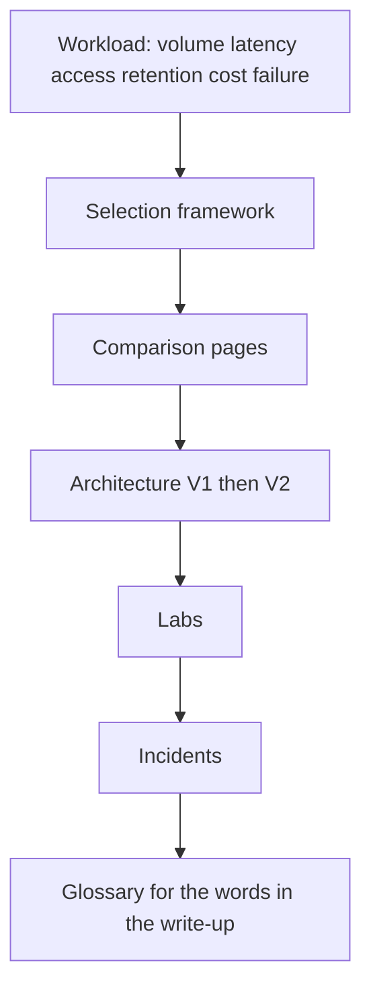

# Reference

A design review: someone asks "why not Databricks for everything?" A teammate opens this page, searches for "selection framework," and starts reading glossary definitions instead of answering the question.

Predict before you read on: is that the right reflex, or is reference the wrong place to start when you are still building intuition?

It's the wrong place. Use this section when you need a **precise term** or a **version pin**, not a tutorial or a decision procedure — [Versions & Primary Sources](version-matrix.md) before applying version-sensitive examples in production, the [Glossary](glossary.md) for an operational term you hit mid-page. If you are still building intuition, go back to the module (foundations → tool → architecture); looking up "watermark" every time is a signal to replay [Flink time](../flink/time.md), not to live in the glossary.

!!! note "Selection framework and cost engineering moved"
    The technology selection framework and cost engineering are now taught as lessons in [Phase 11: Architecture & Economics](selection-framework.md) under **Learn**, not looked up here as reference material — they are decision procedures you work through with a real workload, not definitions you check mid-page. This page keeps the links below for continuity; the module pages themselves are unchanged.

---

## Contents

| Page | Use it when |
|------|-------------|
| [Technology selection framework](selection-framework.md) | Designing a system, defending a choice, killing a zoo — now Phase 11 |
| [Cost engineering](cost-engineering.md) | Converting architecture into unit economics and a budget — now Phase 11 |
| [Versions and primary sources](version-matrix.md) | Checking lab pins and version-sensitive behavior |
| [Glossary](glossary.md) | Operational meaning of a word used in this academy |

---

## When to open the selection framework

- A stakeholder asks "why not Databricks / Flink / ClickHouse for everything?"
- You are about to add Kafka "because we might stream later."
- Two teams want Spark **and** Flink **and** Ray for the same job.
- You have a workload (events/s, SLA, query shape) and two names left — after a [comparison](../comparisons/index.md).

The framework is a **question list** plus anti-patterns. It will not pick a vendor SKU. It will stop you from buying Pinot for 5 QPS.

---

## When to open the glossary

- A page said **ISR**, **granule**, **watermark**, **manifest** and you need the **ops** definition.
- You are writing a design doc and do not want Wikipedia's definition of "exactly-once."
- You are explaining a term to someone and want the academy's meaning (which includes *why it pages you*).

The glossary is 40–60 terms that **show up in this repo**. It is not a data-engineering encyclopedia.

---

## How reference relates to the rest

If you start at the glossary, you will collect definitions. If you start at the workload, the glossary is a checksum.

---

## Fast pointers (do not substitute for modules)

| You need | Go here |
|----------|---------|
| Batch vs stream | [foundations](../foundations/batch-vs-stream.md), [Spark vs Flink](../comparisons/spark-vs-flink.md) |
| Partitioning | [foundations/partitions](../foundations/partitions.md), Kafka/Spark labs |
| Lake vs OLAP vs TSDB | [CH vs Trino](../comparisons/clickhouse-vs-trino.md), [TSDB vs OLAP](../comparisons/tsdb-vs-olap.md) |
| Graph vs SQL | [graph vs relational](../graph/graph-vs-relational.md) |
| Operating the platform | [metadata](../metadata/index.md), [quality](../quality/index.md), [security](../security/index.md) |
| End-to-end boxes | [architectures](../architectures/index.md) |

---

## What this section is not

- Not a certification dump.
- Not a replacement for [incidents](../incidents/index.md) (those train judgement).
- Not vendor pricing.
- Not "best practices" detached from a workload.

---

## Suggested 30-minute use

1. Pick a real system at work (even a modest one).
2. Fill the framework's workload table with **numbers** (guesses OK if labelled).
3. Write choose-X / choose-Y / choose-neither for one pair.
4. Check glossary terms you used in the write-up — if you cannot define **lag** operationally, fix that before the design review.

---

## Contributing to reference

Add a glossary term when a module uses it **and** the ops meaning is easy to get wrong (e.g. **exactly-once** vs **idempotent sink**). Do not add terms that are not in the academy.

Add a framework anti-pattern when you see it twice in real design docs. One-off vendor quirks stay in module gotchas.

---

## Cheat sheet: tool → first metric

| Tool | First thing to graph |
|------|----------------------|
| Kafka | Lag **per partition**, ISR, disk |
| Spark | Stage max/median task time, shuffle read |
| Flink | Watermark vs now, checkpoint duration, backpressure |
| ClickHouse | Parts, query_log marks, insert delay |
| Iceberg | Snapshot count, files per partition, plan time |
| Trino | Coordinator heap, bytes scanned, broadcast vs partitioned |
| Prometheus | Head series, scrape duration |

If you cannot name the metric, you are not done selecting the tool. Details: [glossary](glossary.md), [incidents](../incidents/index.md).

---

## Cheat sheet: word → module

| Word | Module |
|------|--------|
| Watermark | [Flink time](../flink/time.md) |
| Shuffle | [Spark shuffle](../spark/shuffle.md) |
| Granule / ORDER BY | [ClickHouse](../olap/clickhouse.md) |
| Snapshot / manifest | [Iceberg](../lakehouse/iceberg.md) |
| Cardinality | [time series](../time-series/cardinality.md) |
| ISR / ack | [Kafka replication](../kafka/replication.md) |
| Idempotent DAG | [Airflow](../airflow/idempotency.md) |

---

## How not to use this section

Do not quote the framework at a product manager without the **workload table** filled. "We chose ClickHouse because the framework said dashboards <100 ms" is valid **only** if you wrote the query. Empty framework checkboxes are theatre.

Do not dump the glossary into onboarding as 60 flashcards. Assign [start here](../start-here.md) and let terms appear in labs.

---

## Link map

- Comparisons: [index](../comparisons/index.md)
- Architectures: [index](../architectures/index.md)
- Labs: [index](../labs/index.md)
- Simulations: [index](../simulations/index.md)
- Platform: [metadata](../metadata/index.md), [quality](../quality/index.md), [security](../security/index.md), [notebooks](../notebooks/index.md)

---

## Decision record archive (personal)

Keep a folder of one-pagers (the framework template). After six months you will see the same anti-patterns. That archive is more valuable than re-reading this index. This section is the **legend** for those pages: terms, metrics, links.

---

## Common lookups

**"Do I need Flink?"** — [framework](selection-framework.md) latency row, then [Spark vs Flink](../comparisons/spark-vs-flink.md).

**"Hot key"** — [glossary](glossary.md) hot partition, [incident 1](../incidents/index.md), Kafka lab.

**"Why is the dashboard slow?"** — CH `ORDER BY` / parts, [incident 4](../incidents/index.md), [CH vs Trino](../comparisons/clickhouse-vs-trino.md) if someone pointed Grafana at Trino.

**"user_id in Prometheus"** — [glossary](glossary.md) cardinality, [TSDB vs OLAP](../comparisons/tsdb-vs-olap.md).

**"Can Trino replace CH?"** — No for 100 ms tiles. Yes for ad-hoc lake. Framework + comparison.

---

## Index of anti-patterns (short)

Kafka-for-someday, Flink-because-Kafka, lake-as-OLTP, Trino-for-Grafana, Prom-high-card, Neo4j-on-auth, notebooks-as-DAG, dual-OLAP-in-V1, Ray-for-SQL, one-cluster-all-SLAs, schema-less-JSON, shard-later-without-keys.

Full prose: [selection framework](selection-framework.md).

---

## How terms are chosen for the glossary

A term lands in [glossary](glossary.md) if:

1. It appears in multiple academy pages, and
2. The Wikipedia definition misses the **ops** consequence (e.g. exactly-once vs idempotent sink).

If you need a term that fails (2), it stays in the module.

---

## 10-minute drill

Open the framework. Fill volume/latency/access for **your** last project. Circle one anti-pattern you committed. Write the V1 you **would** ship now. That is the use of this section. Re-reading definitions without a workload is studying for a quiz, not for on-call.
