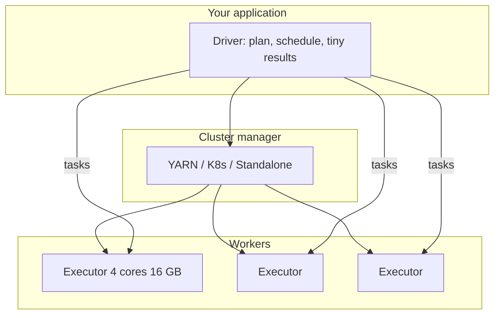

# The Spark Mental Model

14:40. Code review on a one-line PR: `events = spark.read.parquet(...)`. The reviewer asks three questions before approving — which process holds the plan, which process holds the 5 TB, and does line 1 touch S3, or does the `write` three lines down? You cannot answer confidently in the thread.

Predict before you read on: for a `filter` then `groupBy` then `write`, how many stages does Spark run, and does `hourly.collect()` afterward cost the same as `hourly.write()`?

Yesterday’s SaaS events: 5 TB of

```text
{timestamp, customer_id, user_id, service, endpoint, region, latency_ms, status_code, bytes}
```

You need average latency per `service` per hour. One machine can scan it overnight. A cluster can scan it in minutes **if** something assigns splits, notices that `filter` does not need a shuffle, notices that `groupBy` does, and retries the executor that YARN just preempted.

That “something” is Spark. This page is the map of who does what so [The Shuffle](shuffle.md) and [Gotchas](gotchas.md) have somewhere to hang.

---

## Start with the situation { #use-case }

```python
events = spark.read.parquet("s3://analytics/events/date=2024-01-15/")
hourly = (
    events
    .filter(F.col("status_code") < 500)
    .groupBy("service", F.window("timestamp", "1 hour"))
    .agg(F.avg("latency_ms").alias("avg_ms"))
)
hourly.write.mode("overwrite").parquet("s3://marts/hourly_latency/")
```

Questions this model must answer:

- Which process holds the plan? Which process holds the 5 TB?
- When does S3 get touched — line 1 or the `write`?
- How many stages? Which line is wide?
- Why `hourly.collect()` is an incident but `hourly.write` is a pipeline.

Same model for observability rollups, CDC MERGE jobs, IoT downsampling, and fraud **offline** features. Online fraud scoring is not this model; do not force it.

---

## Why the obvious approach breaks at scale { #why-this-is-hard-at-scale }

Without a model, teams cargo-cult config:

- They `repartition(1000)` “for parallelism” and pay **two** shuffles.
- They cache the 5 TB on a 2 TB cluster and call it “optimisation.”
- They run the driver on a laptop and blame Kubernetes for `Lost executor`.
- They use RDDs in Python and wonder why Catalyst “does nothing.”

At 5 TB these are not style issues. They are [scale](../foundations/scale.md) failures: extra [data movement](../foundations/data-movement.md), driver heap, and stages that wait on one task ([distributed execution](../foundations/distributed-execution.md)).

---

## Build the mental picture { #intuition }

Spark is a **lazy query planner plus a task scheduler**.

- Your Python process is usually the **driver**. It does **not** contain the events.
- **Executors** are JVMs with cores (slots) and RAM. They read S3, shuffle, write.
- Transformations build a **DAG**. Actions **execute** it.
- **Narrow** ops stay inside a partition. **Wide** ops cut a **stage** and shuffle.



If the driver dies, the application dies. If an executor dies, **tasks** retry; cached blocks and shuffle files on that executor may vanish (hence the external shuffle service).

---

## Under the hood { #internals }

### Driver, executors, cluster manager

| Role | Responsibilities | Heap holds |
|------|------------------|------------|
| Driver | Parse API, Catalyst, DAGScheduler, Spark UI, collect/broadcast | Plan, file listings, broadcast vars, *any `collect`* |
| Cluster manager | Start/stop executor containers | Nothing of yours |
| Executor | Run tasks, store cache, write shuffle | Partitions, shuffle buffers, Python workers |

PySpark: each executor may spawn **Python workers**. Their RSS is **not** the JVM heap. It must fit in `spark.executor.memoryOverhead` (or YARN/K8s kills the container). That is why UDFs OOM “with plenty of heap.”

### RDDs, DataFrames, Datasets

- **RDD** — typed (Scala) or untyped (Python) partitions; **opaque** to Catalyst.
- **DataFrame** — `Row` + schema; **the** API. Catalyst + Tungsten.
- **Dataset[T]** — JVM only. PySpark has DataFrames.

Use DataFrames. Reach for RDDs when you are implementing a connector, not an ETL.

### Lazy evaluation and actions

```python
events = spark.read.parquet("s3://events/2024/")           # no I/O of data
errors = events.filter(events.status_code >= 500)          # no I/O
per_service = errors.groupBy("service").count()            # no I/O
per_service.show()                                         # I/O + shuffle + print
```

On `show()`, Spark: analyses names/types → Catalyst optimises → physical plan → stages → tasks → maybe samples for `show`. `write` is the action you want in production; `show`/`count` in notebooks are extra **jobs**.

| Lazy (transformation) | Eager (action) |
|-----------------------|----------------|
| `filter`, `select`, `withColumn` | `show`, `take`, `first` |
| `groupBy` / `agg` | `count`, `collect`, `toPandas` |
| `join`, `orderBy`, `repartition` | `write`, `foreach`, `foreachPartition` |

### Narrow vs wide

| Type | Dependency | Examples | Shuffle? |
|------|------------|----------|----------|
| Narrow | 1 in partition → 1 out | `map`, `filter`, `select`, `union` (per side) | No |
| Wide | many in → 1 out | `groupBy`, `join` (SMJ), `distinct`, `orderBy`, `repartition` | Yes |

`coalesce(n)` for \(n <\) current partitions is a **narrow** reduction (merge adjacent). `repartition(n)` is a **full shuffle**.

```text
Action
  └── Job
        └── Stage 1  (narrow pipeline on input splits)
        └── Shuffle
        └── Stage 2  (narrow pipeline on shuffle partitions)
```

### How partitions appear

- **Read**: roughly one partition per split (`spark.sql.files.maxPartitionBytes`, 128 MiB default; also Parquet row-group / file boundaries).
- **Shuffle**: `spark.sql.shuffle.partitions` (default **200**) or AQE coalesced count.
- **Explicit**: `repartition`, `repartitionByRange`, `partitionBy` **on write** (storage, not compute).

200 shuffle partitions is almost always wrong: 100 MB dataset → 200 empty-ish tasks; 10 TB → 50 GB tasks. [Shuffle](shuffle.md) does the math.

### Caching (MEMORY_AND_DISK etc.)

```python
hot = events.filter(F.col("date") == "2024-01-15").cache()
hot.count()   # first action materialises
hot.select("service").distinct().count()  # hits cache if still there
```

Cache is **executor-local blocks**, keyed by partition. It is not a lakehouse. Eviction, executor death, and `unpersist` all undo it.

!!! warning "Production gotcha"
    Caching a 500 GB frame on 400 GB of executor memory is a spill machine. Cache only frames that are **reused in this app**, **fit**, and are **expensive to recompute**.

---

## Put it to work { #how }

### A production-shaped session

```python
from pyspark.sql import SparkSession
from pyspark.sql import functions as F

spark = (
    SparkSession.builder
    .appName("saas-hourly-latency")
    .config("spark.sql.adaptive.enabled", "true")
    .config("spark.sql.adaptive.coalescePartitions.enabled", "true")
    .config("spark.sql.adaptive.advisoryPartitionSizeInBytes", str(128 * 1024 * 1024))
    .config("spark.sql.adaptive.skewJoin.enabled", "true")
    .config("spark.sql.autoBroadcastJoinThreshold", str(64 * 1024 * 1024))
    .config("spark.sql.shuffle.partitions", "400")
    .config("spark.serializer", "org.apache.spark.serializer.KryoSerializer")
    .getOrCreate()
)

events = spark.read.parquet("s3://analytics/events/date=2024-01-15/")
dim = spark.read.parquet("s3://dims/services/")  # tens of MB

hourly = (
    events
    .select("timestamp", "service", "latency_ms", "status_code")
    .filter(F.col("status_code") < 500)
    .groupBy("service", F.window("timestamp", "1 hour"))
    .agg(F.avg("latency_ms").alias("avg_ms"), F.count("*").alias("n"))
    .join(F.broadcast(dim), "service")
)

hourly.explain(mode="formatted")
hourly.write.mode("overwrite").parquet("s3://marts/hourly_latency/date=2024-01-15/")
```

`select` before `groupBy` is column pruning insurance. `broadcast` on a small dim avoids a sort-merge. `explain` is part of the code review, not an optional lab.

### Seeing jobs you did not intend

```python
df.count()
df.show()
df.write.parquet(...)
```

Three actions, **three jobs** (more if AQE or `count` on a computed frame). In a notebook, that is how you scan S3 all afternoon.

---

## Production gotchas

!!! production-gotcha "pandas API on Spark as a free lunch"
    `df.to_pandas()` is `collect`. The pandas-on-Spark API still shuffles for groupby. Profile it or write DataFrame SQL.

!!! production-gotcha "Schema-on-read JSON"
    `spark.read.json` samples a fraction, then silently `null`s new fields. For SaaS events, pass an **explicit schema**. CDC JSON is worse.

!!! production-gotcha "Window without watermark in SS"
    Mental model still holds: the query is a DAG. State in Structured Streaming **grows forever** without `withWatermark`. That is a [batch vs stream](../foundations/batch-vs-stream.md) bug wearing a Spark hat.

---

## How it fails { #failure-modes }

| Failure | Mental-model translation |
|---------|--------------------------|
| Driver OOM | You treated the driver as an executor (`collect`, huge broadcast, listing 20 M files) |
| Executor OOM | One partition was the working set |
| `Task not serializable` | Driver captured a live DB connection in a closure |
| Job hangs at 99% | Stage barrier + straggler |
| Different counts each run | Non-deterministic UDF, or downstream read while write still going (no table format) |

---

## How to investigate { #debugging }

Spark UI:

1. **Jobs** — one per action. Extra jobs → extra `count`/`show`.
2. **Stages** — number should match wide ops (+ maybe file listing).
3. **SQL** — physical plan, not the code you hoped ran.
4. **Environment** — did the K8s spark-submit actually set AQE?
5. **Executors** — 0 active executors means cluster manager, not SQL.

```python
print(spark.sparkContext.getConf().get("spark.sql.adaptive.enabled"))
print(spark.sparkContext.defaultParallelism)
```

Logs on the **driver** for planning; on the **executor** for `java.lang.OutOfMemoryError` and Python worker tracebacks (`stderr`).

---

## Scale

| Factor | What the model predicts |
|--------|-------------------------|
| **10×** data, same 200 shuffle parts | Same stage count, fatter tasks, spill |
| **100×** files | Driver listing / InMemoryFileIndex pressure; Iceberg manifests or file indexes |
| **1000×** | You stop using “one Spark app reads the world”; incremental snapshots, more than one DAG per day |

Cores: `defaultParallelism` ≈ cores. Input partitions ≪ cores → idle. Input partitions ≫ cores → many waves, OK if tasks are 2–30 s, disaster if they are 50 ms.

---

## Trade-offs

| Choice | Gain | Cost |
|--------|------|------|
| DataFrame SQL | Optimiser, codegen | Less arbitrary Python |
| RDD | Control | No Catalyst, PySpark pain |
| Cache | Reuse | RAM vs execution |
| Cluster mode | Stable driver | Slower feedback loop |
| Client mode notebook | Interactive | Driver reliability, collect temptation |
| More executors | Scan bandwidth | Shuffle connections, $ , idle on stragglers |

---

## Alternatives

- **Pandas / Polars / DuckDB** on one node until they lose. The mental model of “the process has the data” is *correct* there.
- **Trino** if the “Spark job” is an analyst SQL with no UDF story.
- **Flink** if the DAG should not end.
- **Ray** if tasks are Python functions with uneven fan-out, not partitions of a table.

Spark’s advantage is **the same plan at 20 GB and 20 TB** with task retry. That advantage is negative at 20 MB.

---

## How to apply at work

In review, annotate the PR with:

1. Actions (jobs).
2. Wide ops (shuffles).
3. Expected partition counts at read and after shuffle.
4. What is cached and why it fits.
5. Where the driver could see a large result.

If the author cannot mark those on the code, they do not have a mental model. They have a script that worked on a sample.

---

## Check your understanding { #exercise }

```python
df1 = spark.read.parquet("s3://orders/")          # 200 partitions
df2 = spark.read.parquet("s3://customers/")        # 50 partitions
joined = df1.join(df2, "customer_id")
grouped = joined.groupBy("customer_segment").agg(F.sum("amount"))
grouped.write.parquet("s3://output/")
```

AQE off, `spark.sql.shuffle.partitions=200`, `autoBroadcastJoinThreshold` default 10 MB. `customers` is 800 MB. `orders` is 2 TB. One retailer is 25% of orders.

1. How many **jobs**? Minimum **stages**?
2. Where are the shuffle boundaries?
3. How many tasks in each stage (order of magnitude)?
4. Which operator is likely most expensive, and which UI metric confirms it?
5. What changes if `customers` is 8 MB and you `broadcast` it?
6. Why is `grouped.toPandas()` on the driver probably fine **here**, but `joined.toPandas()` is not?

??? question "Worked answer"
    1. **One job** (`write`). Stages: read orders, read customers, join, aggregate+write — typically **three or four** physical stages (two scans can be separate stage trees feeding a join exchange, then a second exchange for `groupBy`). Minimum with SMJ: scan+shuffle each side → join → shuffle-agg.
    2. Boundaries: **sort-merge join** on `customer_id` (both sides exchange unless broadcast), then **hash aggregate** on `customer_segment`.
    3. Scan orders ~200 tasks; scan customers ~50; join/agg ~200 shuffle partitions each stage.
    4. **Join shuffle of 2 TB** (and the whale key). Confirm: SQL `Exchange` bytes, stage shuffle read, task max vs median. The `groupBy customer_segment` is usually tiny after the join *unless* segment is skewed too.
    5. Broadcast: **no shuffle of orders** for the join; each orders task joins locally. Stages drop. 8 MB × N executors is fine. 800 MB broadcast would **not** be — that is why the original SMJs.
    6. `grouped` has one row per `customer_segment` (maybe dozens). `toPandas` is a tiny collect. `joined` is ~2 TB of rows — driver death.
