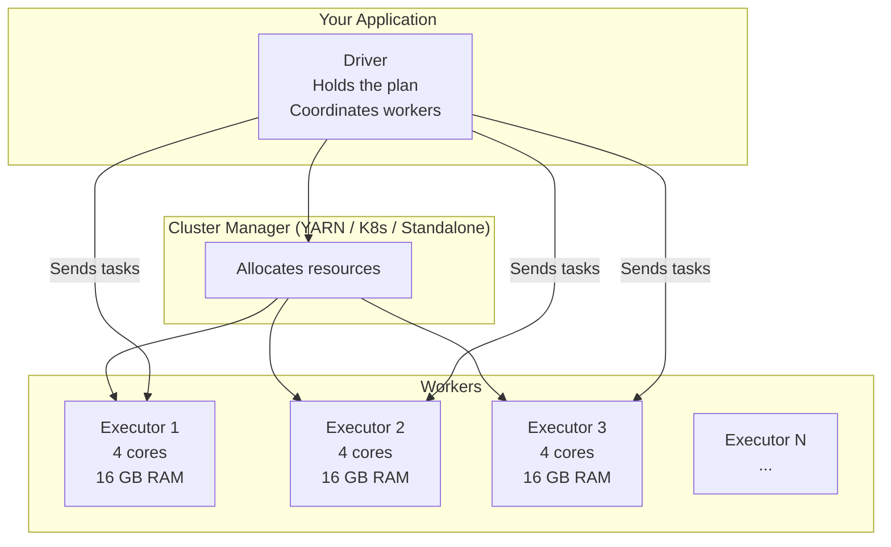

# The Spark Mental Model

## The Problem

5 TB of event data. You need to compute the average API latency per service per hour.

On one machine: possible, but painfully slow.
On a cluster: fast, but requires coordination.

Spark is the coordination layer.

---

## Core Architecture



**Driver**: Your application code. Plans the computation. Schedules stages and tasks. Collects small results. If the driver dies, the job dies.

**Executors**: Worker JVMs that run tasks and store cached data. They register with the Driver. Each executor has a fixed number of CPU cores (task slots) and memory.

**Cluster Manager**: Allocates executors for you (YARN on Hadoop, Kubernetes, or Spark's built-in standalone mode).

---

## RDDs, DataFrames, and Datasets

Spark exposes data as:

- **RDD** (Resilient Distributed Dataset) — low-level, typed, not optimized by Catalyst
- **DataFrame** — untyped rows, optimized by Catalyst, preferred for SQL/ETL
- **Dataset** — typed DataFrame, JVM only (Scala/Java)

**Use DataFrames.** The Catalyst optimizer can inspect and rewrite your DataFrame plan. RDD operations are opaque to the optimizer.

---

## Lazy Evaluation

Spark does not execute transformations when you call them. It builds a **logical plan**.

```python
# None of these lines run any computation
events = spark.read.parquet("s3://events/2024/")
errors = events.filter(events.status_code >= 500)
per_service = errors.groupBy("service").count()

# This triggers the entire plan
per_service.show()
```

When `show()` is called, Spark:
1. Optimises the logical plan (Catalyst)
2. Produces a physical plan
3. Splits into stages
4. Schedules tasks across executors
5. Executes and collects results

**Why lazy evaluation?** The optimizer needs to see the complete plan before it can apply transformations like predicate pushdown. If Spark executed each line immediately, it could not push the filter before the read.

---

## Jobs, Stages, Tasks

```
Action (show/write/count)
  └── Job
        └── Stage 1 (no shuffle required)
              └── Task per partition
        └── Shuffle (data redistribution)
        └── Stage 2
              └── Task per partition
```

- **Action** triggers execution: `show()`, `write()`, `count()`, `collect()`
- **Transformation** builds the plan: `filter()`, `groupBy()`, `join()`, `select()`

**Transformations are either narrow or wide:**

| Type | Definition | Example | Shuffle? |
|------|-----------|---------|----------|
| Narrow | Each output partition depends on one input partition | filter, map, select | No |
| Wide | Output partition depends on multiple input partitions | groupBy, join, sort | Yes |

Wide transformations create stage boundaries because they require a shuffle.

---

## Partitions in Spark

When Spark reads a Parquet file from S3, it creates one partition per Parquet file (or per Parquet row group for large files). You can control the number of partitions:

```python
# Read with explicit partition count
events = spark.read.parquet("s3://events/").repartition(400)

# After a shuffle, control partition count
spark.conf.set("spark.sql.shuffle.partitions", 400)
```

**Default shuffle partitions: 200**. This is almost always wrong:
- For a 100 MB dataset: 200 tiny partitions with more scheduling overhead than computation
- For a 10 TB dataset: 200 partitions of 50 GB each — too large for executor memory

---

## Caching

You can cache a DataFrame in executor memory to avoid recomputing it across multiple actions:

```python
hot_data = events.filter(events.date == "2024-01-15").cache()
hot_data.count()  # triggers caching
# All subsequent uses of hot_data read from cache
```

!!! warning "Production Gotcha"
    Do not cache everything. Cached data occupies executor memory. If cached data fills memory, Spark spills to disk (slow) or evicts cached partitions (defeats the purpose). Cache only DataFrames that are reused multiple times in the same job and fit comfortably in memory.

---

## Actions vs Transformations Recap

| Transformation (lazy) | Action (eager) |
|----------------------|----------------|
| `filter()` | `show()` |
| `select()` | `count()` |
| `groupBy()` | `collect()` |
| `join()` | `write()` |
| `withColumn()` | `take(n)` |
| `orderBy()` | `first()` |

---

## Reasoning Exercise

```python
df1 = spark.read.parquet("s3://orders/")         # 200 partitions
df2 = spark.read.parquet("s3://customers/")       # 50 partitions

joined = df1.join(df2, "customer_id")
grouped = joined.groupBy("customer_segment").agg(sum("amount"))
grouped.write.parquet("s3://output/")
```

1. How many stages does this job have?
2. Where are the shuffle boundaries?
3. How many tasks in total (assuming default 200 shuffle partitions)?
4. Which operation is likely most expensive?
5. What metric would you look at in the Spark UI to confirm your answer?
