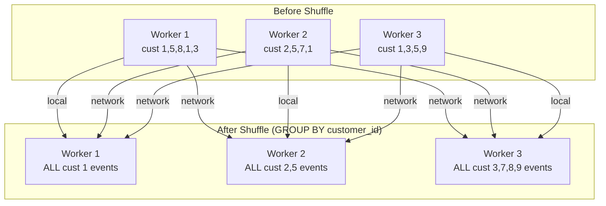

# The Shuffle

The shuffle is the most expensive operation in Spark. Every performance investigation eventually leads back to it.

Understanding shuffles deeply will make you a significantly better data engineer.

---

## Why the Shuffle Exists

Consider this query:

```python
events.groupBy("customer_id").agg(count("*"), sum("bytes"))
```

When Spark reads the input data, events for the same customer are scattered across different partitions on different workers:

```
Worker A: customer 1, 5, 8, 3, 1, 5
Worker B: customer 2, 5, 7, 1, 3
Worker C: customer 1, 3, 5, 9, 2
```

To count events *per customer*, all events for customer 1 must be on the same worker at the same time. They are currently spread across Workers A, B, and C.

**The shuffle is the operation that redistributes records so that all records with the same key end up on the same worker.**

---

## Shuffle Mechanics

### Step 1: Shuffle Write

Each worker partitions its output based on the grouping key:

```
Worker A output:
  → partition for customer 1: events for customer 1
  → partition for customer 5: events for customer 5
  → partition for customer 8: events for customer 8
  ...
```

Each worker writes these partitioned files to local disk. This is **shuffle write**.

### Step 2: Network Transfer

Workers pull the partitions they are responsible for from all other workers.

If there are 200 output partitions and 10 workers, each worker is responsible for 20 partitions. It must contact all other workers to pull those 20 partitions.

This is the network-intensive phase.

### Step 3: Shuffle Read

Each worker reads the data it fetched and begins computing the final aggregation.

---

## Visualising the Shuffle



---

## What Triggers a Shuffle

| Operation | Shuffle? | Why |
|-----------|----------|-----|
| `filter()` | No | Each record processed independently |
| `select()` | No | Column projection, no redistribution needed |
| `groupBy().agg()` | **Yes** | Records with same key must co-locate |
| `join()` | **Usually Yes** | Records with same join key must co-locate |
| `distinct()` | **Yes** | Deduplication requires all copies of a value together |
| `sort()` | **Yes** | Global sort requires all data to be sorted across workers |
| `repartition(n)` | **Yes** | Explicit redistribution |
| `coalesce(n)` | No (partial) | Reduces partitions by merging local partitions |

---

## Shuffle Spill

If a worker cannot hold shuffle data in memory, it **spills to disk**. Spill is expensive — disk I/O is orders of magnitude slower than memory.

Causes of spill:
- Executor has too little memory
- Partitions are too large (too few shuffle partitions)
- Skew causing one worker to accumulate much more data than others

In the Spark UI, look at "Shuffle Spill (Memory)" and "Shuffle Spill (Disk)". Any non-zero spill is a problem.

---

## Partition Count and Shuffle Performance

The default `spark.sql.shuffle.partitions = 200` is almost never right.

**Too few partitions** (e.g., 10 for a 1 TB dataset):
- Each partition is ~100 GB — too large for executor memory
- Spill to disk
- Parallelism is limited

**Too many partitions** (e.g., 2000 for a 1 GB dataset):
- Each partition is ~500 KB
- Task scheduling overhead dominates
- Small file problem: writing 2000 tiny Parquet files hurts downstream reads

**Rule of thumb**: target 100–300 MB per partition after the shuffle.

```python
# For a 1 TB dataset with 200 GB per executor:
# 1 TB / 200 MB per partition = ~5000 partitions
spark.conf.set("spark.sql.shuffle.partitions", 5000)
```

Spark 3+ introduces **Adaptive Query Execution** (AQE) which can automatically coalesce shuffle partitions after execution. Enable it:

```python
spark.conf.set("spark.sql.adaptive.enabled", "true")
```

---

## Skew in Shuffles

Skew is when one partition contains significantly more data than others.

```
After shuffle:
  Partition 0 (customer A): 800 GB  ← one large enterprise customer
  Partition 1 (customer B): 0.5 GB
  Partition 2 (customer C): 1.2 GB
  ...
```

The task processing Partition 0 takes hours. All other tasks complete in minutes. Your 200-task stage has a straggler.

**How to detect skew**: Spark UI → Stage → Task Duration. Look for one task significantly longer than the median.

**How to fix skew**:

1. **Salt the key**: append a random integer to the hot key to distribute it across multiple partitions

```python
from pyspark.sql.functions import concat, lit, rand, floor

# Add random salt 0-9 to hot keys
events_salted = events.withColumn(
    "salted_customer",
    concat("customer_id", lit("_"), floor(rand() * 10).cast("string"))
)

# Aggregate with salted key
partial = events_salted.groupBy("salted_customer").agg(count("*").alias("cnt"))

# Remove salt and re-aggregate
from pyspark.sql.functions import split
final = partial.withColumn("customer_id", split("salted_customer", "_")[0]) \
               .groupBy("customer_id").agg(sum("cnt"))
```

2. **Broadcast join**: for skewed joins where one side is small, broadcast it

3. **AQE Skew Join**: enable and let Spark handle it automatically (Spark 3+)

```python
spark.conf.set("spark.sql.adaptive.skewJoin.enabled", "true")
```

---

## Broadcast Joins

A regular (sort-merge) join shuffles both sides.

A broadcast join sends the *smaller* table to every worker, eliminating the shuffle for the larger table.

```python
from pyspark.sql.functions import broadcast

# Orders is large (TB), regions is small (KB)
# This avoids shuffling orders
result = orders.join(broadcast(regions), "region_code")
```

Use broadcast join when one side is small enough to fit in executor memory (typically < few hundred MB). The default threshold is 10 MB; increase it:

```python
spark.conf.set("spark.sql.autoBroadcastJoinThreshold", str(200 * 1024 * 1024))  # 200 MB
```

!!! warning "Production Gotcha"
    Broadcasting large tables causes executor OOM. If the broadcast table is 500 MB and you have 50 executors, broadcasting adds 25 GB of memory pressure to your cluster. Know your table sizes.

---

## Lab: Observe a Shuffle

```python
from pyspark.sql import SparkSession
import pyspark.sql.functions as F

spark = SparkSession.builder \
    .appName("ShuffleLab") \
    .config("spark.ui.enabled", "true") \
    .getOrCreate()

# Generate skewed data: customer 1 has 80% of events
from pyspark.sql.types import StructType, StructField, StringType, IntegerType, LongType
import random

data = []
for i in range(1_000_000):
    if random.random() < 0.8:
        customer = "customer_1"
    else:
        customer = f"customer_{random.randint(2, 1000)}"
    data.append((customer, random.randint(0, 1000), random.randint(100, 5000)))

schema = StructType([
    StructField("customer_id", StringType()),
    StructField("status_code", IntegerType()),
    StructField("bytes", LongType())
])

events = spark.createDataFrame(data, schema)
events.cache().count()  # force caching

# Observe this in the Spark UI: one task will be huge
result = events.groupBy("customer_id").agg(
    F.count("*").alias("event_count"),
    F.sum("bytes").alias("total_bytes")
)
result.write.mode("overwrite").parquet("/tmp/output_skewed")

print("Check Spark UI at localhost:4040")
print("Look at Stage with groupBy — task duration should be very uneven")
```

After running, open `http://localhost:4040` and examine the stage. You will see one task taking significantly longer than others.

---

## Key Takeaways

- Shuffles are expensive: serialise + write to disk + network transfer + read from disk + deserialise
- Every `groupBy`, `join`, and `sort` triggers a shuffle
- The default 200 shuffle partitions is wrong for most workloads
- Skew causes stragglers — one task extending the entire stage duration
- Broadcast joins eliminate shuffles for small tables
- AQE can automatically optimise shuffle partitions and skewed joins in Spark 3+
