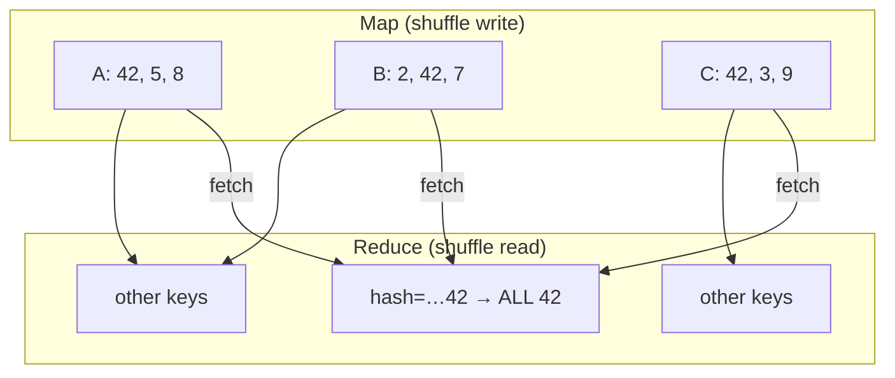

# The Shuffle

02:47 AM page: the `groupBy("customer_id")` stage has been stuck at 199 of 200 tasks for forty minutes. Yesterday's run of the same code, same cluster, finished in twelve minutes. CPU dashboards look idle; the bill does not.

A. The network is saturated moving shuffle data.
B. One reducer owns a single hot key's share of the data, and the other 199 finished long ago.
C. `spark.sql.shuffle.partitions` is set too low for the data volume.
D. Every task is spilling to disk equally.

Pick one before reading on. Every serious Spark investigation ends here. The SaaS p95 job is “slow” because **rows for `cust_0042` live on twenty executors and must live on one** before `groupBy("customer_id")` is correct. The mechanism that makes them meet — serialise, write, fetch, deserialise, maybe spill — is the shuffle.

If you only internalise one Spark lesson, internalise this page. It is the concrete form of [Data Movement](../foundations/data-movement.md) and [Partitioning](../foundations/partitions.md).

---

## Start with the situation { #use-case }

```python
events.groupBy("customer_id").agg(F.count("*"), F.sum("bytes"))
```

On disk, after a date-partitioned read, each **Spark partition** is a 128 MB Parquet slice with a mix of tenants:

```text
Executor A: cust_0042, acme, tiny, cust_0042, ...
Executor B: acme, cust_0042, ...
Executor C: tiny, ...
```

`cust_0042` is 38% of the day’s 2 TB. After a hash shuffle to 200 reducers, **one** reducer owns ~760 GB of that tenant. The other 199 reducers finish in four minutes. The stage is four hours. CPU dashboards look idle. Finance asks why the cluster is so large.

Observability analogue: `groupBy("cluster", "pod")` after a cardinality explosion. CDC analogue: join `orders` to `order_items` where one wholesale order has 2 million lines. IoT analogue: `groupBy("device_id")` when 1% of devices retry a firmware dump.

---

## Why the obvious approach breaks at scale { #why-this-is-hard-at-scale }

A shuffle is not a function call. It is a **distributed sort-merge of the cluster’s working set**:

- **CPU** to serialise Tungsten rows and compress blocks.
- **Disk** to hold map output (so mappers can finish before reducers start) and to spill.
- **NIC** to pull \(M \times R\) logical slices (sort-shuffle writes one file per mapper, but reducers still fetch their range from every mapper).
- **Memory** on the reducer to merge and aggregate. If the key is hot, memory is one machine’s RAM, not the cluster’s.

Retries amplify it: lose an executor, **recompute its map outputs** (or fetch from the shuffle service). Dynamic allocation without a shuffle service turns this into a `FetchFailedException` storm.

---

## Build the mental picture { #intuition }

**Narrow** ops (`filter`, `select`) are a conveyor belt inside one partition.

**Wide** ops (`groupBy`, SMJ `join`, `distinct`, `orderBy`, `repartition`) need a **post office**:

1. Each mapper puts each row in a **mailbox** numbered `hash(key) % R`.
2. Mailboxes are written to **local disk** (shuffle write).
3. Reducer \(r\) **fetches** mailbox \(r\) from every mapper (shuffle read).
4. Reducer deserialises and computes.



The **law of the stage**: wall time = time until the **last** mailbox is processed. Balance the mailboxes or split the hot one.

---

## Under the hood { #internals }

### Sort-based shuffle (default since Spark 1.2, what you run in 3.x)

`SortShuffleManager` (default):

1. Map task inserts rows into an in-memory sorter, keyed by **partition id** (and sometimes the sort key).
2. When the buffer fills: **spill** a sorted run to disk.
3. At task end: merge runs into **one** data file + **one** index file (`shuffle_X_Y.data/.index`).
4. Reduce task asks each mapper (or the **external shuffle service**) for byte range \([start_r, end_r)\).

Old hash shuffle wrote \(R\) files per mapper (\(M \times R\) files cluster-wide). That melted HDFS. It was removed in Spark 2.0; you should not see it on 3.x.

### Shuffle write vs shuffle read

| Phase | Where | Failure looks like |
|-------|-------|--------------------|
| Write | Mapper executor disk + CPU | Slow map stage, disk full, `IOException` |
| Fetch | Network + shuffle service | `FetchFailedException`, `TimeoutException` |
| Read / merge | Reducer memory then disk | Spill metrics, reducer OOM, GC |

Spark UI columns **Shuffle Write** (map stage) and **Shuffle Read** (reduce stage) should roughly agree in bytes (compression makes them not identical to input). If write is 2 TB and read is 80 MB, you aggregated **map-side** (partial hash agg) — that is a win.

### Fetch graph (why \(M \times R\) still matters)

Sort-shuffle writes **one** file per map task, but each reducer still **contacts every mapper** (or the shuffle service) for a byte range. 8 000 maps × 8 000 reduces is 64 million fetch requests. That is why huge \(R\) is not free even when each file is tiny: connection setup, `maxSizeInFlight`, and `spark.shuffle.io.maxRetries` dominate.

```python
spark.conf.set("spark.shuffle.io.maxRetries", "10")
spark.conf.set("spark.shuffle.io.retryWait", "5s")
spark.conf.set("spark.reducer.maxReqsInFlight", "8")  # 3.x; don't stampede
```

External shuffle service: a daemon on the node that **serves map output after the executor JVM is gone**. Mandatory with dynamic allocation. Without it, “scale executors to zero between stages” deletes the post office.

### Serialisers and codecs

SQL shuffles **UnsafeRow** (Tungsten), not Python objects. RDD shuffles use `spark.serializer` (Java by default, **Kryo** if you set it).

```python
spark.conf.set("spark.serializer", "org.apache.spark.serializer.KryoSerializer")
spark.conf.set("spark.shuffle.compress", "true")
spark.conf.set("spark.shuffle.spill.compress", "true")
spark.conf.set("spark.io.compression.codec", "lz4")  # zstd if CPU-rich and NIC-poor
spark.conf.set("spark.shuffle.file.buffer", "1m")
spark.conf.set("spark.reducer.maxSizeInFlight", "96m")
```

Python UDFs shuffle **after** coming back to JVM rows; the UDF itself paid pickle/Arrow. Do not add a UDF just before a `groupBy` if a native function exists.

### Spill

When the reducer (or map sorter) cannot hold the run:

1. Spill to disk (uncompressed size in “Shuffle Spill (Memory)”, on-disk in “Shuffle Spill (Disk)”).
2. Later merge spills — more disk, more CPU, sometimes more spill.

Causes: **too few partitions**, **skew**, **too little `spark.memory.fraction`**, **broadcast + cache** stealing execution memory.

!!! warning "Non-zero spill is a problem"
    A little spill on one task is a skew clue. Tens of GB of spill on **every** task means \(R\) is too small or executors are too small. Do not “add 50 machines” first.

### Partition count math

Let \(B\) be expected **shuffle write bytes** (after map-side agg). Target \(s \approx 128\)–\(256\) MB per reducer task:

\[
R \approx \max\left(\text{cores} \times 2,\ \left\lceil \frac{B}{s} \right\rceil \right)
\]

```text
B = 1 TB, s = 200 MB  →  R ≈ 5000
B = 800 MB, s = 128 MB → R ≈ 8  (not 200)
```

```python
spark.conf.set("spark.sql.shuffle.partitions", "5000")
```

**AQE** (Spark 3.x) coalesces *after* measuring map output:

```python
spark.conf.set("spark.sql.adaptive.enabled", "true")
spark.conf.set("spark.sql.adaptive.coalescePartitions.enabled", "true")
spark.conf.set("spark.sql.adaptive.advisoryPartitionSizeInBytes", str(128 * 1024 * 1024))
spark.conf.set("spark.sql.adaptive.coalescePartitions.minPartitionSize", str(16 * 1024 * 1024))
```

AQE does **not** split a 280 GB skewed partition by itself unless **skew join** applies (joins). For aggregations, you still salt or isolate whales.

### What triggers a shuffle

| Operation | Shuffle? | Notes |
|-----------|----------|-------|
| `filter` / `select` / `withColumn` (native) | No | |
| `groupBy().agg()` | Yes | Partial agg may shrink bytes |
| `join` SMJ / SHJ | Yes both sides | |
| `join` broadcast | **No** large-side shuffle | Small side collected to driver, then broadcast |
| `distinct` / `dropDuplicates` | Yes | |
| `orderBy` / `window` with global order | Yes | |
| `repartition(n)` / `repartition(cols)` | Yes | |
| `coalesce(n)` \(n<\) current | Partial, no full exchange | Cannot increase parallelism |
| `union` | No extra shuffle | Partition count adds |

---

## Put it to work { #how }

### Broadcast join (eliminate the fat shuffle)

```python
from pyspark.sql.functions import broadcast

# regions: 4 MB. events: 2 TB.
spark.conf.set("spark.sql.autoBroadcastJoinThreshold", str(64 * 1024 * 1024))
result = events.join(broadcast(regions), "region")
```

**Memory pressure:** broadcast is stored on the **driver** first, then on **every executor**.

```text
size × (1 driver + N executors)   plus copies / caches
80 MB × 100 executors ≈ 8 GB cluster RAM  (plus driver 80 MB)
1.5 GB × 100 executors ≈ 150 GB  →  cluster-wide OOM / GC
```

Default threshold is **10 MB**. Raising it to 1 GB because “joins got faster on the sample” is a classic outage. `spark.sql.adaptive.autoBroadcastJoinThreshold` (AQE) can switch SMJ → BHJ **at runtime** if the *measured* side is small — still bound by executor RAM.

!!! production-gotcha "Broadcast is a tax × executors"
    500 MB dim × 50 executors = 25 GB extra, **on top of** the fact table partitions. Know table sizes from `df.rdd.setName` / `spark.sql("ANALYZE")` / a `count` of bytes, not from folklore.

### AQE skew join (joins, not every agg)

```python
spark.conf.set("spark.sql.adaptive.enabled", "true")
spark.conf.set("spark.sql.adaptive.skewJoin.enabled", "true")
spark.conf.set("spark.sql.adaptive.skewJoin.skewedPartitionFactor", "5")
spark.conf.set("spark.sql.adaptive.skewJoin.skewedPartitionThresholdInBytes", str(256 * 1024 * 1024))
```

Spark splits a fat join partition and replicates the matching slice of the other side. Great for **one hot join key**. For `groupBy("customer_id")` of a whale, use salting.

### Salting (aggregations and joins)

Two-phase agg for sums/counts (percentiles need mergeable sketches or a whale-specific path):

```python
from pyspark.sql.functions import col, concat, lit, floor, rand, split, count, sum as Fsum

SALTS = 16
salted = events.withColumn(
    "k",
    concat(col("customer_id"), lit("#"), floor(rand(seed=42) * SALTS).cast("int").cast("string")),
)
partial = salted.groupBy("k").agg(count("*").alias("n"), Fsum("bytes").alias("bytes"))
final = (
    partial
    .withColumn("customer_id", split(col("k"), "#").getItem(0))
    .groupBy("customer_id")
    .agg(Fsum("n").alias("n"), Fsum("bytes").alias("bytes"))
)
```

First shuffle: `cust_0042` spread over 16 reducers. Second shuffle: 16 rows for that tenant. **Do not salt keys that are already small** — you multiply partitions for everyone.

Join salting: salt the large side randomly 0..S-1; **explode** the small side to all salts (or replicate). Only if the dim is still too big to broadcast.

### Isolate the whale

```python
whale = events.filter(col("customer_id") == "cust_0042")
rest = events.filter(col("customer_id") != "cust_0042")
# rest: normal groupBy
# whale: repartition(64) then aggregate without hashing all tenants together
```

Operationally this is how SaaS platforms survive a new enterprise logo on Tuesday.

---

## Production gotchas

!!! production-gotcha "`repartition(1000)` immediately before `groupBy`"
    Extra full shuffle, then a second shuffle to `spark.sql.shuffle.partitions`. Delete the `repartition` unless you are **salting** or **isolating**.

!!! production-gotcha "Dynamic allocation + no shuffle service"
    Executors with map output get reclaimed. Reducers fail to fetch. Stage retries until `spark.stage.maxConsecutiveAttempts`. Set `spark.shuffle.service.enabled=true` and `spark.dynamicAllocation.shuffleTracking.enabled=true`.

!!! production-gotcha "Cross-AZ sort-merge"
    Shuffle bytes × cross-AZ price. Pin executors. Compression is not a substitute for topology.

!!! production-gotcha "Spark UI 'shuffle read' 0 on a join"
    You broadcast accidentally (or AQE did). Confirm BHJ in `explain`. If the dim grew, tomorrow it may SMJ without you noticing unless tests assert join strategy.

---

## How it fails { #failure-modes }

| Mode | Mechanism | What you see |
|------|-----------|----------------|
| Straggler | Hot hash bucket | One task 50× duration |
| Reducer OOM | Fat partition + execution memory | Task killed, retries, then stage fail |
| Spill death spiral | Merge of spills spills again | Disk full, 10× slowdown |
| FetchFailed | Lost map output | Stage retry; sometimes job abort |
| Driver OOM | Broadcast collect of “small” table | App dead before tasks run |
| Wrong counts | Salt not stripped / double salt | Silent |
| Small files | \(R = 8000\) written as 8000 objects | Next job’s scan is LIST + 8000 GETs |

`spark.speculation=true` **duplicates** the straggler. If the straggler is a bad **node**, good. If it is a bad **key**, you run two 760 GB tasks.

---

## How to investigate { #debugging }

**Order of operations on `:4040`:**

1. SQL tab → find `Exchange` / `AQEShuffleRead`. Bytes.
2. Slowest stage → **Tasks** sorted by duration. Plot max vs median vs p75.
3. Same task row: Shuffle Read Size, Spill Disk, GC time, records.
4. If one task read 40% of shuffle bytes → **skew**, not CPU.
5. If *all* tasks spill → \(R\) or executor memory.
6. Executors tab: one host with all the shuffle read → data locality accident or that host ran the fat task.

```python
df.groupBy("customer_id").count().orderBy(F.desc("count")).show(10)
# then
from pyspark.sql.functions import pmod, hash as h
events.groupBy(pmod(h("customer_id"), 200).alias("p")).count() \
    .agg(F.min("count"), F.expr("percentile_approx(count, 0.5)"), F.max("count")).show()
```

Logs: `FetchFailed`, `Unreasonable huge partition`, `SparkOutOfMemoryError`.

Interactive feel without a cluster: [shuffle simulation](../simulations/spark-shuffle.html).

---

## Scale

| Factor | Shuffle picture | Move |
|--------|-----------------|------|
| **10×** even keys | 10× bytes, same \(R\) → 10× fatter tasks | Raise \(R\) or rely on AQE coalesce (does not help if already too *few*) |
| **100×** + whale | One reducer owns a machine-month | Salt / isolate / two-phase; maybe a dedicated job |
| **1000×** | You cannot shuffle the raw day | Incremental marts, pre-agg at ingest, do not `SELECT *` into a join |

Map-side combiners (`HashAggregate` before `Exchange`) are why `count` shuffles far less than `collect_list`. Prefer aggregations that **merge**.

---

## Trade-offs

| Tactic | Saves | Costs |
|--------|-------|-------|
| Higher \(R\) | Spill, more parallelism | Scheduler, small files, fetch overhead |
| Lower \(R\) | Overhead | Fat tasks |
| Broadcast | Large-side shuffle | RAM × N, driver collect |
| AQE coalesce | Tiny tasks | Extra stage, surprises in file counts |
| AQE skew join | Manual salting | Only joins; plan harder to read |
| zstd shuffle | NIC | CPU |
| External shuffle service | Dynamic allocation | Ops daemon |

---

## Alternatives

- **Don’t shuffle:** pre-bucket Iceberg by `customer_id` so a join is a **local** sort-merge (bucket join). Maintenance cost: rewriting buckets when \(N\) changes.
- **Don’t use Spark:** if the dim and fact fit in ClickHouse, `JOIN` there.
- **Stream the agg:** Flink keyed state updates per event; you pay movement **once** into state, not 2 TB every night. [Spark vs Flink](../comparisons/spark-vs-flink.md).
- **Approximate:** HyperLogLog, t-digest — smaller shuffle, different contract.

---

## How to apply at work

Paste into the incident ticket:

1. Shuffle write bytes, shuffle read bytes, spill bytes.
2. \(R\) (configured vs AQE).
3. max/median task shuffle-read.
4. Join strategy (`BroadcastHashJoin` vs `SortMergeJoin`).
5. Whether a whale key exists (top-10 counts).
6. AZ placement and codec.

If (3) is 50×, the fix is keys, not `spark.executor.instances+20`.

---

## Practice the idea

First use the [shuffle visualiser](../simulations/spark-shuffle.html) to compare
uniform, skewed, and salted keys. Then run the
[Spark lab](../labs/index.md#spark-labsspark) and find the max-versus-median task
duration in the Spark UI. The
[skewed-join incident](../incidents/index.md#incident-2-spark-executor-oom-on-a-skewed-join)
turns that observation into a diagnosis.

## Check your understanding { #exercise }

Cluster: 50 executors × 4 cores × 16 GB. Day of SaaS events: **2 TB** Parquet. `groupBy("customer_id")` sum/count. AQE off, \(R=200\). `cust_0042` = 38% of rows. Then a join to `customers` (1.2 GB SCD).

1. Approximate shuffle-read of the **median** reducer vs the **whale** reducer for the agg (even other keys).
2. Is 16 GB enough for the whale task? What UI numbers prove it?
3. Design a salting factor \(S\) so whale tasks are ~200 MB. What happens to the long tail of tiny customers?
4. For the join, broadcast or SMJ? Compute broadcast cluster RAM. What AQE settings would you enable?
5. After fixing, `write` uses the shuffle partition count. How do you avoid 5 000 tiny Parquet files?
6. Name one **fetch** failure you still need to architect for if you turn on dynamic allocation.

??? question "Worked answer"
    1. Even remainder \(0.62 \times 2\) TB / 199 ≈ **6 GB** per typical reducer if they split the non-whale (order-of-magnitude; hash is not perfect). Whale reducer ≈ **0.38 × 2 TB ≈ 760 GB** (plus that key’s hash collisions). Median is ~few GB; max is hundreds of GB.
    2. **No.** 16 GB heap with `spark.memory.fraction` ~0.6 leaves ~8–10 GB execution. 760 GB **must** spill or OOM. UI: one task Shuffle Read ~760 GB, Spill Disk huge, duration hours, maybe `ExecutorLost`.
    3. \(760\text{ GB}/200\text{ MB} \approx 3800\) — that is \(S\) if you salt **only the whale**. Salting **all** keys by 16 is simpler code but multiplies tiny keys into 16× more partials; prefer `when(customer_id==whale, salt else 0)` or isolate. Long tail: extra partial rows, second agg is still cheap.
    4. **Do not broadcast 1.2 GB** × 50 ≈ 60 GB + driver collect of 1.2 GB — risky on 16 GB executors (together with fat partitions). Project `customers` to columns you need; if ≤ ~50–100 MB, broadcast. Else SMJ + AQE skew join. Enable `adaptive.enabled`, `skewJoin.enabled`, `coalescePartitions`.
    5. `coalesce`/`repartition` **after** the tiny final agg (the mart is small — even `coalesce(20)` is fine), or `spark.sql.files.maxRecordsPerFile`, or AQE + `advisoryPartitionSize` on the last exchange. Compaction job if a table format.
    6. **Map output lost** when idle executors are reclaimed: `FetchFailedException`. External shuffle service + shuffle tracking; or disable DA for this job.
