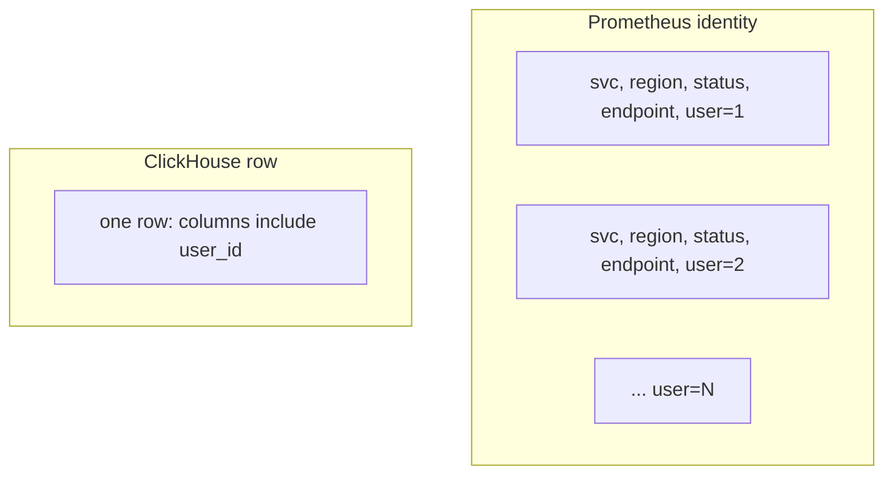

# Cardinality

Prometheus outages have a favorite root cause: someone added a label. `user_id` looks like observability. It is a new time series per user per other-label combination — an index that grows until the TSDB cannot compact, scrape, or query.

Cardinality is not “how many rows.” It is **how many distinct series identities** the engine keeps hot.

---

## Use case

SaaS observability. You already scrape:

```text
http_requests_total{service="api", region="us-east", status="200", endpoint="/checkout"}
```

A PM wants “latency per user” on the same Grafana. The patch is:

```text
http_requests_total{..., user_id="u123456"}
```

Dashboards over hundreds of millions of events/day can **store** per-user facts in ClickHouse. They cannot **index** per-user Prom series.

IoT analogue: `{device_id, sensor}` is the series — 10 M devices × 5 sensors = 50 M series. Painful but bounded. Add `firmware_build` + `session_id` and you are gone.

Explore numbers: [cardinality calculator](../simulations/cardinality-calculator.html).

---

## Why this is hard

Every unique `(name, label set)` is a series. Each series has:

- an inverted index entry (label value → series ids);
- a head block in RAM;
- WAL / chunk writes even if you scrape **once**.

Cost is **#series**, not #samples, until samples pile up. A label with 10⁷ values multiplies **every** other dimension.

```text
series ≈ ∏ |values(label_i)|   (if independent)
```

They are never fully independent, but the product is the planning bound. Engineering reviews use the product, not hope.

---

## Intuition

A series is a **named line** on a graph. Grafana can draw 20 lines. Prometheus can hold millions of lines in the index. It cannot hold a line per customer per endpoint per status per user.

Columns in ClickHouse are not lines. `GROUP BY user_id` is a query-time hash table. You pay it when you query, not at every scrape.



If you can name a **bound** (“we have ≤ 200 endpoints”), it can be a label. If the bound is “our user table,” it is a column in an event store.

---

## Internals

### What Prometheus stores

- **Head:** in-memory samples for active series.
- **Postings:** inverted index, label pair → series.
- **Chunks:** compressed samples on disk, per series.

Memory scales roughly **linearly with active series** (plus label string length). Order of magnitude: hundreds of bytes to a few KB per series of overhead, **not** counting samples. 10 M series is a dedicated, well-run Prom/VM. 10⁹ series is not a Prom problem.

Churn (series that appear once — `trace_id`) is worse: index grows, compaction storms, scrape payloads huge, then the series goes idle but not immediately forgotten.

### Explosion, stepwise

| Labels | Distinct (example) | Series |
|--------|-------------------|--------|
| `service` | 50 | 50 |
| + `region` | 10 | 500 |
| + `status` | 20 | 10,000 |
| + `endpoint` | 500 | **5,000,000** |
| + `user_id` | 1,000,000 | **5×10¹²** |

Endpoint at 500 is already a conversation (path templating vs raw URLs). User_id is not a conversation; it is a page.

Raw URLs: `/orders/8891` as `endpoint` **is** user-level cardinality. Template to `/orders/:id` before it becomes a label.

### Why ClickHouse survives the same points

```sql
CREATE TABLE http_events
(
    ts         DateTime64(3),
    service    LowCardinality(String),
    region     LowCardinality(String),
    status     UInt16,
    endpoint   LowCardinality(String),
    user_id    String,
    latency_ms UInt32
)
ENGINE = MergeTree
ORDER BY (service, endpoint, ts);
```

`user_id` is a column. The primary index does not allocate a granule list per user unless you **sort** by user. 5×10⁸ rows/day is parts and compression, not 5×10¹² series.

`GROUP BY user_id` on a day can still OOM — that is **query** cardinality, not ingest identity. Different knob (`max_memory_usage`, two-level agg, pre-agg).

### Ingest cardinality vs query cardinality

| Kind | When you pay | Example |
|------|----------------|---------|
| **Ingest / identity** | Every scrape, every series in RAM/index | Prom `user_id` label |
| **Query** | When that SQL runs | CH `GROUP BY user_id` on a day |
| **Index** | When you build inverted/star-tree on the column | Pinot inverted `user_id` |

ClickHouse lets you **ingest** 2 M users/day as a column for cheap, then **refuse** the query `GROUP BY user_id` without `customer_id =`. That is an application limit, not a TSDB series limit. Prometheus does not give you that split: ingest **is** identity.

Pinot sits in the middle: ingest of a high-card column as a **raw dimension** can be fine; promoting it to inverted/star-tree makes it Prom-shaped again.

### IoT: device_id is bounded — until it is not

10 M devices × 5 sensors = 50 M series if `{device_id, sensor}` is the Prom identity. Some VM clusters hold that. Add `session_id` (new UUID each Wi‑Fi join) and you get **churn**: series that live for 20 minutes and pollute the index forever-ish.

Better IoT split:

```text
fleet Prom/VM:  temperature{model, site, customer}     # bounded
drill-down CH:  (ts, device_id, sensor, value)         # 10 M ids as column
                                                ORDER BY (device_id, sensor, ts)
```

`device_id` in ClickHouse with that `ORDER BY` is **the** skip key for “chart this thermostat.” In Prom it is 10 M lines on every global query unless you always `{device_id="..."}`.

### VictoriaMetrics / Mimir / Thanos

They raise the ceiling (better compression, sharding). They do **not** make `user_id` a good label. 100× more series is still the wrong model for events.

---

## How

**Bound labels (Prom):**

```text
http_requests_total{service, region, env, status, endpoint}   # endpoint templated
http_request_duration_seconds_bucket{..., le}
```

**Per-user / per-request (ClickHouse / Pinot):**

```sql
INSERT INTO http_events VALUES
    (now64(), 'api', 'us-east', 200, '/checkout', 'u123456', 42);
```

**IoT Prom-style (if you must):** `device_id` only if 10 M series is **funded** (VM cluster, not one pod). Prefer: fleet metrics with `{model, site}` + drill-down SQL on `{device_id, ts, value}`.

**Recording rules** do not fix cardinality. A rule that does `sum by (user_id)` **creates** more series if you already exploded, or fails if you did not store user_id. Rules are for **reducing** dimensions (`sum by (service)`).

**Relabel** to drop:

```yaml
# Prometheus scrape relabel — drop user_id if a client added it
metric_relabel_configs:
  - regex: user_id
    action: labeldrop
```

Measure:

```text
prometheus_tsdb_head_series
prometheus_tsdb_symbol_table_size_bytes
count({__name__=~".+"})
topk(10, count by (__name__)({__name__=~".+"}))
```

If one metric name owns 80% of series, you found the label.

Python bound (same as the calculator):

```python
services, regions, statuses, endpoints, users = 50, 10, 20, 500, 1_000_000
print("without users", services * regions * statuses * endpoints)
print("with users", services * regions * statuses * endpoints * users)
# 5e6 vs 5e12
```

---

## Gotchas

!!! production-gotcha "Un-templated HTTP path"
    `endpoint="/users/uuid/orders/uuid"` is a unique series per request path. Middleware must templatize **before** metrics.

!!! production-gotcha "Exemplar / trace_id as label"
    Exemplars exist so you **do not** put trace ids on series. Labels are not a join key to Jaeger.

!!! production-gotcha "LowCardinality(user_id) in ClickHouse"
    That is a dictionary of millions of keys. Use `String`. LowCardinality is for `service`, `sensor`.

!!! production-gotcha "Kubernetes `pod` label on every metric"
    Pods churn. `pod` cardinality ≈ deploy rate × replicas. Prefer `deployment`/`workload`; keep `pod` on a few debug metrics.

!!! production-gotcha "Grafana legend = `*` "
    UI will try to render 50k series. The TSDB still computed them. Limit `topk`.

---

## Failure modes

| Failure | Signal |
|---------|--------|
| Prom OOM | `head_series` cliff; GC; WAL replay 45 min |
| Scrape timeout | `/metrics` megabytes because of label explosion on the **app** |
| Compaction behind | Disk; query timeouts |
| CH query OOM | `GROUP BY user_id` on 7 days without filter — query cardinality |
| Pinot inverted on `user_id` | Segment heap; see [Pinot](../olap/pinot.md) |

---

## Debugging

1. `topk(20, count by (__name__, user_id)(http_requests_total))` — if this even parses slowly, stop.
2. Cardinality dashboard: series per metric name, per label name.
3. `count(count by (user_id)(http_requests_total))` → unique users as series dimension.
4. App: dump `/metrics` size. If it is 80 MB, the incident started in the process, not in Prom.
5. ClickHouse: `SELECT uniqExact(user_id) FROM http_events WHERE ts > now() - 3600` — this is **allowed**. `SELECT count() FROM system.metrics` analogue in Prom is `head_series`.

Marks/parts: if you tried to “fix” Prom by dumping into CH **and** `ORDER BY (user_id, ts)` with 50 M users, you get a wide index and tiny granules per user — different problem (too many marks), still better than Prom.

---

## Scale 10× / 100× / 1000×

| Growth | Prom labels | Event columns |
|--------|-------------|----------------|
| **10×** traffic, same label set | Samples 10×, series ~constant | Rows 10×, parts/merges |
| **10×** endpoints (raw URLs) | Series 10× | `LowCardinality` may break; still rows |
| **100×** users as labels | Death | Rows; query with tenant filter |
| **1000×** devices as Prom series | Sharded VM/Mimir, or abandon Prom for IoT | CH/Timescale sharded by device |

Traffic growth is a **sample** problem. Dimension growth is a **series** problem. Only the second is this page.

---

## Trade-offs

| Put it in labels | Put it in columns |
|------------------|-------------------|
| Fast PromQL `rate` by that dim | Fast **if** in `ORDER BY` prefix or you filter |
| Bounded dims only | High-card OK |
| Alerting ecosystem | SQL / OLAP |
| Memory ~ series | Memory ~ query |

Hybrid is normal: Prom for `{service, endpoint}` SLOs; ClickHouse for user/session drill-down.

---

## Alternatives

| Need per-user | Tool |
|---------------|------|
| Dashboards, SQL | ClickHouse, Pinot, Timescale |
| Logs | Loki/ELK with **careful** index fields |
| Traces | Tempo/Jaeger, not metric labels |
| “PromQL but bigger” | VictoriaMetrics, Mimir — still no user_id |

---

## Apply

Label review in PR: **bound?** if not, reject. Path templating in HTTP metrics is a platform standard, not an app choice.

If a product metric needs user_id, it is an **event** — Kafka topic, OLAP table, `ORDER BY (customer_id, ts)`.

Platform checklist before merge:

1. Product of label bounds written in the PR (not “should be small”).
2. HTTP paths templated in middleware.
3. Histogram `le` buckets counted in the product.
4. A cardinality dashboard exists (`head_series` by metric name).
5. If someone says “we’ll add remote_write,” that scales **samples**, not a 10¹² series bound.

Incident smell: `/metrics` grew from 2 MB to 80 MB after a “debug label” shipped on Friday. Roll back the label before you scale the TSDB. The TSDB is working as designed.

For a walk-through of the product-of-bounds arithmetic, use the [cardinality calculator](../simulations/cardinality-calculator.html). Change one label at a time. The cliff is never “10× traffic”; it is the unbounded dimension.

Compare engines once the identity is a column: [TSDBs](tsdbs.md), [ClickHouse](../olap/clickhouse.md), [TSDB vs OLAP](../comparisons/tsdb-vs-olap.md).

---

## Exercise

`http_request_duration_seconds_bucket` has labels `service` (80), `le` (12 buckets), `endpoint` (templated 40), `method` (8). Traffic: 200 M requests/day, 2 M DAU.

Engineer A adds `user_id`. Engineer B adds `customer_id` (2,000 tenants). Engineer C writes requests to ClickHouse with those as columns and keeps Prom without them.

Estimate series for A and B (product bound). Who is right for a “p95 per tenant” product dashboard vs SLO per service?

??? success "Answer"
    Base Prom series ≤ 80 × 12 × 40 × 8 = **307,200** (if independent). Comfortable.

    **B:** × 2,000 customers → ≤ ~6×10⁸ series **bound**. Reality: not every tenant hits every endpoint, but tens of millions of series is plausible. Too high for one Prometheus; maybe a sharded VM **if** you truly need PromQL per tenant. Prefer `customer_id` as a column or a **recording** path into CH.

    **A:** × 2 M users → 10¹¹–10¹² bound. Invalid. Do not ship.

    **C is right for both:** Prom keeps service SLOs (`histogram_quantile` by `service, endpoint`). ClickHouse `ORDER BY (customer_id, ts)` (or Pinot inverted `customer_id`) serves p95 per tenant from events (`quantile` / histogram columns). 200 M rows/day is a normal CH ingest if batched.

    Product dashboard p95 per tenant: **C** (or B only with a dedicated high-card TSDB and a hard series cap — still worse). SLO per service: Prom **without** A/B labels.
