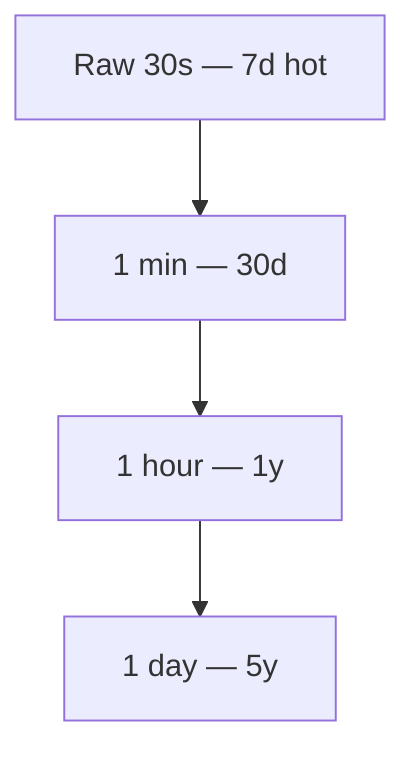

# Downsampling

**Storage review, Thursday.** Finance flags the observability budget: the raw-readings disk has grown to 160 TB and is still climbing. Someone points out the dashboards only ever render a 1,200-pixel-wide chart — nobody looks at more than 1,200 points at once, no matter how many billions of rows sit behind it.

Predict before you read on: (A) buy more/cheaper disk, (B) shorten raw retention with nothing to replace it, (C) build tiered rollups (1 min / 1 hour / 1 day) and drop raw after days not years, or (D) compress harder at the same resolution?

It's (C). 10 million devices × 1 sample / 30 s ≈ 3.3×10⁵ points/s ≈ **2.9×10¹⁰ / day** ≈ **10¹³ / year**, and at 16 bytes/point (time + id hash + value) that's already **~160 TB/year** before indexes and replicas. You will aggregate. The only question is whether you aggregate **once**, on write, or **every time someone opens Grafana**.

---

## Use case

IoT `{timestamp, device_id, sensor, value}` plus observability events at hundreds of millions/day.

Queries:

| Tile | Time span | What the pixel needs |
|------|-----------|----------------------|
| Debug | 1–6 h | Raw or 30 s |
| Ops week | 7–30 d | 1–5 min |
| Exec year | 1 y | 1 h–1 d |
| Alert | last 5–15 min | Raw / 1 min, **max** not only avg |

Retention money: keep raw hot for 7 days, not 7 years.

---

## Why this is hard

Downsampling **destroys information**. Average of a minute hides a 5 s 100% CPU. p95 of a day cannot be recovered from 24 hourly p95s by averaging them. Late event time means a rollup you already closed is wrong unless you recompute.

If you downsample in the UI (Grafana “min interval”), 10 M devices still send 10 M series to the UI path. Pre-aggregation must happen **per series / per device** in the store.

---

## Intuition

A pyramid. Each layer is tumbling windows ([windows](windows.md)) with fewer rows.



The query router picks the **coarsest layer that still fills the pixels** (and the statistics the tile needs).

Storage is dominated by the **finest** layer you keep × retention. Dropping raw after 7 days is the only lever that actually bends the year-cost curve.

---

## Internals

### Storage math (order of magnitude)

10 M devices, 1 sensor, 30 s raw:

| Layer | Points / year (if kept all year) | Relative to raw |
|-------|----------------------------------|-----------------|
| 30 s raw | ~1×10¹³ | 1 |
| 1 min | ~5×10¹² | ½ (two 30 s samples → one minute bucket) |
| 1 h | ~8.8×10¹⁰ | ~1/120 |
| 1 d | ~3.7×10⁹ | ~1/2880 |

Keeping **raw 7 d + 1 min 30 d + 1 h 1 y + 1 d 5 y** is tens of TB, not 160 TB × 5 years. Replicas and indexes still multiply — but the pyramid is why TSDBs quote “10× compression” and still need TTL.

### Which statistics to keep

| Keep | Why |
|------|-----|
| `count`, `sum` | rates, averages that **merge** (`sum/sum`) |
| `min`, `max` | spikes survive |
| quantile **state** | p95 that **merges** (t-digest, DDSketch, CH `quantilesState`) |
| `last` | gauges’ current value |
| only `avg` | **insufficient** for ops |

Merge law: `avg` of avgs is wrong unless weighted by `count`. Always store `sum`+`count` or `avgState`.

### Continuous aggregates vs batch vs stream

| Mechanism | Example | Late data |
|-----------|---------|-----------|
| **Timescale cagg** | `time_bucket` MV, refresh policy | Refresh window must overlap lateness |
| **ClickHouse MV** | insert-time partial aggs | Late insert updates the state **if** it still hits the MV; TTL raw independent |
| **Prom recording rules** | `rate:...:5m` | Only as good as scrape presence |
| **Flink window job** | write 1 min table | Watermarks **define** close |
| **Nightly batch** | Spark on Iceberg | Cheap, stale |

Grafana “recording” in the browser is not a layer.

### Query routing

```sql
-- pseudo: pick table by span
-- span < 6h  -> readings_raw
-- span < 40d -> readings_1m
-- else       -> readings_1h
```

Do this in the API or Grafana using **different metrics/tables**, not `UNION ALL` raw with 1h (the optimizer will not save you if you still touch raw).

### TTL vs downsampling

TTL **deletes**. Downsampling **copies a summary then deletes**. TTL without a layer behind it is amnesia. A layer without TTL is a second full-price copy.

---

## How

**Timescale continuous aggregate:**

```sql
CREATE MATERIALIZED VIEW readings_1h
WITH (timescaledb.continuous) AS
SELECT
    time_bucket('1 hour', ts) AS hour,
    device_id,
    sensor,
    avg(value) AS avg_v,
    max(value) AS max_v,
    min(value) AS min_v,
    count(*)   AS n,
    sum(value) AS sum_v
FROM readings
GROUP BY hour, device_id, sensor;

SELECT add_continuous_aggregate_policy('readings_1h',
    start_offset => INTERVAL '3 hours',
    end_offset   => INTERVAL '1 hour',
    schedule_interval => INTERVAL '30 minutes');

SELECT add_retention_policy('readings', INTERVAL '7 days');
SELECT add_compression_policy('readings', INTERVAL '2 days');
```

`end_offset` 1 hour: do not close the bucket until event time has some slack for late IoT. If devices buffer 40 minutes, 1 hour is still tight — set from measured lag ([time semantics](time-semantics.md)).

**ClickHouse rollup + TTL:**

```sql
CREATE TABLE readings_raw (...)
ENGINE = MergeTree
PARTITION BY toYYYYMMDD(ts)
ORDER BY (device_id, sensor, ts)
TTL ts + INTERVAL 7 DAY;

CREATE TABLE readings_1m
(
    m DateTime,
    device_id String,
    sensor LowCardinality(String),
    avg_s AggregateFunction(avg, Float64),
    max_s AggregateFunction(max, Float64),
    min_s AggregateFunction(min, Float64),
    n_s   AggregateFunction(count)
)
ENGINE = AggregatingMergeTree
PARTITION BY toYYYYMM(m)
ORDER BY (device_id, sensor, m)
TTL m + INTERVAL 90 DAY;

CREATE MATERIALIZED VIEW readings_1m_mv TO readings_1m AS
SELECT
    toStartOfMinute(ts) AS m,
    device_id,
    sensor,
    avgState(value) AS avg_s,
    maxState(value) AS max_s,
    minState(value) AS min_s,
    countState()    AS n_s
FROM readings_raw
GROUP BY m, device_id, sensor;

-- query
SELECT m, avgMerge(avg_s), maxMerge(max_s), countMerge(n_s)
FROM readings_1m
WHERE device_id = 'd-9' AND m >= now() - INTERVAL 14 DAY
GROUP BY m
ORDER BY m;
```

**Prometheus:** 15 d local, remote_write to VM/Thanos; recording rules for 5m rates; **not** 10 M device labels ([cardinality](cardinality.md)).

**Graphite-style CH:** `GraphiteMergeTree` exists for drop policies; most teams still prefer explicit MVs they can query with SQL.

---

## Gotchas

!!! production-gotcha "Only avg in the rollup"
    You cannot answer “did we spike?” a month later. Add max/min/count.

!!! production-gotcha "TTL shorter than cagg refresh"
    Raw gone before the 1h bucket finalized. Refresh from nothing. Align TTL ≫ lateness + refresh.

!!! production-gotcha "MV on a table you INSERT with SELECT *"
    Column mismatch silently drops metrics. MV is a **push** trigger on insert, not a historical backfill. `POPULATE` / backfill separately.

!!! production-gotcha "Percentile columns as Float64 p95"
    Cannot merge. Use `quantilesState` / sketches.

!!! production-gotcha "Partition by ingest date, TTL by event time"
    Late rows land in today’s partition and TTL yesterday’s partition — you delete the wrong files or none. Same clock for PARTITION, TTL, query.

!!! production-gotcha "UI downsampling as the plan"
    Grafana min step still queries the TSDB for every series. 10 M series never arrive.

---

## Failure modes

| Failure | Cause |
|---------|--------|
| Disk still 160 TB | Raw TTL not actually dropping (`system.parts` old partitions) |
| Year chart empty | Query still hitting raw that TTL’d |
| Year chart too smooth | Only avg 1d |
| Cagg lag 12 h | Refresh job failing; late offset too large |
| Double count | Hybrid raw UNION rollup overlapping time |
| Mutation storm | Trying to “fix” rollups with UPDATEs instead of rebuild |

---

## Debugging

Storage:

```sql
-- ClickHouse
SELECT
    table,
    formatReadableSize(sum(bytes_on_disk)) AS disk,
    sum(rows) AS rows
FROM system.parts
WHERE active AND table LIKE 'readings%'
GROUP BY table;

SELECT partition, min(min_date), max(max_date), count()
FROM system.parts
WHERE table = 'readings_raw' AND active
GROUP BY partition
ORDER BY partition;
```

If `readings_raw` has partitions older than TTL, TTL is mis-set (`ttl_only_drop_parts`, merge not running, column vs table TTL).

Query:

```sql
-- should be ~14d of minutes, not 14d of 30s
SELECT count() FROM readings_1m
WHERE device_id = 'd-9' AND m > now() - INTERVAL 14 DAY;
```

Timescale: `timescaledb_information.jobs` / job stats; chunk exclusion in `EXPLAIN`.

Prom: retention flag vs disk; remote_write lag.

---

## Scale 10× / 100× / 1000×

| Scale | Move |
|-------|------|
| **10×** devices | Same pyramid; shard/partition by `device_id`; batch inserts |
| **100×** | Drop raw to 24–72 h; 1 min becomes the debug layer; compute 1 min in Flink |
| **1000×** | Do not store per-device 1 min for a year. Store per-device 1 min for 7 d, per-**customer** 1 min for 90 d, fleet 1 h forever |

The pyramid **dimensions** can coarsen too: not only time, but identity (`device` → `customer` → `fleet`). That is downsampling of **cardinality**, not only of time.

---

## Trade-offs

| Keep raw longer | Coarser sooner |
|-----------------|----------------|
| Forensic debug | Cost, merge CPU |
| True p99 later | Need sketches anyway |
| Simple queries | Disk |

| Recompute rollups | Incremental MV |
|-------------------|-----------------|
| Correct with late data | CPU |
| Batch-friendly | Close-time semantics |

---

## Alternatives

| Tool | Downsample story |
|------|------------------|
| Timescale cagg | Best SQL story |
| ClickHouse MV + TTL | Best at high ingest |
| VM / Mimir downsampling | Prom ecosystem |
| Iceberg + Spark nightly | Lake as cold layer, Trino for humans |
| Pinot star-tree | Dimensional pre-agg, not year IoT |

---

## Apply

Write the table:

`tile → max span → layer → stats → retention`.

Compute TB. If finance would not sign it, you do not have a retention policy; you have a hope.

At work the smell is a 14-day dashboard that scans 30 s raw for 10 M series, or a 13-month disk that is 99% raw.

---

## Exercise

10 M devices, 30 s temperature, 3× replication, 24 bytes/point on disk after compression (all-in). Budget: 40 TB usable for this pipeline.

Propose raw / 1 min / 1 h retentions that fit, which stats live in 1 min, and what the 1-year exec chart reads. Show the arithmetic.

??? success "Answer"
    Points/day per layer (10 M devices):

    | Layer | Points/day | Bytes/day at 24 B/point (3× repl. all-in) |
    |---|---|---|
    | Raw (30 s) | 10e6 × 86400/30 = 2.88×10¹⁰ | ≈ **691 GB/day** |
    | 1 min | 10e6 × 1440 = 1.44×10¹⁰ | ≈ **346 GB/day** |
    | 1 hour | 10e6 × 24 = 2.4×10⁸ | ≈ **5.8 GB/day** |
    | 1 day | 10e6 × 1 = 1×10⁷ | ≈ **0.24 GB/day** |

    A year of fleet-wide raw would be 691 GB × 365 ≈ **252 TB** — more than 6× the 40 TB budget. That is the actual constraint: not that raw is unaffordable for a day, but that it is unaffordable to keep for a **year** at full fidelity. Coarsen with time, not with a blanket TTL.

    **A design that fits 40 TB:**

    - Raw (30 s), fleet-wide, **7 days**: 7 × 691 GB ≈ **4.8 TB** — enough to debug last week's incident.
    - 1 min, fleet-wide, **60 days**: 60 × 346 GB ≈ **20.8 TB** — covers "what did last month look like."
    - 1 hour, fleet-wide, **365 days**: 365 × 5.8 GB ≈ **2.1 TB** — a full year of per-device hourly trend.
    - 1 day, fleet-wide, **3 years**: negligible (≈0.26 TB) — long-horizon capacity planning.
    - Per-customer (2,000 customers) 1-min rollups, kept indefinitely: tens of GB, trivial.

    Total ≈ 4.8 + 20.8 + 2.1 + 0.26 ≈ **28 TB**, leaving ~12 TB of headroom for quantile sketches, indices, and growth.

    **1-year exec chart:** daily fleet or per-customer aggregates from the 1-day layer, not per-device 30 s raw. Carry `sum, count, min, max` (and a quantile sketch if you need p95) through every layer — never collapse to average-only, or you lose the ability to reconstruct a proper percentile later.

    The point of the arithmetic: compression buys you weeks of full fidelity almost for free, but a **year** of per-device full fidelity is the expensive part. Downsampling is what buys back the year — by dropping identity (fleet/customer instead of per-device) or resolution (hour/day instead of second), not by a blanket retention cut.
