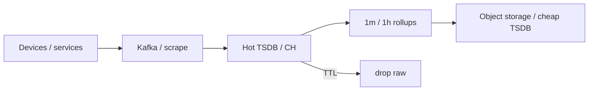

# Time Series

!!! info "Capacity is measured, not universal"
    Product ceilings depend on workload and deployment. Treat numerical thresholds as planning examples, then load-test. Primary documentation is listed in [Versions & Primary Sources](../reference/version-matrix.md).

**Design review, Tuesday.** An engineer proposes one Postgres table for the new IoT fleet: `{timestamp, device_id, sensor, value}`, indexed on `(device_id, timestamp)`. Ten million devices report every 30 seconds. Someone does the arithmetic on a whiteboard and the room goes quiet.

Predict before you read on: at ~3.3×10⁵ points/s, does plain Postgres survive this, survive it with tuning, or is this simply the wrong category of database regardless of tuning?

Ten million devices at that rate is ~3×10¹⁰ points/day and ~10¹³/year — and nobody actually looks at 10¹³ points, they look at a 1,200-pixel chart of "temperature last 90 days" and an alert on "rate of failed logins." Time-series systems exist because **time is the primary access path**, writes are appends, and the answer is almost always an aggregate over a window — not a row.

---

## Workload

**IoT platform** (this module’s backbone):

```
{timestamp, device_id, sensor, value}
```

- Regular sampling (every 30 s) **and** irregular events (faults).
- Queries: latest value, last-hour chart, last-year trend, anomaly vs rolling mean.
- Devices go offline. Packets arrive late. Clocks lie.

**Observability** (same physics, different cardinality):

Prometheus scrapes `http_requests_total{service, region, status, endpoint}`. Add `user_id` as a label and the TSDB falls over. That story is [cardinality](cardinality.md).

If the question is “p95 latency by endpoint for one customer, ad-hoc SQL,” you may still **store** events in ClickHouse — but you should understand why that is an OLAP access pattern, not PromQL. See [TSDB vs OLAP](../comparisons/tsdb-vs-olap.md).

---

## What this module covers

| Topic | What you will be able to do |
|-------|-----------------------------|
| [Time semantics](time-semantics.md) | Event time vs scrape time; counters vs gauges; gaps |
| [Windows](windows.md) | Tumbling / sliding / session; rate over a range |
| [Cardinality](cardinality.md) | Why `user_id` as a label is an outage |
| [Downsampling](downsampling.md) | Tiers, continuous aggregates, TTL |
| [TSDBs](tsdbs.md) | Prometheus, VictoriaMetrics, Timescale, Influx, ClickHouse — by access pattern |

Stream **processing** windows (Flink watermarks) are cousins: [Flink time](../flink/time.md), [Flink windows](../flink/windows.md). This module is **storage and query** of measurements.

---

## What is actually different

A `users` table is mutated. A measurement is not. You append `(t, device, sensor, value)`. If the device later reports a correction, you append another sample or a tombstone — you do not rewrite last Tuesday in place (and if you do, you are in OLAP mutation land).

Five properties that break generic databases:

1. **Append-only** at high rate.
2. **Time-range predicates** on almost every query.
3. **Aggregation as the product** (rate, p95, avg, max).
4. **Retention tiers** — raw for days, rollups for years.
5. **Identity is the series** — metric + labels / tags / `{device_id, sensor}`.



Postgres can do a million rows. It does not want 300k inserts/s of `(timestamptz, text, float)` without hypertables, batching, and a serious vacuum story. Prometheus wants that scrape. ClickHouse wants **batches** of the same rows and a sort key `(device_id, timestamp)`.

---

## Access patterns (choose storage from these)

| Pattern | Example | Engine instinct |
|---------|---------|-----------------|
| Scrape + alert | `rate(http_requests_total[5m]) > 100` | Prometheus / VictoriaMetrics |
| Latest per device | thermostat UI | TSDB `last` / CH `argMax` / Redis |
| Fixed dashboard, IoT | 24 h temperature, 10k devices | Timescale continuous agg / CH MV |
| High-cardinality events | per-user API latency | **Not** Prom labels — ClickHouse / Pinot |
| Ad-hoc SQL over sensors + customers | join devices to billing | Timescale or CH, not PromQL |
| Year of fleet trend | 1 px ≈ 1 day | Downsampled daily table, not raw |

The failure mode of this industry is stuffing **event logs** into a **metrics** TSDB because both have timestamps.

---

## Cardinality and downsampling are the two cliffs

**Cardinality:** each unique label set is a series. Series have indexes and RAM. `user_id` turns 10k series into 10¹². Tools that survive this (ClickHouse) treat `user_id` as a **column**, not a series identity.

**Downsampling:** the year chart cannot read 10¹³ raw points. You pre-aggregate. If you only keep `avg`, you delete the 5-second CPU spike. Keep min/max/count too. [Downsampling](downsampling.md).

Get both wrong and you either OOM Prometheus in a week or pay for a 80 TB SSD that serves 1,200 pixels.

---

## Event time is not optional

A device buffers 40 minutes offline, then dumps. If you chart **ingestion time**, the dump is a spike **now**. If you chart **event time**, the samples fill the gap in the past — and your 5-minute window must still be **open** or you accept late data.

TSDBs are sloppier than Flink about watermarks. You still have to pick the timestamp column and live with late writes. Details: [time semantics](time-semantics.md).

---

## Windows are the product

Nobody queries “all temperatures.” They query a **window**: last 5 minutes, tumbling 1 minute, rolling p95, session of device-awake. PromQL `rate(x[5m])` is a lookback, not SQL `time_bucket`. Mixing them is how Grafana and a SQL warehouse disagree by 30%.

Compute tumbling rollups **once** (continuous aggregate / ClickHouse MV). Derive sliding charts from the 1-minute table, not from 30 s raw × 10 M devices. Session windows usually stay on hot raw or in Flink. [Windows](windows.md).

---

## Retention is a pyramid, not a disk size

Raw 30 s × 10 M devices × 1 year is not a dashboard. It is a finance incident. The shape that works:

- raw / 30 s: hours to a few days (debug);
- 1 minute: weeks;
- 1 hour / 1 day: years;
- and often **coarser identity** at the long end (per customer, not per device).

Keep `min`/`max`/`count` with `avg` or you delete the spike you will page on. [Downsampling](downsampling.md).

---

## What this module is not

| Problem | Module |
|---------|--------|
| Flink watermarks, allowed lateness | [Flink time](../flink/time.md) |
| User-facing 5k QPS dimensional SQL | [Pinot](../olap/pinot.md) |
| Ad-hoc lake SQL | [Trino](../query-engines/trino.md) |
| “We have timestamps, so Prometheus” | this module’s anti-pattern — [TSDBs](tsdbs.md) |

Metrics vs events vs traces: timestamps are necessary, not sufficient. If the identity is unbounded (`user_id`, `trace_id`, `stack_hash`), it is not a Prom series.

---

## Scale cliffs

| Devices × rate | Pain |
|----------------|------|
| 10k × 1 Hz | Postgres + indexes still tempting; you will regret vacuum |
| 10 M × 1/30 s (this academy’s IoT) | Dedicated TSDB or CH; batch writes; rollups |
| 100 M devices | Shard by device; never Prom labels per device-user; cold storage |

10× devices is 10× **series** if `device_id` is identity — that is the cardinality curve, not the byte curve.

---

## How to study

1. [Time semantics](time-semantics.md) — counters, gaps, which clock.
2. [Windows](windows.md) — what a chart actually computes.
3. [Cardinality](cardinality.md) + [cardinality calculator](../simulations/cardinality-calculator.html).
4. [Downsampling](downsampling.md) — storage math for one year.
5. [TSDBs](tsdbs.md) — pick from **access pattern**, not logos.

Then [IoT architecture](../architectures/iot.md) and [observability](../architectures/observability.md).

When you can answer “what is a series, which clock, which window, which layer, which engine” for one tile without looking at a vendor page, the module has done its job.

| Tile | Clock | Window | Layer | Engine instinct |
|------|-------|--------|-------|-----------------|
| Page on 5xx rate | scrape | lookback 5m | raw / recording rule | Prom / VM |
| Device last value | event | none (`argMax`) | raw hot | CH / Timescale |
| Year fleet trend | event | tumbling 1d | daily rollup | any SQL + TTL |
| Crashes per customer | event | tumbling 1d | event table | CH, not Prom |

---

## Check your understanding { #exercise }

IoT: 10 M devices, 30 s temperature, plus a `firmware_crash` event with `{device_id, stack_hash}`. Product wants PromQL alerts on temperature **and** a “crashes per customer last 7 days” SQL report (customers have 1–50k devices). One engineer proposes one Prometheus with `device_id` and `customer_id` labels on both metrics.

What do you split, and where does each data type live?

??? success "Answer"
    **Temperature scrape/series:** if you truly need PromQL alerts per device, that is already 10 M series — above comfort for a single Prometheus. VictoriaMetrics or sharded Prom/Mimir/VM, **or** drop per-device Prom and alert on **fleet** metrics (`customer_id` + `model`, not `device_id`) plus a TSDB/CH for drill-down.

    **Never** put `stack_hash` + `device_id` + `customer_id` as Prom labels on crash **events**. Crashes are logs/events: Kafka → ClickHouse/Timescale with columns, `ORDER BY (customer_id, timestamp)`.

    **SQL report** “crashes per customer”: OLAP/SQL store. Prometheus will not JOIN customers and should not hold the event.

    Two pipelines: metrics (bounded labels) vs events (high-cardinality columns). The shared key is `device_id` as a **column** in the event store, not as a Prom label on everything.
