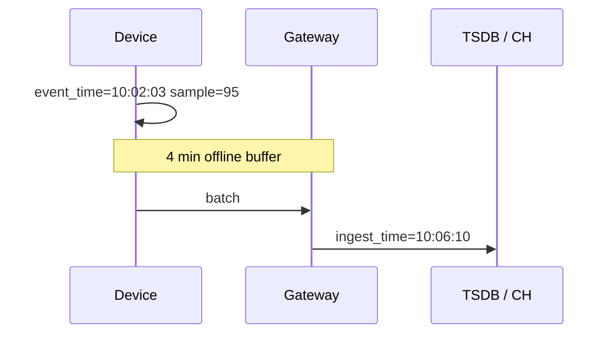

# Time Semantics

**10:07 AM.** An on-call engineer is staring at a Grafana panel showing a fleet-wide temperature spike to 95° at 10:06. Nothing is actually overheating — a batch of devices just reconnected to Wi-Fi after a brief outage and dumped their buffered readings. The sensor read 95° at `10:02:03Z`; the gateway didn't deliver it until `10:06`.

Predict before you read on: does the chart look wrong because of (A) a bad `avg` aggregation, (B) the wrong timestamp column being used to bucket the data, (C) clock drift on the device, or (D) too coarse a scrape interval?

It's (B) — and which clock you stored, event time, ingestion time, or scrape time, decides whether this reads as a spike in the past, a spike now, or a sample that never enters the window at all. Time-series bugs like this are usually **silent**: the chart looks plausible.

---

## Use case

IoT: `{timestamp, device_id, sensor, value}` every 30 s, plus bursts after reconnects.

Observability: counters scraped every 15 s from `/metrics`.

You need:

- a live “last value” tile;
- a 1-hour chart aligned to **when the physical world changed**;
- an alert on **rate of a counter**, not its raw value;
- honest gaps when a device is offline (not a straight line through missing).

---

## Why this is hard

Clocks disagree. Devices sleep. NTP steps. Mobile buffers. Scrapes fail. Counters reset on deploy. Regular sampling pretends the world is a grid; the world is not.

A database that stores `now()` at insert time is recording **ingestion time**. Every delayed batch becomes a false storm at ingest. A system that stores the payload timestamp records **event time**, then must define what a query with `start=10:00,end=10:05` does when a 10:03 sample arrives at 10:40.

Flink makes this explicit with watermarks ([Flink time](../flink/time.md)). TSDBs often pick a timestamp and hope. You still need the same mental model.

---

## Intuition

Name three clocks, never mix them in one column.

| Clock | Meaning | Typical source |
|-------|---------|----------------|
| **Event time** | When the measurement was true | Device clock / app timestamp |
| **Ingestion time** | When the store first saw it | Kafka timestamp, `now()` on INSERT |
| **Processing / scrape time** | When a job or Prometheus collected it | Scrape interval, job clock |



Chart by event time: the point sits at 10:02. Chart by ingest: a 95° spike at 10:06 next to other reconnecting devices — a fleet “incident” that did not happen.

---

## Internals

### Metric, labels, sample, series

- **Metric / measurement name:** `temperature`, `http_requests_total`.
- **Labels / tags / dimensions:** `{device_id="d-9", sensor="oil"}`. In PromQL these **are** the series identity. In ClickHouse they are columns.
- **Sample:** `(timestamp, value)` for that identity.
- **Series:** the time-ordered stream of samples for one identity.

Mixing a high-cardinality identifier into labels creates series. Mixing it into a column creates rows. Same number of points; **wildly** different indexes. [Cardinality](cardinality.md).

### Timestamp precision and time zones

Store UTC. Display zones in the UI.

| Precision | Fits | Breaks |
|-----------|------|--------|
| 1 s | Coarse IoT | Two samples in the same second collide; scrape jitter |
| ms | Events, most TSDBs | Fine |
| ns | Tracing, some IoT | Wasteful if your device is 30 s |

Prometheus uses ms. ClickHouse `DateTime64(3)` is the usual event-time column. `DateTime` (seconds) silently collides.

Device clocks without NTP will **wander**. You can clip “future” samples (clock ahead) and accept late event time (clock behind / buffer). There is no perfect fix except better clocks.

### Regular vs irregular sampling

**Regular:** 30 s temperature. Aggregation is `avg`/`max` in a bucket. Missing buckets mean **offline or scrape fail**, not “zero temperature.”

**Irregular:** crashes, requests, orders. “Average per minute” without `count` is meaningless; you want `count` / `rate` / histograms.

Do not force irregular events into a gauge that is “0 when nothing happened” unless you like to invent traffic.

### Gaps

| System | Gap behaviour |
|--------|----------------|
| Prometheus | Stale markers; functions like `rate` need enough samples in range; range vectors are **lookback**, not SQL `GROUP BY` |
| Influx | Missing points are missing; fill in Flux/InfluxQL if asked |
| Timescale | `time_bucket_gapfill` + `interpolate` / `locf` |
| ClickHouse | You only see rows that exist; `WITH FILL` on `ORDER BY` can synthesize buckets |

Filling with **zero** is correct for “requests we counted” (none). It is wrong for “temperature” (unknown). Filling with **linear interpolation** is honest for a slowly changing physical quantity and a lie for a counter.

```sql
-- Timescale: 5-minute grid, interpolate temperature, do NOT interpolate crashes
SELECT
    time_bucket_gapfill('5 minutes', ts) AS bucket,
    device_id,
    interpolate(avg(temperature)) AS temperature
FROM sensor_readings
WHERE ts >= now() - interval '1 day'
  AND sensor = 'temperature'
GROUP BY bucket, device_id
ORDER BY bucket;
```

### Counters vs gauges vs histograms

**Gauge:** temperature, heap bytes, replica lag. Value is the world. Chart the value. `avg`/`max`/`last` make sense. `rate()` does not (except as “how fast is this gauge changing,” which is rarely the alert you wanted).

**Counter:** `http_requests_total`, packets, joules. Monotonic (until restart). The raw value is an implementation detail. Dashboards want **rate** or **increase**.

```text
# PromQL
rate(http_requests_total[5m])
increase(http_requests_total[1h])
```

`rate` is per-second average over the range window. It handles **resets** (deploy) by detecting a drop. Your SQL equivalent must do the same or a deploy looks like negative traffic.

```sql
-- ClickHouse: per-series rate with reset handling (sketch)
SELECT
    device_id,
    ts,
    value,
    greatest(value - lag(value) OVER (PARTITION BY device_id ORDER BY ts), 0) AS delta
FROM counters;
```

**Histogram:** latency buckets. p95 is **not** `quantile` of gauges unless you stored a summary correctly. Prom histograms need `histogram_quantile`. ClickHouse wants `t-digest` / `quantiles` on raw events — different product.

### Lookback windows vs SQL buckets

PromQL `rate(x[5m])` at time T uses samples in `(T-5m, T]`. It is a **sliding lookback**, evaluated at each step (`query_range` step).

SQL `time_bucket('5 minutes', ts)` is a **tumbling** grid aligned to the epoch (or origin).

These are not the same chart. Aligning Grafana “min interval” with scrape interval is how you avoid 2-sample `rate` noise.

---

## How

**IoT ClickHouse** — event time as the column you filter; ingest time as debug:

```sql
CREATE TABLE readings
(
    ts          DateTime64(3),      -- event time from device
    ingested_at DateTime64(3) DEFAULT now64(3),
    device_id   String,
    sensor      LowCardinality(String),
    value       Float64
)
ENGINE = MergeTree
PARTITION BY toYYYYMMDD(ts)
ORDER BY (device_id, sensor, ts);

INSERT INTO readings (ts, device_id, sensor, value) VALUES
    ('2024-06-12 10:02:03.000', 'd-9', 'temperature', 95);
```

**Prometheus** — scrape time is the sample time unless the client uses the OpenMetrics timestamp (rare, and dangerous if devices lie). For IoT, Prometheus is often the **wrong** collector; use a push gateway or skip Prom and write event time into a TSDB.

**Timescale:**

```sql
CREATE TABLE readings (
    ts timestamptz NOT NULL,
    device_id text NOT NULL,
    sensor text NOT NULL,
    value double precision NOT NULL
);
SELECT create_hypertable('readings', 'ts');
```

**Never:**

```sql
INSERT INTO readings (ts, ...) VALUES (now(), ...);  -- device was offline 40 min
```

unless `ts` is defined as ingest time **and** the chart is labelled “ingest.”

Late data: keep the window query on event time and accept that a “closed” hour can change.

```sql
SELECT toStartOfHour(ts) AS hour, avg(value)
FROM readings
WHERE device_id = 'd-9'
  AND ts >= now() - INTERVAL 1 DAY
GROUP BY hour
ORDER BY hour
WITH FILL STEP 3600;   -- ClickHouse: show gaps as defaults
```

---

## Gotchas

!!! production-gotcha "now() as event time"
    Every batch job, every Kafka consumer retry, every backfill will rewrite history as “today.” Pass the producer timestamp.

!!! production-gotcha "Local time in the column"
    DST: 01:30 happens twice or not at all. UTC in storage. Convert in Grafana.

!!! production-gotcha "rate() on a gauge"
    `rate(memory_bytes[5m])` is “bytes per second of change,” not utilization. Use `memory_bytes` or `deriv` with intent.

!!! production-gotcha "Ignoring counter resets"
    Naive `last - first` over a window that includes a pod restart is a large negative. Prom `rate` handles this; your SQL must too.

!!! production-gotcha "Scrape interval ≥ chart step"
    `rate[1m]` with a 15 s scrape is fine. `rate[15s]` with 15 s scrape is 1–2 samples — noise. Range ≥ 4× scrape is a common rule of thumb.

!!! production-gotcha "Interpolating counters"
    Gapfill + interpolate on `http_requests_total` invents requests that never hit the server. Interpolate gauges; zero-fill or leave gaps on counts.

---

## Failure modes

| Symptom | Cause |
|---------|--------|
| Spike at the same wall time many devices reconnect (Wi‑Fi) | Charting ingest time |
| Alert fires at deploy | Counter reset treated as a drop / spike |
| Smooth line through an outage | `locf` / interpolate on a gap that should be null |
| Future samples | Device clock ahead; some TSDBs drop “too future” |
| Duplicate PK / collapsed points | Second precision + 30 s jitter still OK; 1 s sampling into `DateTime` seconds + two sensors |
| Dashboard disagrees with Prom | SQL tumbling buckets vs Prom lookback + different reset handling |

---

## Debugging

1. **Print three timestamps** for one sample: payload, Kafka, insert. If they differ by minutes, pick one for the product and log the others.
2. **Raw samples around the incident**, not the 5-minute avg. Anomalies live in raw.
3. Prometheus: `timestamp(metric)` vs `time()`. Huge delta → client timestamps or clock skew.
4. ClickHouse:

```sql
SELECT
    ts,
    ingested_at,
    dateDiff('second', ts, ingested_at) AS lag_s,
    value
FROM readings
WHERE device_id = 'd-9'
ORDER BY ingested_at DESC
LIMIT 50;
```

If `lag_s` is 0 always, you are not storing event time (or devices are in the DC). If `lag_s` is 3600 for a fleet at 02:00 UTC, you stored local time without zone.

5. For counters, plot **raw** and **rate** on the same incident. A reset is a vertical drop on raw and a blip on a bad rate.

---

## Scale 10× / 100× / 1000×

| Scale | Time-semantics pain |
|-------|---------------------|
| **10×** devices | More late bursts; merge jobs that use `now()` become visible |
| **100×** | You cannot repair history with UPDATEs; backfills must carry original `ts`; partitions by **event** day, not ingest day, or late data lands in “today” partitions |
| **1000×** | Clock skew is a fleet property; reject samples too far in the future; watermark-like cutoffs for rollups so continuous aggregates **close** |

Partitioning by ingest day and querying by event time = late points live in the wrong partition and prune fails. Partition on the same clock you filter.

---

## Trade-offs

| Choice | Gain | Cost |
|--------|------|------|
| Event time | Honest charts | Late updates to “closed” windows |
| Ingest time | Simple, monotone partitions | False spikes, useless physics |
| Prom scrape time | Alerting ecosystem | Bad for buffered IoT |
| Interpolate gaps | Pretty graphs | Invented physics |
| Leave gaps | Honest | UI must handle nulls |

---

## Alternatives

| Approach | When |
|----------|------|
| Flink event time + watermarks | You **compute** windows before storage |
| Prometheus + recording rules | Infra metrics, scrape model |
| ClickHouse event-time MergeTree | High-cardinality IoT + SQL |
| Timescale hypertables | SQL team, moderate rates |
| Device-side aggregation | You cannot afford raw at all |

---

## Apply

For every pipeline, write in the design doc: **which column is event time**, **what we do with late samples**, **counter or gauge**, **how gaps render**.

If you cannot answer, Grafana will answer for you — incorrectly.

This is the same discipline as [Flink time](../flink/time.md), applied to storage.

---

## Exercise

Gateway sends:

```json
{"device_id":"d-9","sensor":"temperature","value":95,"ts":"2024-06-12T10:02:03Z"}
```

It arrives at 10:06:10Z after a buffer. Prometheus also scrapes a gauge `last_temperature{device_id="d-9"}` at 10:06:15. A user looks at 10:00–10:05. An alert is `avg_over_time(last_temperature[5m]) > 90` evaluated at 10:06:20.

Where does the 95 appear in (1) ClickHouse `GROUP BY toStartOfFiveMinutes(ts)` on payload `ts`, (2) the same on `ingested_at`, (3) the Prom alert? Which is correct for “overheating at the machine”?

??? success "Answer"
    **(1)** Bucket `10:00–10:05` (or `10:00` start). Correct for physics: the machine was 95 at 10:02.

    **(2)** Bucket `10:05–10:10`. False: looks like overheating after 10:05. Fleet reconnects make a fake heat wave.

    **(3)** Gauge `last_temperature` sampled at 10:06:15 is 95. `avg_over_time[5m]` at 10:06:20 averages scrapes from ~10:01:20–10:06:20. If the gateway exposed **last pushed value** even while the device was offline, Prom may have been scraping 95 **during the outage** (stale last value) or stale-marking. If the gauge only updates on push, Prom sees 95 from 10:06:15 — the alert fires at **evaluation time**, not at 10:02. Prom is scraping **gateway state**, not event time.

    For “overheating at the machine,” (1) is the source of truth. Use Prom only if the exporter’s timestamps/values mean event time (usually they don’t). Alert from the event-time store or a stream job with watermarks if the SLA is physics, not scrape.
